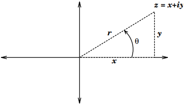
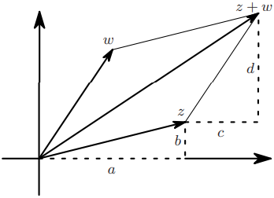
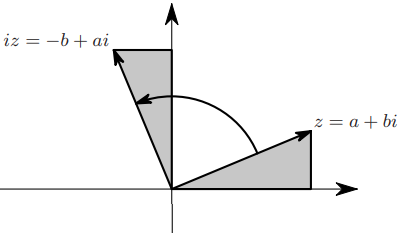
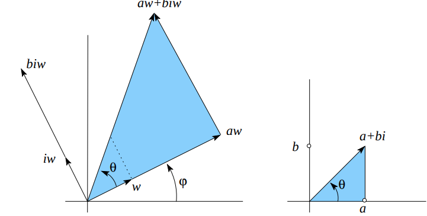

# Introducing Complex Numbers

## Imaginary Unit Number and Complex plane

Define the __imaginary unit number__ (Euler's notation) as $i^2 = -1$. 
Then a __complex number__ is an expression of the form $z=x+iy$ where 

- $\text{Re}(z):=x$ is the __real part__ of $z$ 
- $\text{Im}(z):=y$ is the __imaginary part__ of $z$. 

If $y=0$, then $z$ is real, if $x=0$, then $z$ is pure imaginary. 

Therefore, we can define the set of complex numbers as 

$$\mathbb C = \{x+iy:x,y\in\mathbb R\}$$

Geometrically, each complex number can be placed on a 2-D coordinate system $(x, y)$, such system is defined as a __complex plane__. 

Note that $z$ can also be represented by the polar coordinate

$$x = r\cos\theta, y = r\sin\theta$$

so that the complex number $z$ can also reside in the polar coordinate 

$$z = x+iy = r(\cos\theta+i\sin\theta)$$

And we can define the __modulus__ of $z$ as its absolute value

$$|z|:= r = \sqrt{x^2+y^2}$$

and the __argument__ of $z$ is defined by its angle when $z\neq 0$

$$\arg z := \theta = \arctan(y/x), z\neq 0$$

Note that $\theta$ is periodic with period $\pi$, which means it's multivalued. 

## Geometry of Arithmetic
Using the complex plane, we can better understand the "addition" and "multiplication". Let $z, w$ be two complex variables. Then, addition is the addition of their vectors in the complex plane. 

Multiple $z$ by $i$ will rotate $z$ counterclockwise by 90 degrees.

$$iz = i(a+ib) = -b + ai$$

Multiple $z$ by $c\in\mathbb R$ simply scales the vector. 

$$cz = ca+icb$$

Multiple $z=a+bi, w=c+di\in\mathbb C$ gives

$$zw = (a+bi)w = aw+biw$$

Geometrically, it scales $z$ by $|w|$ and rotates from $w$ counterclockwise for $\theta$. 

## Polar Exponential
Define the polar exponential by 

$$\cos\theta + i\sin\theta = e^{i\theta}$$

So that $z$ can be written in the polar exponential form as 

$$z = r(\cos\theta+i\sin\theta) = re^{i\theta}$$

Note that this notation is so convenient as we can prove exponential properties from trigonometric identities. 

__Theorem__

\begin{align*}
e^{i\theta_1} e^{i\theta_2} &= (\cos\theta_1 + i\sin\theta_1)(\cos\theta_2 + i\sin\theta_2)\\
&= \cos\theta_1\cos\theta_2+i(\cos\theta_1\sin\theta_2 + \cos\theta_2\sin\theta_1) + i^2\sin\theta_1\sin\theta_2\\
&= (cos\theta_1\cos\theta_2 - \sin\theta_1\sin\theta_2) + i\sin(\theta_1+\theta_2) + (i^2+1)\sin\theta_1\sin\theta_2\\
&= \cos(\theta_1 + \theta_2) + i\sin(\theta_1+\theta_2) + 0\\
&= e^{(\theta_1+\theta_2)i}\\
(e^{i\theta})^m &= e^{im\theta}\\
(e^{i\theta})^{1/n} &= e^{\frac{i\theta}n}
\end{align*}

__Example__ complex number to polar exponential form (since $\theta$ is periodic, we will only take values in $0<\theta\leq 2\pi$)

\begin{align*}
1 &\Rightarrow r = \sqrt{1^2+0^2} = 1, \theta = \arctan(0) = 2\pi \Rightarrow e^{i2\pi}\\
-i &\Rightarrow r = \sqrt{0^2+(-1)^2} = 1, \theta = \arctan(-\infty) = \frac{3\pi}2 \Rightarrow e^{i\frac32\pi}\\
1+i &\Rightarrow r = \sqrt{1^2+1^2} = \sqrt2, \theta = \arctan(1) = \frac{\pi}4 \Rightarrow \sqrt2e^{i\frac\pi4}\\
\frac12+\frac{\sqrt3}2i &\Rightarrow r = \sqrt{(1/2)^2+(\sqrt{3}/2)^2} = 1, \theta = \arctan(\sqrt3) = \frac{\pi}3 \Rightarrow e^{i\frac\pi3}\\
\frac12-\frac{\sqrt3}2i &\Rightarrow r = \sqrt{(1/2)^2+(-\sqrt{3}/2)^2} = 1, \theta = \arctan(-\sqrt3) = \frac{\pi}3 \Rightarrow e^{i\frac{5\pi}3}\\
\end{align*}

__Example__ polar exponential form to $x+yi$

\begin{align*}
e^{2+i\pi/2}&\Rightarrow x^2 + y^2  = e^4, \frac{y}x=\tan(\frac{\pi}2)=\infty\Rightarrow e^2i\\
 &\text{or} \Rightarrow e^2e^{i\frac\pi2} = e^2i\\
(1+i)^{-1}&= (e^{i2\pi} + e^{i\pi/2})^{-1} = e^{-i\frac52\pi}=e^{i\frac32\pi} = -i\\
(1+i)^3 &= e^{i\frac{15}{2}\pi} = e^{i\frac32\pi} = -i\\
|3+4i| &= \sqrt{3^2+4^2} = 5\\
\end{align*}

__Example__ Define $\cos z = \frac{e^{iz} + e^{-iz}}2, e^z = e^{x}e^{iy}$, evaluate $\cos(c+i\frac{\pi}4)$ where $c\in\mathbb R$

\begin{align*}
\cos(c+i\frac{\pi}4) &= \frac12\big(\exp(i(c+i\frac\pi4)) + \exp(-i(c+i\frac\pi4))\big)\\
&= \frac{1}2\big(e^{ic + e^{i^2}\frac{\pi}4} + e^{-ic-i^2\frac\pi4}\big)\\
&= \frac12\big(e^{ic-\pi/4} + e^{\pi/4 - ic}\big)\\
&= \frac12\big(e^{ic}e^{-\pi/4} + e^{-ic}e^{\pi/4}\big)\\
&= \frac12\big((\cos c+i\sin c)e^{-\pi/4} + (\cos(-c) +i \sin(-c))e^{\pi/4}\big)\\
&= \frac12\big(e^{-\pi/4}\cos c+ e^{\pi/4}\cos(-c)\big)+ i\frac12\big(e^{-\pi/4}\sin c + e^{\pi/4}\sin(-c)\big)
\end{align*}

## Powers of Complex Numbers

Consider an equation of the form for $z, w\in\mathbb C, n\in\mathbb N^+$

$$z^n = w = |w|e^{i\theta} = |w|e^{i(\theta + 2\pi m)}, m\in\mathbb N$$

so that 

$$z = |w|^{1/n} e^{i(\theta + 2\pi m)/n}, m\in\mathbb N$$

Since the period is $2\pi$, this will yield $n$ unique roots. 

__Example__ 

\begin{align*}
z^3 &= 4 \\
z^3 &= 4e^{i2\pi} \\
z &= \{4^{1/3}e^{i\frac{2\pi}3}. 4^{1/3}e^{i\frac{4\pi}3}, 4^{1/3}e^{i2\pi}\}
\end{align*}

\begin{align*}
z^4 &= -1 \\
z^4 &= e^{i\pi} \\
z &= \{e^{i\frac{\pi}{4}}, e^{i\frac{3\pi}{4}}, e^{i\frac{5\pi}{4}}, e^{i\frac{7\pi}{4}}\}
\end{align*}

\begin{align*}
(az+b)^3 &= c;\:a,b,c \in\mathbb R^+\\
(az+b)^3 &= |c|e^{i2\pi}\\
az+b &= \{c^{1/3}e^{i\frac{2k\pi}{3}}: k = 0, 1, 2\}\\
z &= \{\frac{1}a(c^{1/3}e^{i\frac{2k\pi}{3}} -b): k = 0, 1, 2\}
\end{align*}

\begin{align*}
z^4+2z^2+2 =0\\
(z^2+1)^2&=-1\\
z^2+1 & =\pm i\\
z^2_1 &= -1 + i\\
z_1^2 &= 2^{1/2}e^{i\frac{3\pi}4}\\
z_1 &= \{2^{1/4}e^{i\frac{3\pi}{8}}, 2^{1/4}e^{i\frac{11\pi}{8}} \}\\
z_2^2 &= -1-i\\
z_2 &= \{2^{1/4}e^{i\frac{\pi}{8}}, 2^{1/4}e^{i\frac{9\pi}{8}} \}\\
\Rightarrow z &= \{2^{1/4}e^{i\frac{\pi}8}, 2^{1/4}e^{i\frac{3\pi}8}, 2^{1/4}e^{i\frac{9\pi}8}, 2^{1/4}e^{i\frac{11\pi}8}\}
\end{align*}

## Arithmetic Operations
__Equivalence__ $z_1 = z_2$ IFF their real and imaginary parts are respectively equal, i.e. 

$$z_1 x_1+iy_1 = x_2 + iy_2=z_2 \iff x_1=x_2\land y_1=y_2$$

Also note that given the definition as $\mathbb C = \{a+ib:a,b\in\mathbb R\}$, Addition, subtraction, multiplication, division follows the same rules as real numbers. and the commutative, associative, distributive laws of addition and multiplication hold.

### Complex Conjugate
For $z = x+iy =re^{i\theta}$, define its __complex conjugate__ as $\bar z = x - iy = re^{-i\theta}$. 
Consequently, we can have the following results,

$$z\bar z = \bar z z= (x+iy)(x-iy) =|z|^2$$

and the division can be better viewed as

\begin{align*}
\frac{z_1}{z_2} &= \frac{z_1\bar{z_2}}{z_2\bar{z_2}} =  \frac{z_1\bar{z_2}}{|z_2|^2} = \frac{x_1x_2+y_1y_2}{x_2^2+y_2^2} + i\frac{x_2y_1-x_1y_2}{x_2^2+y_2^2}
\end{align*}

### Results of Elementary Functions
Let $z=a+ib, w =c+id\in\mathbb C$,

__Theorem__ $\overline{z+w} = \bar z + \bar w$  
_proof_ $z+w=(a+c)+i(b+d), \overline{z+w}= (a+c) -i(b+d) = (a-ib)+(c-id) =  \bar z + \bar w$

__Theorem__ $|z-w| \leq |z|+|w|$  
_proof_ $|z-w|^2 = (a-c)^2 + (b-d)^2 \leq a^2+b^2 + c^2 + d^2 = |z|^2 + |w|^2$,  
since the absolute values are all real numbers, it follows triangle inequality that $|z|^2 + |w|^2 \leq (|z|+|w|)^2$  
Given $|z-w| \geq 0, |z|+|w|\geq 0, |z-w|\leq |z|+|w|$

__Theorem__ $z-\bar z = 2i Im(z)$  
_proof_ $z-\bar z = a+ib-(a-ib) = 2ib$

__Theorem__ $Re(z)\leq |z|$  
_proof_ $a \leq \sqrt{a^2+b^2}$

__Theorem__ $|wz| = |w||z|$  
_proof_ We will equivalently prove $|wz|^2 = |w|^2|z|^2$  
$|wz|^2 = (ac-bd)^2 + (ad+bc)^2 = \cdots = (a^2+b^2)(c^2+d^2)$

## Triangular Inequality

$$|z+w|\leq |z|+|w|$$

_proof_ First note that 

$$|z+w|^2 = (z+w)(\bar z+ \bar w) = |z|^2+|w|^2 + z\bar w + \bar z w$$

Then, 

\begin{align*}
z\bar w + \bar z w &= (ac+bd) + i(ad-bc) + (ac+bd) + i(bc-ad) \\&= 2(ac+bd)\\ &= 2Re(z\bar w)
\end{align*}

Using the results above, 

$$Re(z\bar w) \leq |z\bar w | = |z||w|$$

So that $|z+w|^2 \leq |z|^2 + 2|z||w| + |w|^2 = (|z| + |w|)^2$, and take a square root, we have the right inequality. 

Note that the reverse triangular inequality is a corollary of triangular inequality, which 

$$||z|-|w||\leq |z+w|\leq |z|+|w|$$

__Theorem__ $|w\bar z + \bar w z| \leq 2|wz|$  
_proof_ First note that $|z| = |\bar z|$ as $a^2+b^2 = a^2 + (-b)^2$, then by trig-inequality and the theorem above,   
$|w\bar z + \bar w z| \leq |w\bar z| + |\bar w z| = 2|w||z| = 2|wz|$
