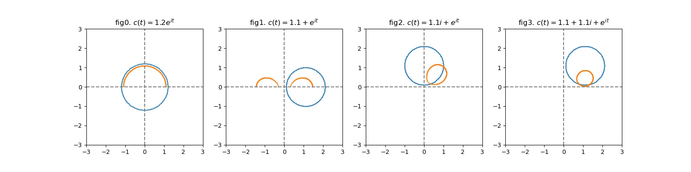

# Multivalued Functions

## Square Root Function

Consider the simplest example, for $z = w^2$, we can write its inverse as $w = z^{1/2}$, we know that its $z^{1/2}$ have values as 

$$z^{1/2} \equiv \sqrt r e^{i\frac{\theta + 2\pi n }{2}}, n = 0, 1, 2, ...$$

Which takes to be 2 distinct values $\pm \sqrt r e^{i\theta/2}$. 

Therefore, if we define some function f as one root of the square root function, say $f(re^{i\theta}) = \sqrt{r} e^{i\theta/2}$.  
Consider a path traverse through the circle of radius $r$ around $0$, 

$$c:[0, 2\pi)\rightarrow \mathbb C, c(t) = re^{it}, c(0) = c(2\pi) = r$$

Then, consider any $t\in(0, 2\pi)$, $f(c(t))$ is continuous. However, when $f$ goes along the path and approaches $2\pi$, we have 

$$\lim_{t\rightarrow 2\pi} f(c(t)) = \sqrt re^{i\pi} = -\sqrt r\neq \sqrt r = f(c(0))$$

$f$ does not return to its original value. 

If we look at another example (fig.2), consider a path traverse through the circle around $1.1+1.1i$. $f$ goes back to the original value. 

??? quote "Source code"
    ```py 
    --8<-- "mat334/scripts/multi_val_func.py"
    ```


    


Note that for the curve traversed by $c(t)= 1.1+e^{it}$, there exists some other definition of $f$ as square root function such that the image of $f$ can be closed. 

## Branch
Therefore, we define a __branch point__ for a multivalued function $f$ as   
 - (intuitively) $f$ is discontinuous upon traversing a small circuit around the point
 - (more formally) $z_0$ is a branch point if there is no domain $D$ on which a continuous single value functions that is defined which contains $B_\delta(z_0) - \{z_0\}$ for any $\delta > 0$. 
 
For example, the square root function have branch points $0, \infty$. 

A __branch__ of a multivalued function is a single valued continuous function defined on a restricted region. 

For functions with a single branch point, $z_0$, a __branch cut__ is a curve $p:[0,\infty)\rightarrow \mathbb C$, s.t. $p(0) = z_0, p(\infty) = \infty$, so that a branch can be defined on $\mathbb C - p([0,\infty))$

## Logarithm Function

Consider the inverse of exponential function $w = f(z)$ s.t. $e^w = z$. 

\begin{align*}
e^w &= z\\
e^{u+iv} &= re^{i\theta} &u,v\in\mathbb R, r > 0, \theta\in [0, 2\pi)\\
e^ue^{iv} &= re^{i\theta}\\
e^u = r&\Rightarrow u = \log(r)\\
v &= \theta + 2\pi n\\
\Rightarrow w &= log(r) + i(\theta + 2\pi n) &n\in\mathbb Z
\end{align*}

This is multivalued, and in fact, it has infinite distinct values for each $n$ chosen. 


Conveniently, we take $n = 0$ and defines the __principal branch__ of $\log$ on the domain $D = \{re^{i\theta} :r > 0, \theta \in [0, 2\pi)\}$ as 

$$\log: D\rightarrow \mathbb C, \log(re^{i\theta}):= \log r + i\theta$$

## Power Function
Note that the power function can be defined through 

$$z^a = (e^{\log z})^a = e^{a\log z}$$

Consider $a = n\in\mathbb Z$, 

\begin{align*}
\exp({n\log(re^{i\theta}))} &\equiv \exp(n(\log r + i\theta + i2\pi k)) \\
&= e^{n\log r} \cdot e^{in\theta} \cdot e^{i2\pi (nk)} \\
&= r^n\cdot e^{in\theta}\cdot 1 \\
&= r^n (e^{i\theta})^n \\
&= (re^{i\theta})^n
\end{align*}

it is uniquely defined 

However, for $a = n^{-1}$, 

\begin{align*}
\exp({n^{-1}\log(re^{i\theta}))} &\equiv \exp(n^{-1}(\log r + i\theta + i2\pi k)) \\
&= e^{\frac{\log r}{n}} \cdot e^{i\frac{\theta}n} \cdot e^{i \frac{2\pi k}{n}} \\
&= r^{1/n}\cdot e^{i\frac{\theta}n}\cdot e^{i \frac{2\pi k}{n}}  \\
&= (re^{i\theta})^{1/n}e^{i \frac{2\pi k}{n}}
\end{align*}

it has $n$ different values

Finally, for $a = i$, 

\begin{align*}
\exp(i\log z) &\equiv \exp(i(\log r + i\theta + i2\pi k)) \\
&=e^{i\log r} e^{-\theta}e^{-2\pi k}
\end{align*}

it has infinitely many values

### Example 
For $a\in\mathbb R$. Show that the set of all values of $\log(z^a)$ is not necessarily the same as $a\log(z)$. 

Consider $z = re^{i\theta}$ for $r > 0, \theta \in [0, 2\pi)$. 

\begin{align*}
\log(z^a) &= \log(r^ae^{ia\theta}) = a\log(r) + i(a\theta + 2\pi k)\\
a\log(z) &=  a\log(re^{i\theta}) = a\log(r) + ia(\theta + 2\pi k)
\end{align*}

Note that $\{(a\theta + 2\pi ak):k\in\mathbb Z\} \neq \{a\theta + 2\pi k):k\in\mathbb Z\}$
