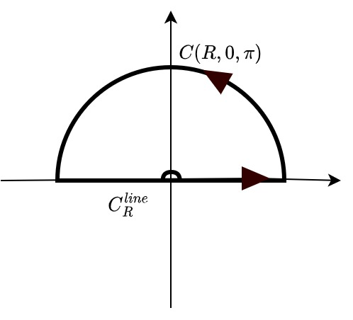
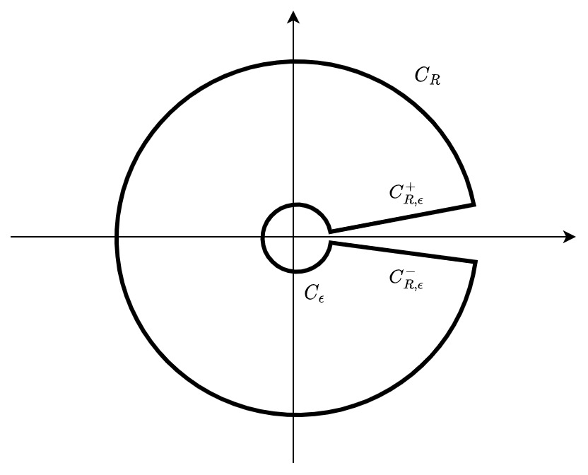

# Principal Value Integrals

## Principal Value Integrals

Suppose $f:[a, c)\cup (c,b]\rightarrow \mathbb C$ is integrable on $[a, c-\epsilon)\cup (c+\epsilon, b]$ for all $\epsilon > 0$. Define the __principal value integral__ as 

$$p.v.\int_a^b f(x)dx = \lim_{\epsilon\rightarrow 0} \big(\int_a^{c-\epsilon} f(x)dx + \int_{c+\epsilon}^b f(x)dx\big)$$

__Example__ Consider $x^{-1}$, which is not defined on $x=0$, but 

\begin{align*}
p.v. \int_{-1}^1 x^{-1}dx &= \lim_{\epsilon\rightarrow 0} \big(\int_{-1}^{-\epsilon} x^{-1}dx + \int_{\epsilon}^1 x^{-1}dx\big) \\
&= \lim_{\epsilon\rightarrow 0} [\log(x)]^{-\epsilon}_{-1} + [\log(x)]^{1}_{\epsilon}\\
&= 0
\end{align*}

Note that $p.v.\int_a^b f(x)dx = \int_a^b f(x)dx$ if the integral exists.  
And the principal value integral at infinity is defined as 

\begin{align*}
p.v.\int_{-\infty}^\infty f(x)dx &= \lim_{R\rightarrow\infty}p.v.\int_{-R}^R f(x)dx\\
&=\lim_{R\rightarrow\infty} \lim_{\epsilon\rightarrow 0} \big(\int_{-R}^{c-\epsilon} f(x)dx + \int_{c+R}^\infty f(x)dx\big)
\end{align*}

## Solving Integrals with PVI
Then, for some real functions, we can extend to complex, and take a way around its undefined point.
 
​<figure markdown>
{width="320"}
</figure>

### Lemma 1
$\lim_{z\rightarrow z_0}(z-z_0)f(z) = 0\implies \lim_{\epsilon\rightarrow 0^+} \int_{C(\epsilon, \theta_1, \theta_2)_{z_0} }f(z)dz = 0$. 

_proof_. First, take $\epsilon$ small enough s.t. $z_0$ is the only singularity in $C_\epsilon$. By residue theorem, 

$$\int_{C_\epsilon} f(z)dz = 2\pi i Res(f, z_0) = 2\pi i \lim_{z\rightarrow z_0}(z-z_0)f(z)  = 0$$

Then, let $a, b$ be the two endpoints of $C(\epsilon, \theta_1, \theta_2)_{z_0}$, so that $C^{1} = C(\epsilon, \theta_1, \theta_2)_{z_0}$ is the upper arc of $C_{\epsilon}$, then, let $C_{2}$ be the lower arc from $a$ to $b$. Because $\int_{C_\epsilon} = 0$, by deformation of curve, $\int_{C_{1} } = \int_{C_{2} }$. Also, note that $\int_{C_2} + (\int_{-C_1}) = 0$ so that $\int_{C_1} = \int_{-C_1} = 0$

### Lemma 2
If $f(z)$ has a pole of order 1 at $z_0$ then

$$\lim_{\epsilon\rightarrow 0^+} \int_{C(\epsilon, \theta_1, \theta_2)_{z_0} }f(z)dz = i(\theta_2 - \theta_1)Res(f, z_0)$$

_proof_. 
Consider the Laurent expansion of $f$,

\begin{align*}
\lim_{\epsilon\rightarrow 0^+} \int_{C(\epsilon, \theta_1, \theta_2)_{z_0} }f(z)dz &= \lim_{\epsilon\rightarrow 0^+} \int_{C(\epsilon, \theta_1, \theta_2)_{z_0} }\sum_{n=-1}^\infty c_n (z-z_0)^ndz\\
&=  \lim_{\epsilon\rightarrow 0^+} \int_{C(\epsilon, \theta_1, \theta_2)_{z_0} } c_{-1} (z-z_0)^{-1}dz&\text{lemma 1}\\
&= \lim_{\epsilon\rightarrow 0^+}i\int_{\theta_1}^{\theta_2} c_{-1} (z_0 + \epsilon e^{it} - z_0)^{-1} \epsilon e^{it}dt\\
&= i(\theta_2 - \theta_1) c_{-1}
\end{align*}

### Example 1
Consider $p.v. \frac{\sin^{x} }{x}dx$
First note that 

$$p.v. \int_{-\infty}^\infty \frac{e^{ix} }{x}dx = p.v. \int_{-\infty}^\infty \frac{\cos x}{x}dx + i  \:\:p.v.\int_{-\infty}^\infty \frac{\sin x}{x}dx $$

Because $\cos x / x $ is odd, $ p.v. \int_{-\infty}^\infty \frac{\cos x}{x}dx = 0$, we are left with

$$ \:\:p.v.\int_{-\infty}^\infty \frac{\sin x}{x}dx  = i^{-1}p.v. \int_{-\infty}^\infty \frac{e^{ix} }{x}dx$$

Define $f(z) = e^{iz}/z$ and consider the integrals

\begin{align*}
I_C &= \lim_{R\rightarrow\infty}\lim_{\epsilon\rightarrow 0} \oint_{C_{R,\epsilon} } f(z)dz\\
&= \lim_{R\rightarrow\infty}\lim_{\epsilon\rightarrow 0} (\int_{C_{R, \epsilon}^{line} } f(z)dz + \int_{C(R,0,\pi)} f(z)dz - \int_{C(\epsilon,0,\pi)} f(z)dz )\\
&= \lim_{R\rightarrow\infty}\lim_{\epsilon\rightarrow 0} \int_{C_{R, \epsilon}^{line} } f(z)dz +  \lim_{R\rightarrow\infty}\int_{C(R,0,\pi)} f(z)dz - \lim_{\epsilon\rightarrow 0}\int_{C(\epsilon,0,\pi)} f(z)dz \\
&= I_{line} + I_R - I_\epsilon
\end{align*}

Consider each integral, we have
 - By Residue Theorem, since $I_C$ goes around the undefined point, $I_C = 0$  
 - By definition, $I_{line} = \lim_{R\rightarrow\infty}\lim_{\epsilon\rightarrow 0}p.v.\int_{-R}^R f(z)dz$ is exactly what we want.  
 - By Jordon's Lemma, $I_{R} = 0$.  
Thus, we are left with $I_{line} = I_\epsilon =  \lim_{\epsilon\rightarrow 0}\int_{C(\epsilon,0,\pi)} f(z)dz$ is what we want.  
By lemma 2, 

$$\lim_{\epsilon\rightarrow 0}\int_{C(\epsilon,0,\pi)} f(z)dz = i(\pi - 0) Res(f, 0) = i\pi (\lim_{z\rightarrow 0} z \frac{e^{iz} }{z}) = i\pi$$

Therefore, 

$$p.v. \frac{\sin x }{x}dx = i^{-1}I_{line} = \pi$$

### Example 2
Similarly, if the principal value integral has multiple undefined points, we can go around each of them. Consider $p.v. \int_{-\infty}^\infty (x^2 - 1) dx$

Similarly, $I_C = I_{R} + I_{line} - I_{\epsilon, -1} - I_{\epsilon, 1}$
- $I_C = 0$ by residue theorem
- $I_{line} =  \lim_{R\rightarrow\infty}\lim_{\epsilon\rightarrow 0} \int_{C_{R, \epsilon}^{line} } (z^2 - 1)^{-1}dz = p.v. \int_{-\infty}^\infty (x^2-1)^{-1}dx$ is what we want
- $ I_{\epsilon, -1} + I_{\epsilon, 1} = I_{line}$ is what we calculate.
By lemma 2, since $z=-1$ and $z=1$ are both poles of order 1, 

$$I_{\epsilon, 1} = \pi i Res(f, 1) = \lim_{z\rightarrow 1}(z+1)^{-1} = \pi i /2$$

$$I_{\epsilon, -1} = \pi i Res(f, -1) = \lim_{z\rightarrow -1}(z-1)^{-1} = -\pi i/2$$

$$ \int_{-\infty}^\infty (x^2-1)^{-1}dx = \pi i /2 - \pi i /2 = 0$$

## Integrals with Branch Cuts
Consider functions on $\mathbb C$ with branch points at $0$, and we only defined the funciton on some domain $D = \{re^i\theta: r> 0, \theta\in (0, 2\pi)\}$ with a branch cut.

For function $f(z)$, define $f_+, f_-: (0,\infty)\rightarrow\mathbb C$ as 

$$f_+(r) = \lim_{\theta\rightarrow 0^+} f(re^{i\theta}), f_-(r) = \lim_{\theta\rightarrow 2\pi^-} f(re^{i\theta})$$

###  Example 1 
Consider the sqrt function $f(re^{i\theta}) = r^{1/2} e^{i\theta/2}$, then

$$f_+(r) = r^{1/2}, f_-(r) = -r^{1/2}$$

### Example 2 
evaluate $\int_0^\infty \frac{\sqrt x}{x^3+1}dx$

​<figure markdown>
{width="320"}
</figure>

First, note that 

$$\lim_{R\rightarrow\infty}\lim_{\epsilon\rightarrow 0}\lim_{\theta\rightarrow0^+}I_C =  
\lim_{R\rightarrow\infty}I_{C_R} -
\lim_{\epsilon\rightarrow 0}I_{C_\epsilon} + 
\lim_{R\rightarrow\infty}\lim_{\epsilon\rightarrow 0}\lim_{\theta\rightarrow0^+} I_{C^{+}_{R,\epsilon}} +
\lim_{R\rightarrow\infty}\lim_{\epsilon\rightarrow 0}\lim_{\theta\rightarrow0^+}  I_{C^{-}_{R,\epsilon}}$$

Then, note that $\lim_{z\rightarrow\infty} z f(z) = \lim_{z\rightarrow\infty}\frac{z^{3/2}}{z^3+1} = 0, \lim_{z\rightarrow 0} z f(z) = \frac{0^{3/2}}{0^3+1} = 0$, so that 

$$\lim_{R\rightarrow\infty}I_{C_R} = 0, \lim_{\epsilon\rightarrow 0}I_{C_\epsilon} = 0$$

Then, consider the left two terms

$$\lim_{R\rightarrow\infty}\lim_{\epsilon\rightarrow 0}\lim_{\theta\rightarrow0^+} I_{C^{+}_{R,\epsilon}} = \lim_{R\rightarrow\infty}\lim_{\epsilon\rightarrow 0}\int_{\epsilon}^R f_+(x)dx = \int_{0}^\infty f_+(x)dx$$

$$\lim_{R\rightarrow\infty}\lim_{\epsilon\rightarrow 0}\lim_{\theta\rightarrow0^+} I_{C^{-}_{R,\epsilon}} = \lim_{R\rightarrow\infty}\lim_{\epsilon\rightarrow 0}\int_{R}^{\epsilon} f_-(z)dz = -\int_{0}^\infty f_-(z)dz$$

via branch cut of square root functions, we have $-f_-(z) = f_+(z) = f(x)$ so that the whole integral 

$$\lim_{R\rightarrow\infty}\lim_{\epsilon\rightarrow 0}\lim_{\theta\rightarrow0^+}I_C = \int_{0}^\infty f_+(x) -\int_{0}^\infty f_-(x) = 2 \int_0^\infty \frac{\sqrt x }{x^3+1} dx$$

Now, using residue theorem, 

$$I_C = \int_{C} f(z)dz = 2\pi i (Res(f, -1) + Res(f, e^{i\pi/3}) +  Res(f, e^{-i\pi/3}))$$

so that the original integral

$$\int_0^\infty \frac{\sqrt x }{x^3+1} dx = \pi i (Res(f, -1) + Res(f, e^{i\pi/3}) +  Res(f, e^{-i\pi/3}))$$
