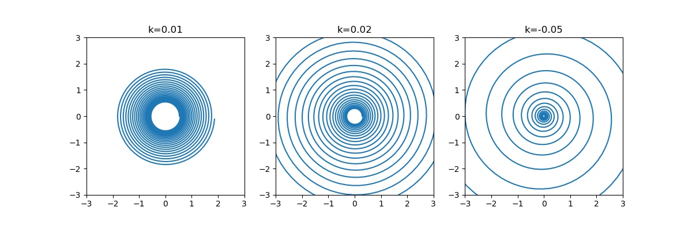

# Arc Length

## Defining arc Length
For a vector $v$, the length is defined as $\|v\| = \sqrt{v_1^2 + \cdots + v_n^2}$.   
For vector $u, v$, $\|u-v\|$ is the length of the line segment joining $u, v$. 

Consider a parameterized curve $\gamma$, and an arc from $\gamma(t_0)$ to $\gamma(t_1)$. We can partition the curve into many points, and then approximate the length by summing the length of the line segments joining the points. 

One easy partition is to partition by adding a small step $\delta t$ from previous time step $t$. Hence for an arbitrary segment of the curve between $\gamma(t)$ and $\gamma(t+\delta t)$, its length is then approximated by $\|\gamma(t+\delta t) - \gamma(t)\|$. Since $\delta t > 0$ and it's taken arbitrarily small, 

$$\lim_{\delta t\rightarrow 0}\|\gamma(t+\delta t) - \gamma(t)\| = \|\gamma'(t)\delta t\| = \|\gamma'(t)\|\delta t$$

Therefore, the arc is then approximated as 

$$l(t_0, t_1) = \lim_{\delta_t \rightarrow 0} \sum_{n = 0}^{(t_1 - t_0)/\delta_t} \|\gamma(t+\delta t) - \gamma(t)\|= \int_{t_0}^{t_1} \|\gamma'(u)\|du$$


Therefore, the __arc-length__ of a curve $\gamma$ starting at $\gamma(t_0)$ is a function $s(t)$ given by 

$$s(t) =\int_{t_0}^{t} \|\gamma'(u)\|du$$


Note that 
 - $s(t_0) = \int_{t_0}^{t_0} = 0$
 - $\forall t > t_0. s(t) > 0$
 - $\forall t < t_0. s(t) = \int_{t_0}^{t}  \|\gamma'(u)\|du = -\int_{t}^{t_0}  \|\gamma'(u)\|du < 0$

Also, if we choose a different starting point $t_1$, the resulting arc-length $s_1$ differs from $s$ by a constant $\int_{t_0}^{t_1} \|\gamma'(u)\| du$

### Example: Logarithmic spiral
Parameterize the a logarithmic spiral as 

$$\gamma(t) = (e^{kt}\cos t, e^{kt}\sin t), k\neq 0$$


??? quote "Source code"
    ```python
    --8<-- "mat363/scripts/arc_length.py"
    ```


    

    


Then, we can find its arc length by 

\begin{align*}
\gamma'(t) &= (ke^{kt}\cos t - e^{kt}\sin t, ke^{kt}\sin t + e^{kt}\cos t)\\
\|\gamma'(t)\|^2 &= k^2 e^{2kt}\cos^2 t -ke^{2kt}\cos t \sin t + e^{2kt}\sin^2 t + k^2 e^{2kt}\sin^2 t +ke^{2kt}\cos t \sin t + e^{2kt}\cos^2 t\\
&= k^2e^{2kt} + e^{2kt}\\
s(t) &= \int_0^t (k^2e^{2ku} + e^{2ku})^{1/2}du\\
&= \int_0^t ((k^2 + 1)^{1/2}e^{ku})du\\
&= \int_0^t \sqrt{k^2+1} u du \\
&= \sqrt{k^2+1}{k}(e^{kt} - 1)
\end{align*}

### Example: Catenary
The catenary parameterized with $\gamma(t) = \cosh t$. Determine the arc-length starting at $(0, 1)$. 

$$\|\gamma'(t)\| = \sqrt{1 + \sinh^2 t} = \cosh t$$


$$s(t) = \int_0^t \cosh x dx = \sinh t$$


## Speed 

Treat $\gamma(t)$ as the position of a particle at time $t$, then the arc-length $s(t)$ can be seen as the distance traveled by the particle. Therefore, we can define speed as $\frac{ds}{dt}$ since $s$ is definitely differentiable. 

For a parameterized curve $\gamma$, its __speed__ at $t$ is defined as $\|\gamma'(t)\|$.  
$\gamma$ is said to be a __unit-speed curve__ if $\forall t \in (a, b). \|\gamma'(t)\| = 1$.

__Lemma__ For some function $\mathbf n: (a, b)\rightarrow\mathbb R$ s.t. $\mathbf n$ is smooth and $\forall t. \|\mathbf n(t)\| = 1$. Then, $\mathbf n'(t)\cdot\mathbf n(t) = 0$.

_proof._ Assume $\mathbf n$ is smooth, then $\mathbf n$ and $\mathbf n'$ are both differentiable. 
Therefore, consider 

$$\frac{d}{dt}(\mathbf n\cdot \mathbf n) = \mathbf n'\cdot \mathbf n + \mathbf n\cdot \mathbf n' = 2\mathbf n'\cdot \mathbf n$$

Also we know that 

$$\mathbf n\cdot \mathbf n = \|n\| = 1\implies \frac{d}{dt} (\mathbf n\cdot \mathbf n ) = 0$$

Therefore, 

$$2\mathbf n'\cdot \mathbf n = 0 \Rightarrow \mathbf n'\cdot \mathbf n = 0$$


__Corollary__ If $\gamma$ is a unit-speed curve, then $\gamma'' = 0$ or perpendicular to $\gamma'$.  
_proof_. Take $\mathbf n = \gamma'$, $\gamma''\cdot \gamma' = 0$

### Example
Show that $\gamma(t) = (\frac{1}{3}(1+t)^{3/2}, \frac{1}{3}(1-t)^{3/2}, \frac{t}{\sqrt{2}})$ is unit-speed. 

\begin{align*}
\gamma'(t) &= (\frac{1}{2}(1+t)^{1/2}, -\frac{1}{2}(1-t)^{1/2}, \frac{1}{\sqrt{2}})\\
\|\gamma'(t)\|^2 &= (\frac{1}{2}(1+t)^{1/2})^2 + (-\frac{1}{2}(1-t)^{1/2})^2 + \frac{1}{2}\\
&= \frac{1}{4}(1+t+ 1-t) + \frac{1}{2}\\
&= 1
\end{align*}

Show that $\gamma(t) = (\frac{4}{5}\cos t, 1 - \sin t, \frac{-3}{5}\cos t)$ is unit-speed. 

\begin{align*}
\gamma'(t) &= (-\frac{4}{5}\sin t, -\cos t, -\frac{-3}{5}\sin t)\\
\|\gamma'(t)\|^2 &= \frac{16}{25}\sin^2 t + \cos^2 t + \frac{9}{25}\sin^2 t)\\
&= 1
\end{align*}

### Example
__Claim__ A straight line is the shortest curve joining two given points. 

_proof_. Let $\mathbf p, \mathbf q$ be two points, $\gamma$ be an arbitrary curve passing through with $\gamma(a) = \mathbf p, \gamma(b) = \mathbf q, a < b$.   
Take $\mathbf u = \mathbf p - \mathbf q, \hat{\mathbf u} = \frac{\mathbf u}{\|\mathbf u\|}$ so that $\|\hat{\mathbf u}\| = 1$. Note that 

$$\dot\gamma\cdot \hat {\mathbf u} = \|\dot\gamma\| \|\hat{\mathbf u}\|\cos(\theta) =  \|\dot\gamma\| \cos(\theta)\leq \|\dot\gamma\| $$

So that 

$$\|\mathbf u\| = \mathbf u\cdot \hat {\mathbf u} = (\gamma(b) - \gamma(a)) \cdot \hat{\mathbf u} = \int_a^b \gamma'(t)dt \cdot \hat{\mathbf u} \leq \int_a^b \|\gamma'(t)\|dt$$

