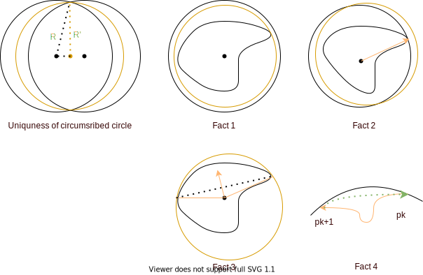

# Four Vertex Theorem

## Simple Closed Curves

A parameterized curve $\gamma$ is __closed__ with a period of $T$, if $\forall t\in \mathbb R, \forall k\in\mathbb N. \gamma(t) = \gamma(t+kT)$

A parameterized curve $\gamma$ is __simple__ if it has no self-intersections.

### Jordan's Theorem

__Claim__ Any simple closed curve in the plane has a connected bounded "interior" and an connected unbounded "exterior".

### Hopf's Umlaufsatz Theorem
The total signed curvature of a simple closed curve in $\mathbb R^2$ is $\pm 2\pi$.

## Vertex
A __vertex__ of a plane curve $\gamma$ is a point where $\frac{d\kappa_s}{dt} = 0$. Note that this definition is independent of parameterizations.

__Example__ Every point on the circle $\gamma(t) = (R \cos t, R\sin t)$ is a vertex. 

_proof_. We known that $\kappa_s = R^{-1}$ for the circle $\gamma$, so that $\frac{d\kappa_s}{dt} = 0$ everywhere.

## Circumscribed circle
For a simple closed curve $\gamma:\mathbb R\rightarrow\mathbb R^2$, we can define a circumscribed circle $C(c, R) = \{x\in\mathbb R^2: \|x - c\| = R\}$ that contains $\gamma(\mathbb R)$ and attains the smallest possible radius. 

__Claim__ existence

_proof_. By Jordon's Theorem, since $\gamma$ is simple, closed. Its interior is bounded. There exists some circles $C(c,R)$ that bounds $\gamma(\mathbb R)$.  

Then, we need to consider whether $\text{inf}\{R\}$ exists. 

Take a sequence $c_n, R_n$ s.t. $R_n\searrow \text{inf}\{R\} = R_\infty$.  
Note that $\|c-\gamma(s)\| \leq R_n$, take a convergent subsequence $c_{n_k}$ s.t. $\lim_{k\rightarrow\infty} c_{n_k} = c_\infty$. 

We claim that circle $C(c_\infty, R_\infty)$ contains $\gamma(\mathbb R)$.  
The idea of the claim is that if we assume $C_\infty = C(c_\infty, R_\infty)$ does not contain $\gamma(\mathbb R)$, then there are some part of $\gamma(\mathbb R)$ "sticks out" of $C_\infty$, i.e. 

$$\exists s_0\in\mathbb R. \|\gamma(s_0) - c_\infty\| > R_\infty$$

By triangle inequality we have 

$$\|\gamma(s_0) - c_\infty\| \leq \|\gamma(s_0) - c_{n_k}\| \leq \|\gamma(s_0) - c_\infty\| + \|c_\infty - c_{n_k}\|$$

Let $D:= \|\gamma(s_0) - c_\infty\| + \|c_\infty - c_{n_k}\|, \epsilon_k := \|c_\infty - c_{n_k}\|$.  so that 

$$\|\gamma(s_0) - c_{n_k}\| \geq D - \epsilon_{k}$$

Take $k$ large enough s.t. $\epsilon_k < \frac{D-R_\infty}{2}$ and $R_{n_k} - R_\infty < \frac{D-R_\infty}{2}$. Therefore, 

$$\|\gamma(s_0) - c_{n_k}\| \geq D - \frac{D-R_\infty}{2} = \frac{D-R_\infty}{2} + R_\infty > R_{n_k}$$

Then, by the construction of our sequence, this is a contradiction. 

### Claim. uniqueness

Assume not unique, then exists $C_1 = (c_1, R), C_2 = (c_2, R)$ ($R$ must be the same since minimum) s.t. $\|\gamma(s) - c_1\| < R$ and $\|\gamma(s) - c_2\| < R$. Therefore, $\gamma(\mathbb R) \in \text{int}(C_1)\cap \text{int}(C_2)$. Then, we can construct new circle according to the picture, where $c = \frac{c_1 + c_2}{2}$ and by triangle inequality, $R' < R$

### Lemmas

__Fact 1__ $C(c, R)$ and $\gamma(\mathbb R)$ has at least one intersection.   
Assume not, then we can keep $c$ unmoved, note that $\forall s. \|\gamma(s) - c\| < R$ so that we can shrink $R' < R$.

__Fact 2__ $C(c, R)$ and $\gamma(\mathbb R)$ has at least two intersections.  
Assume not, by fact 1, we take $s_0$ to be the only intersection. Then move $c$ along the direction of $\gamma(s_0)-c$ by arbitrarily small $\epsilon$, then it has no intersection, which violates Fact 1.

__Fact 3__ If $C(c, R)$ and $\gamma(\mathbb R)$ has exactly two intersections, then the line segment between intersection points is a diameter.   
If not, then move $c$ along the direction normal to the line.

__Fact 4__ $\gamma(\mathbb R)$ and $C$ has the same tangent at their point of intersections.   
Assume there are at least two intersections $p_1,...,p_n$.  
First, we want to show that at all intersections, the orientation is the same. Assume $\gamma$ is oriented the same as $C$ as intersection point $p_k$, to show that all intersection points have the same intersection, it's sufficient to show that of $p_{k+1}$. Note that the curve $\gamma([p_k, p_{k+1}])$ and the arc of circle between $p_k$ and $p_{k+1}$ will form a simple closed curve, by Jordon's theorem, it's bounded and connected.  
Then, consider any simple curve within the enclosed region from $p_{k+1}$ to $p_k$, and it forms a simple closed curve with  $\gamma([p_k, p_{k+1}])$. Therefore, they must oriented the same. 

__Fact 5.1__ If $\gamma$'s image is within $\text{int}(C)$ in a neighborhood of the intersection point, then the curvature of $\gamma, \kappa_s(s_i) \geq R^{-1}$.
Wlog assume $c = (0,0)$. At point of intersection, we have that $p_k = \gamma(s_k)$, then note that $\|\gamma(s_k)\|^2 = \gamma(s_k)\cdot\gamma(s_k)= R^2$ must attain its maximum (since other points are $\|\gamma(s)\| \leq R$ by circumscribed circle). Then, we have 

$$\frac{d}{ds}(\gamma(s_k)\cdot \gamma(s_k)) = 2\gamma'(s_k)\cdot\gamma(s_k) = 0$$

Therefore, we have that $\mathbf t(s_k)$ is perpendicular to the radius at $p_k$ and is the same tangent vector. 

In addition, we have that 

\begin{align*}
\frac{d^2}{ds^2}(\gamma(s_k)\cdot \gamma(s_k)) &\leq 0\\
2(\gamma''(s_k)\cdot\gamma(s_k) + \gamma'(s_k)\cdot\gamma'(s_k))&\leq 0\\
2(\kappa_s(s_k)p_k \cdot \mathbf n_s(s_k) + 1) &\leq 0
\end{align*}

Then note $\mathbf n_s(s_k)$ is parallel and directly opposite to $p_k$, since $\|p_k\| = R, p_k \cdot \mathbf n_s(s_k) = -R$

\begin{align*}
\frac{d^2}{ds^2}(\gamma(s_k)\cdot \gamma(s_k)) &\leq 0\\
(-\kappa_s(s_k)R + 1) &\leq 0\\
\kappa_s(s_k) &\geq R^{-1}
\end{align*}

__Fact 5.2__ If $\gamma$'s image is within $\text{ext}(C)$ in a neighborhood of the intersection point, then the curvature of $\gamma, \kappa_s(s_i) \leq R^{-1}$.

The idea is similar to __Fact 5.1__ while here $\gamma(s_k)\cdot \gamma(s_k)$ attains its local minimum, so that 

\begin{align*}
\frac{d^2}{ds^2}(\gamma(s_k)\cdot \gamma(s_k)) &\geq 0\\
\kappa_s(s_k) &\leq R^{-1}
\end{align*}

## Theorem (Four Vertex Theorem) 
For a simple closed curve $\gamma:\mathbb R\rightarrow\mathbb R^2$, it has at least 4 vertex. 

Let $\gamma$ be a simple closed curve, and $C$ be its circumscribed curve, $p_k = \gamma(s_k)$ and $p_{k+1} = \gamma(s_{k+1})$ be two conservative intersection points. Connecting the two points with the line segment $l = \overline{p_k p_{k+1} }$ and move the the center of the circle along the direction normal to $l$ until the last moment it touches $\gamma$. Then, the $\gamma([s_k, s_{k+1}])$ is all in $\text{ext}(C)$, by __Fact 5.2__, there exists at least one point $q_k$ s.t. $\kappa_s(q_k) \leq R^{-1}$. Note that there are two opposite directions to move $c$.

Therefore, we have that the curve passing through $p_{k}, q_k, p_{k+1}$ must have a local minimum since it goes down from $\geq R^{-1}$ to $\leq R^{-1}$ and then back to $\geq R^{-1}$. Therefore, we have at least $n$ local minimum.  Then, consider the curve passing through $q_k, p_k, q_{k+1}$, similarly we can obtain $n$ local maximum. 

Note that the only possible case is that $\kappa_s$ at $p_k, q, p_{k+1}$ are all $R^{-1}$. In this case, there is infinitely many points of $\gamma$ in the neighborhood of $p_k$, that is coincided with the arc of the circle. Since $C$ is the circumscribed circle, either $\gamma([p_k, p_{k+1]}$ coincides with the arc of the circle all the way, or $\kappa(q_k) < R^{-1}$

### Example : Limacon

Let $\gamma:\mathbb R\rightarrow\mathbb R^2$ be defined as 

$$\gamma(t) = ((1+2\cos t)\cos t, (1 + 2\cos t)\sin t)$$

Note that $\gamma$ is closed (but not simple) with a period of $2\pi$. 

__Claim__ Limacon only has 2 vertices. 

_proof_. 

\begin{align*}
\gamma'(t) &=  (-\sin t - 2\sin 2t, \cos t + 2\cos 2t)\\
\|\gamma'(t) \| &= \sqrt{\sin^2 t + 4\sin t\sin 2t + 4\sin^2 2t + \cos^2 t + 4\cos t\cos 2t + 4\cos^2 2t}\\
&= \sqrt{5 + 8\cos t \sin^2 t + 4\cos t - 8\cos t\sin^2 t)}\\
&= \sqrt{5 + 4\cos t}
\end{align*}

Then, let $\gamma'(t) = \frac{1}{\sqrt{5 + 4\cos t} }(-\sin t - 2\sin 2t, \cos t + 2\cos 2t)$ and define the turning angle by 

$$\cos\varphi = \frac{-\sin t - 2\sin 2t}{\sqrt{5 + 4\cos t} }. \sin\varphi = \frac{\cos t + 2\cos 2t}{ {\sqrt{5 + 4\cos t} } }$$

Because we only interested in $\kappa_s = \varphi'$, observe that 

\begin{align*}
\frac{d}{dt}\sin \varphi &= \frac{d}{d\varphi}\sin\varphi\frac{d\varphi}{dt}\\
\frac{d}{dt}\sin \varphi &= \frac{(-\sin t - 4\sin 2t)\sqrt{5+4\cos t} - (\cos t + 2\cos 2t)(-4\sin t)\frac{1}{2\sqrt{5+4\cos t} } }{5+4\cos t}\\
&= \frac{-\sin t(24\cos^2 t + 42\cos t +9)}{(5+4\cos t)^{3/2} }\\
\varphi'(t) &= \frac{\frac{d}{dt}\sin \varphi}{\cos \varphi} \\
&= \frac{\frac{-\sin t(24\cos^2 t + 42\cos t +9)}{(5+4\cos t)^{3/2} } }{\frac{-\sin t - 2\sin 2t}{\sqrt{5 + 4\cos t} } }\\
&= \frac{9+6\cos t}{5+4\cos t}\\
\kappa_s &= \frac{d\varphi}{ds} = \frac{9+6\cos t}{5+4\cos t} \frac{1}{\sqrt{5+4\cos t} }\\
&= \frac{9+6\cos t}{(5+4\cos t)^{3/2} }\\
\frac{d\kappa_s}{dt} &= \frac{12\sin t (2+\cos t)}{(5+4\cos t)^{5/2} }
\end{align*}

Therefore, $\frac{d\kappa_s}{dt} = 0$ only when $t=0, \pi$ for $t\in [0, 2\pi)$ 
