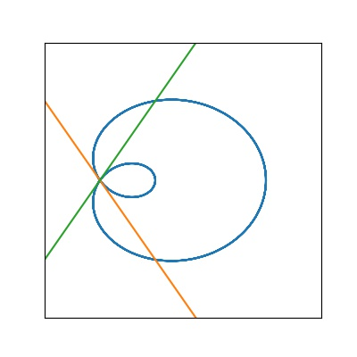

# Introduction to Curves

## Defining a curve

### Level Curves

A __2D curve__ can be described by means of their Cartesian equation $f(x, y) = c$
and the curve is a set of points 

$$C = \{(x,y)\in\mathbb R^2 : f(x, y) = c\}$$

A __3D curve__ can be described by 2 equations $f_1(x, y, z) = c_1, f_2(x,y,z) = c_2$ s.t. 

$$C = \{(x,y, z)\in\mathbb R^3 : f_1(x, y, z) = c_1, f_2(x,y,z) = c_2\}$$

A __level curve__ is a set of points which the quantity $f(x, y)$ reaches the 'level' $c$. 

### Parameterized Curve
A __parameterized curve__ is a map 

$$\gamma: (a, b)\rightarrow \mathbb R^n, -\infty \leq a < b\leq \infty$$

A __parameterization__ of level curve $C$ is a parametrized curve, whose image is contained in $C$. 

The __parameterization__ of a curve is not unique, for example, the image of $(\cos t, \sin t)$ is equal to $(\cos 2t, \sin 2t)$

__Example__ If $\gamma(t) = (t^2, t^4)$ is parameterization of $y = x^2$?

No, note that $1 = (-1)^2$, while for any $t \in \mathbb R$, $t^2 \geq 0$ so that we cannot parameterize $y=x^2$. 

__Example__ Find the parameterization of $\frac{x^2}{4} + \frac{y^2}{9} = 1$.  
Take $(2\cos t, 3\sin t)$, note that $\frac{(2\cos t)^2}{4} + \frac{(3\sin t)^2}{9} = \cos t^2 + \sin t^2 = 1$

__Example__ Find the Cartesian equations of $\gamma(t) = (e^t, t^2)$.  
Let $x = e^t$, then $t = \log x,\implies y = t^2 = (\log x)^2$. 

## Smooth Curve

A parameterized curve $\gamma$ is __smooth__ if $\gamma$ is infinitely differentiable for all $t \in (a, b)$. Note that since $\gamma: (a, b)\rightarrow\mathbb R^n$, its derivative is defined as a vector-valued function and each derivative on each component. We will often denote 
$\dot\gamma:=\frac{d\gamma}{dt}, \ddot\gamma := \frac{d^2\gamma}{dt^2}$. 

### Tangent Vector
Let $\gamma(t)$ be a parameterized curve, then $\dot\gamma(t)$ is the __tangent vector__ of $\gamma$ at point $\gamma(t)$. 

__Theorem__ If the tangent vector of a parameterized curve is constant, then the image of the curve is (part of) a straight line. 

_proof_. Assume $\dot\gamma(t) = \mathbf a$ for all $t$. Then, integrate $\dot\gamma$ component-wise,

$$\gamma (t) = \int \dot\gamma(t)dt = \int \mathbf a dt = t\mathbf a + \mathbf b$$


__Example__ Consider the parameterized curve $\gamma(t) = ((1 + 2\cos t)\cos t, (1 + 2 \cos t) \sin t)$. Its tangent vector is 

$$\dot\gamma(t) = (-\sin t - 2\sin 2t, \cos t + 2\cos 2t)$$

Note that $\gamma$ has a self-intersection at $\gamma(2\pi / 3) = \gamma(4\pi / 3) = (0, 0)$, while 

$$\dot\gamma(2\pi/3) = (\sqrt 3/ 2, -3/2)\neq (-\sqrt 3/ 2, -3/2) = \dot\gamma(4\pi/3)$$


??? quote "Source code"
    ```python
    --8<-- "mat363/scripts/intro_curves.py"
    ```
    

    


### Example: Foci of ellipse
Consider the ellipse $\frac{x^2}{p^2}+ \frac{y^2}{q^2} = 1, p > q > 0$, using the parameterization $\gamma(t) = (p\cos t, q\sin t)$.  
Define the __eccentricity__ of the ellipse as $\epsilon = \sqrt{1 - \frac{q^2}{p^2}}$ and the foci of the ellipse as $\mathbf f_1 = (- \epsilon p, 0), \mathbf f_2 = (\epsilon p, 0)$. 

__Claim__ $\forall a \in C. d(\mathbf f_1, a) + d(\mathbf f_2, a)= \mathbf c$ where $\mathbf c$ does not depend on $a$.   

_proof_. Let $a\in C$, take some $t_0$ s.t. $a = (p\cos t_0, q\sin t_0)$. Consider $d(a, \mathbf f_1)$

\begin{align*}
d(a, \mathbf f_1)^2 &= (p\cos t_0 - \epsilon p)^2 + (q\sin t_0)^2 \\
&= p^2\cos^2 t_0 - 2\epsilon p^2 \cos t_0 + \epsilon^2 p^2 + q^2\sin^2 t_0\\
&= (p^2 -q^2)\cos^2 t_0 - 2\epsilon p^2 \cos t_0 + (p^2 - q^2) + q^2\cos^2 t_0 + q^2\sin^2 t_0\\
&= (p^2 -q^2)\cos^2 t_0 - 2\epsilon p^2 \cos t_0 + p^2\\
&= p^2(\epsilon^2 \cos^2 t_0 - 2\epsilon\cos t_0 + 1)\\
&= p^2(\epsilon\cos t_0 - 1)^2
\end{align*}

Then, taking the square root, notice that $\epsilon < 1. -1 < \cos t_0 < 1$ so that $1 - \epsilon\cos t_0$ > 0. $d(a, \mathbf f_1) = p(1 - \epsilon \cos t_0)$. Similarly, $d(a, \mathbf f_2) = p(1 + \epsilon \cos t_0)$. Therefore,


$$d(\mathbf f_1, a) + d(\mathbf f_2, a) = 2p$$


__Claim__ $\forall a \in C$. The product of the distances from $\mathbf f_1$ and $\mathbf f_2$ to the tangent line at $a$ does not depend on $a$. 

_proof_. For some $t$, the tangent line is 


$$\gamma'(t) = (-p\sin t, q\cos t)$$


Hence the normal is $\mathbf n(t) = (q\cos t, p\sin t)$ so that $\gamma'(t)\cdot \mathbf n(t) =\mathbf 0$. 
Note that the distance between some point $\mathbf f_1$ and the tangent line is $(\mathbf f_1 - a)\cdot \frac{\mathbf n}{\|\mathbf n\|}$. Therefore, the product is 

\begin{align*}
d(\mathbf f_1, l(t))&=\quad (\mathbf f_1 - a)\cdot \frac{\mathbf n}{\|\mathbf n\|}\\
&= \frac{(\epsilon p - p\cos t)q\cos t + q\sin t p \sin t}{(q^2\cos^t + p^2 \sin^2 t)^{1/2}}\\
&= \frac{\epsilon pq\cos t - pq\cos^2 t + pq\sin^2 t}{(q^2\cos^2 t + p^2 \sin^2 t)^{1/2}}\\
&= \frac{pq(\epsilon \cos t - 1)}{(q^2\cos^2 t + p^2 \sin^2 t)^{1/2}}\\
d(\mathbf f_2, l(t))&=\frac{pq(-\epsilon \cos t - 1)}{(q^2\cos^2 t + p^2 \sin^2 t)^{1/2}}\\
d(\mathbf f_1, l(t))d(\mathbf f_2, l(t))&= \frac{p^2q^2(1 + \epsilon \cos t)(1 - \epsilon \cos t)}{q^2\cos^2 t + p^2 \sin^2 t}\\
&= q^2\frac{p^2-(p^2 - q^2)\cos^2 t)}{p^2\sin^2 t + p^2\cos^2 t + (q^2 - p^2)\cos^2 t}\\
&= q^2
\end{align*}

### Example (Viviani's Curve)
Show that 


$$\gamma(t) = (\cos^2 t - 1/2, \sin t\cos t, \sin t)$$


is a parameterization of the curve of intersection of the cylinder of radius $1/2$ and axis the z-axis with the sphere of radius $1$ and center $(-1/2, 0, 0)$. 

The surface of the circle can be represented as 


$$C_1 = \{(x, y, z) : (x + 1/2)^2 + y^2 + z^2 = 1\}$$


The surface of the cylinder is 


$$C_2 = \{(x, y, z): x^2 + y^2 = 1/4\}$$


Let $z = \sin t$, we have the equations


$$\begin{cases}x^2 + x + 1/4 + y^2 + \sin^2 t = 1\\x^2 + y^2 = 1/4\end{cases}$$


solves to have $x + 1/2 = 1 - \sin^2 t\Rightarrow x = \cos^2 t - 1/2$,  
then $y = \sqrt{1/4 - (\cos^2 t - 1/2)^2} = \sqrt{\cos^2 t(1-\cos^2 t)} = \sin t\cos t$.
