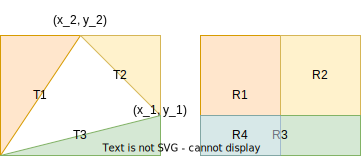

# Isoperimetric Inequality

## Area of a Simple Closed Curve

Let $\gamma: (0,L) \rightarrow \mathbb R^2, \gamma(s) = (x(s), y(s))$ be a simple closed unit-speed curve, $\text{int}(\gamma)$ be the bounded interior. Then the __area__ of $\gamma$ is defined as 

$$A(\gamma) = \iint_{\text{int}(\gamma)}dxdy $$

By Green's Theorem, we can instead integrating through the boundary, i.e. 

$$\iint_S(\partial_x g - \partial f_y)dxdy = \int_{\partial S} (f(x, y)dx + g(x, y)dy)$$

Applied on the area integral, by taking $f(x,y)= \frac{-y}{2}, g(x,y) = \frac{x}{2}$

\begin{align*}
A(\gamma) &= \iint_{\text{int}(\gamma)}dxdy \\
&= \int_{\gamma} (\frac{x}{2}dy - \frac{y}{2}dx)\\
&= \int_{\gamma} (\frac{x}{2}\frac{dy}{ds}ds - \frac{y}{2}dy\frac{dx}{ds}ds)\\
&= \frac{1}{2}\int_0^L x'(s)y(s) - x(s)y'(s) ds
\end{align*}

Also, if we take $f(x, y) = -y, g(x,y)=0$ or $f(x,y) = 0, g(x,y)=x$, then 

$$A = \int_0^L x(s)y'(s) ds = -\int_0^Lx'(s)y(s) ds$$

### Geometric Interpratations
__Lemma__ Consider a triangle $A = (0, 0), B = (x_1,y_1), C = (x_2, y_2)$, WLOG assume $x_1>x_2, y_1<y_2$. Then, its area is 

$$A = \frac{1}{2}(x_1y_2 - x_2y_1)$$

_proof_. 

\begin{align*}
A &= R - T_1 - T_2 -T_3 \\
&= R - \frac{1}{2}(R_1+R_2+R_3)\\
&= R - \frac{1}{2}(Rec - R_4) \\
&= \frac{1}{2}R - R_4 \\
&= \frac{1}{2}(x_1y_2 - x_2y_1)
\end{align*}

__Claim__ For a polygon of $n \geq 3$ points $P_k = (x_k, y_k), k = 1,2,...,n$, its area is 

$$A_n = \frac{1}{2}\sum_{i=1}^{n} x_i y_{i+1} - x_{i+1}y_i, P_{n+1} = P_0$$

_proof_.  Let $n = 3$, translating the polygon by $-(x_1, y_1)$ and use the equation above. 

Let $n > 3$, then note that the polygon can be divided into a polygon $P_1,...,P_{n-1}$ and a triangle $P_{n-1}, P_{n}, P_1$. Therefore, 

\begin{align*}
A_n &= A_{n-1} + T_n\\
&= \frac{1}{2}(\sum_{i=1}^{n-2} (x_i y_{i+1} - x_{i+1}y_i) + x_{n-1}y_{1} - x_1y_{n-1}) \\
&\:+ \frac{1}{2}(x_{n-1}y_{n} - x_{n-1}y_{n} + x_ny_1 - x_1y_n + x_1y_{n-1} - x_{n-1}y_1)\\
&= \frac{1}{2}\sum_{i=1}^{n} (x_i y_{i+1} - x_{i+1}y_i)
\end{align*}

Therefore, for a curve $\gamma$, take each $P_{k} = \gamma(s_k), P_{k+1} = \gamma(s_k + \Delta s) = (x_k + dx, y_k + dy)$, 

\begin{align*}
\tilde A &= \frac{1}{2}\sum_{i=1}^{n} (x_i (y_{i} + dy) - (x_i + dx)y_i)\\
&= \frac{1}{2}\sum_{i=1}^{n} x_idy - dxy_i\\
A &= \frac{1}{2}\int_\gamma xdy-ydx
\end{align*}

## Isoperimetric Inequality (E. Schmidt)

__Claim__ For a simple closed curve $\gamma(s) = (x(s), y(s))$ with length $L$ and area $A$. Then $A\leq \frac{L^2}{4\pi}$. Moreover, $A = \frac{L^2}{4\pi}$ IFF $\gamma$ is a circle. 

_proof_. Since $\gamma$ is a simple closed curve, Take $x_0 = \min(x(s)), x_1 = \max(x(s)), w= x_1-x_0$, take $R = \frac{w}{2}$.   
Let $C$ be a circle of radius $R$ centered at $(0, 0)$. WLOG, translate $\gamma$ by $(-\frac{x_0+x_1}{2}, 0)$ so that $x_0=-R, x_1=R$.  
Parameterized $C$ by projecting $\gamma$ to the circle. i.e.  $c(s) = \text{proj}(x(s), y(s)) = (x(s), \hat y(s))$ where $x(s)^2 + \hat y(s)^2 = R^2$. Note that $c$ is not regular. 

For each $s$, look at its projection to the outer unit normal $-\mathbf n_s(s) = (y'(s), -x'(s))$ (rotating tangent clockwise by $\pi/2$). 
Take $\text{proj}_c$ to be the projection from $c(s)$ to $-\mathbf n_s(s)$, 

\begin{align*}
&\text{proj}_c(s)  (x(s), \hat y(s)) \cdot (y'(s), -x'(s))\\= &\|c(s)\| \|-\mathbf n_s(s)\|\cos(\alpha(s))\\= &R\cos(\alpha(s)) \leq R
\end{align*}

where $a$ is the angle between $(x,\hat y), (y',-x')$
Note that $\text{proj}_c(s) = R\iff \alpha(s) = 0$ IFF the outer normal is directed exactly the same as the vector on the circle.   
Also, we have the inequality 

$$xy'-x'\hat y = (x, \hat y) \cdot (y', -x') \leq R$$

and integrating along the curve

\begin{align*}
\int_0^L (xy'-x'\hat y) ds &\leq RL\\
\int_0^L xy' ds+ (- \int_0^L x'\hat y ds)  &\leq RL\\
A + \pi R^2 &\leq RL &\text{Green's Theorem}\\
A &\leq LR - \pi R^2 = \frac{L^2}{4\pi} - \frac{\pi}{4}(\frac{L}{\pi} - 2R)^2\\
A &\leq \frac{L^2}{4\pi}
\end{align*}

Then, consider the conditions for the equality. First, we must have $L = 2\pi R$ from the computations above, and this must be try for each direction. Also, we must have that for all $s, \alpha = 0 \iff (x,\hat y) \perp (x',y')$. 

### Isoperimetric Inequality (Steiner)

__Fact 1__ $A\leq \pi L^2$, i.e. the curve can be contained within a circle of radius $L$

__Fact 2__ $\gamma$ is convex.  
Suppose that the line segment $\gamma(s_0), \gamma(s_1)$ is not contained in $\text{int}(\gamma)$, then flip $\gamma([s_0, s_1])$ around the line segment and we can get a larger area with the same arc length. 

__Fact 3__ If $\gamma$ is convex, then $\kappa_s(s)$ does not change its sign for all $s$. 

__Fact 4__ For any point $P$ on a circle $C$, and a diameter $AB$, for the triangle formed by $P, A, B$, the angle at $P, \theta_P = \pi/2$. 

__Claim__  If for any simple closed plane curve of length $L$, exists some curve $\gamma$ that attains the maximum, then $\gamma$ is a circle of $R = \frac{L}{2\pi}$. 

Note that the assumption (existence of maximum won't not proved here)

_proof_. Take some convex $\gamma$ be the curve that attains maximum area, take $a,b$ s.t. each $\gamma([a, b)) = \gamma([b, a)) = L/2$. Then, $\text{int}(\gamma)$ is divided into two parts, call then $D_1, D_2$ with area $A_1, A_2$. Then, we must have that $A_1 = A_2$, otherwise we can find a curve with larger area by flipping the larger half. Therefore, we have that for all $P_1, P_2$ that divides the arc into 2 equal pieces, the divided areas must be equal. 

Then, we want to show that $D_1$ and $D_2$ are both semicircles with diameter $P_1P_2$, by Fact 4, equivalently we want to show that $\theta_p = \pi/2$ for any $P$ on the curve.  

Suppose $D_1$ is not a semicircle, then take some $P$ s.t. $\theta_P\neq \pi/2$. 

Then, consider the domain enclosed by the line segment and curve between $PP_1$ and the line segment and curve between $PP_2$. We can  rotate the two domains around $P$ so that $\theta_P = \pi/2$. Note that the area of the triangle formed by $PP_1P_2$ has its maximum when $\theta_P=\pi/2$, the area of other 2 domains does not change, the arc length does not change. Therefore, by contradiction, we proved that $\theta_P = \pi/2$ for all $P$. 

## Example: Isoperimetric Inequality on Ellipse

__Claim__. Let the ellipse be defined as $\frac{x^2}{p^2} + \frac{y^2}{q^2} =1$. Then, we have that 

$$\int_0^{2\pi} \sqrt{p^2\sin^2 t + q^2\cos^2t} dt \geq 2\pi \sqrt{pq}$$

with equality IFF $p=q$. 

_proof_. Let $\gamma(t) = (p\cos t, q\sin t)$ be the parameterization of the ellipse. so that $\gamma'(t) = (-p\sin t, q\cos t)$. and the arc-length 

$$L = \int_0^{2\pi} \|\gamma'(t)\| dt = \int_0^{2\pi} \sqrt{p^2\sin^2 t + q^2\cos^2t} dt$$

and the area of the ellipse is 

$$A = \frac{1}{2}\int_0^{2\pi} p\cos t q\cos t + p\sin t q\sin t = \frac{1}{2}pq\int_0^{2\pi} dt = \pi pq$$

By Isoperimetric Inequality, 

\begin{align*}
L &\geq \sqrt{4\pi A}\\
\int_0^{2\pi} \sqrt{p^2\sin^2 t + q^2\cos^2t} dt &\geq \sqrt{4\pi^2 pq}\\
\int_0^{2\pi} \sqrt{p^2\sin^2 t + q^2\cos^2t} dt &\geq 2\pi\sqrt{pq}
\end{align*}

$p=q$ IFF the ellipse is a circle IFF Isoperimetric equality holds. 
