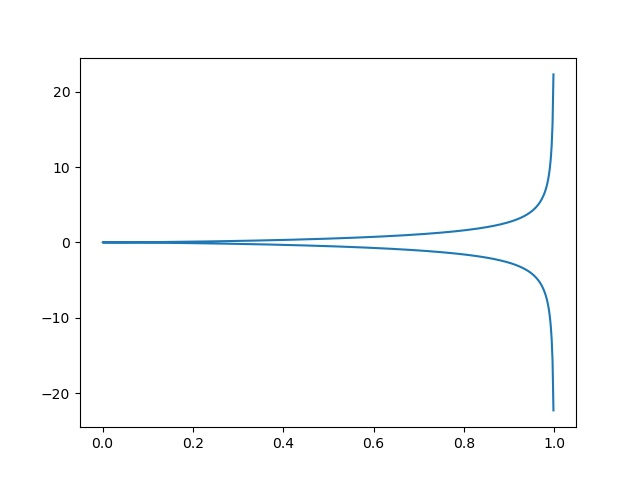

# Reparameterization and unit-length curve

## Reparameterization
A curve can have different parameterizations (even infinite ways). 

For parameterized curves $\gamma: (a, b)\rightarrow\mathbb R^n$ and $\tilde\gamma: (\tilde a, \tilde b)\rightarrow\mathbb R^n$.  
IF $\exists \phi: (a, b)\rightarrow (\tilde a, \tilde b)$ and its inverse $\phi^{-1}$ (since bijective) and $\phi, \phi^{-1}$ are both smooth and 

$$\forall s\in (\tilde a, \tilde b). \tilde\gamma(s) = \gamma(\phi(s))$$


$$\forall t\in (a, b). \gamma(t) = \tilde\gamma(\phi^{-1}(t)) = \tilde\gamma(s)$$


THEN $\tilde\gamma$ and $\gamma$ are __reparameterizations__ of each other. 

__Example__ $\gamma(t) = (\cos t, \sin t), \tilde \gamma(s)= (\sin s, \cos s)$ are both reparameterizations of each other, parameterizing the same circle $x^2 + y^2 = 1$.  
Take $\phi(s) = \pi/2 - s, \phi^{-1}(t) = \pi/2 - t$, $\gamma(t) = \gamma(\phi(s)) = \tilde\gamma(\phi^{-1}(t))$. 


### Claim 1
If $\gamma_1$ is a reparameterization of $\gamma_0$, $\gamma_2$ is a reparameterization of $\gamma_1$, then $\gamma_2$ is a reparameterization of $\gamma_0$. 

_proof_. Take map $s_0$ s.t. $\gamma_1(s_0(t)) = \gamma_0(t)$, take map $s_1$ s.t. $\gamma_2(s_1(t)) = \gamma_1(t)$. Then, let $s_2 = s_1\circ s_0$ so that $\gamma_2(s_2(t)) = \gamma_2(s_1(s_0(t))) = \gamma_1(s_0(t)) = \gamma_0(t)$. 
Note that $s^{-1}_2 = s_0^{-1}\circ s_1^{-1}$ as a composition of invertible functions, is also invertible; and composition of smooth functions is also smooth. 

### Example: [Cissoid of Diocles](https://en.wikipedia.org/wiki/Cissoid_of_Diocles)

The cissoid of Diocles (see below) is the curve 

$$\{(r, \theta)\in \mathbb R \times (-\frac{\pi}{2},\frac{pi}{2}) : r = \sin\theta\tan\theta\}$$

__Claim__ the curve can be parameterized by 

$$\gamma: (-1, 1)\rightarrow\mathbb R^2, \gamma(t) = (t^2, \frac{t^3}{\sqrt{1-t^2} })$$


_proof_. Convert the polar coordinates to Cartesian coordinates

\begin{align*}
(x, y) &= (r\cos\theta, r \sin\theta) \\
&= (\sin^2\theta, \sin^2\theta\tan\theta) \\
&= (\sin^2\theta, \sin^2 \theta \frac{\sin \theta}{\cos\theta})\\
&= (\sin^2\theta, \frac{\sin^3 \theta}{\sqrt{1-\sin^2 \theta} })\\
\end{align*}

Therefore, let $t = \sin\theta$, note that this function is bijective on $(-1, 1)\rightarrow (-\frac{\pi}{2},\frac{pi}{2})$ and both $\sin\theta$ and $arc\sin\theta$ are smooth on the specified domain. 

### Example: Ordinary cusp

A point $\mathbf p$ of $\gamma$, corresponding to a parameter value $t$, is an __ordinary cusp__ if the curve is singular at the point and $\gamma''(t)$ and $\gamma'''(t)$ are linearly indepedent and non-zero. 

__Claim__ If $\gamma$ has an ordinary cusp at a point $\mathbf p$, so does any reparam of it. 

_proof_. Let $\gamma$ be a parameterized curve and with reparameterization $\tilde\gamma$ and map $s$ s.t. $\tilde\gamma(s(t)) = \gamma(t)$. Assume that for some $t_0$ s.t. $\gamma'(t_0) = 0$, $\gamma''(t_0), \gamma'''(t_0)$ are linearly independent and non-zero. 

$$\frac{d\tilde\gamma}{dt}= \frac{d\tilde\gamma}{ds}\frac{ds}{dt} = \frac{d\gamma}{dt} = 0$$

Since $s$ is smooth, $ds/dt \neq 0\implies \frac{d\tilde\gamma}{ds} = 0$

\begin{align*}
\frac{d^2\tilde\gamma}{dt^2} &= \frac{d}{dt}(\frac{d\tilde\gamma}{ds}\frac{ds}{dt})\\
&= \frac{d^2\tilde\gamma}{ds^2}\frac{ds}{dt}\frac{ds}{dt} +\frac{d\tilde\gamma}{ds}\frac{d^2s}{dt^2}\\
&= \frac{d^2\tilde\gamma}{ds^2}(\frac{ds}{dt})^2&\frac{d\tilde\gamma}{ds}=0\\
\frac{d^3\tilde\gamma}{dt^3} &= \frac{d}{dt}(\frac{d^2\tilde\gamma}{ds^2}(\frac{ds}{dt})^2+\frac{d\tilde\gamma}{ds}\frac{d^2s}{dt^2})\\
&= \frac{d^3\tilde\gamma}{ds^3}(\frac{ds}{dt})^3 + 2\frac{d^2\tilde\gamma}{ds^2}\frac{ds}{dt}\frac{d^2s}{dt^2} + \frac{d^2\tilde\gamma}{ds^2}\frac{ds}{dt}\frac{d^2s}{dt^2} + \frac{d\tilde\gamma}{ds}\frac{d^3s}{dt^3}\\
&= \frac{d^3\tilde\gamma}{ds^3}(\frac{ds}{dt})^3 + 3\frac{d^2\tilde\gamma}{ds^2}\frac{ds}{dt}\frac{d^2s}{dt^2}&\frac{d\tilde\gamma}{ds}=0
\end{align*}

Obviously, the two vectors aren't multiple of each other. 

???quote "Source code"
    ```python
    --8<-- "mat363/scripts/reparam.py"
    ```


    

    


## Regular point and regular curves

A point $\gamma(t)$ is a __regular point__ if $\gamma'(t)\neq 0$, otherwise $\gamma(t)$ is a __singular point__.  
A parameterized curve $\gamma$ is a __regular curve__ if $\forall t \in (a, b). \gamma'(t)\neq 0$.  
Note that for the same level curve, it might be parameterized into both regular curve and non-regular curve. 

### Example of Regular Curves

__Claim__ the circle with parameterization $\gamma: \mathbb R\rightarrow \mathbb R^2, \gamma(t) = (\cos^2 t, \sin^2 t)$ is not regular


$$\gamma'(t) = (-2\cos t\sin t, 2\sin t\cos t) = (-\sin(2t), \sin(2t))$$


$$\gamma'(\frac{k}{2}\pi) = (0, 0), \forall k\in \mathbb Z$$


__Claim__ $\gamma(t) = (t, \cosh t)$ is regular

$$\gamma'(t) = (1, \sinh t)\neq 0$$


### Properties of regular curves

__Claim__ Any reparameterization of a regular curve is regular. 

_proof_. Let $\gamma(t)$ be a regular curve and $\tilde\gamma(s)$ be reparameterization with $t = \phi(s) = \phi(\phi^{-1}(t))$. Differentiating the equation will give

$$1 = \frac{d\phi}{ds}\frac{d\phi^{-1} }{dt}$$

Hence $\frac{d\phi}{ds}\neq 1$. So that 

$$\tilde\gamma'(s) = \tilde\gamma'(\phi(t))\phi'(t) \neq 0, \forall s$$


__Claim__ If $\gamma(t)$ is regular, then its arc-length function $s$ is smooth. 

_proof_. Let $\gamma(t) = (x(t), y(t))$, note that we already have 

$$s'(t) = \|\gamma'(t)\| = \sqrt{x'(t)^2 + y'(t)^2}$$

Known that square root is smooth on $(0, \infty)$, and we have that $\gamma'(t) \neq 0$ so that $x'(t)^2 + y'(t)^2 > 0$. Therefore, $s'$ is also smooth. 

## Unit-speed Reparameterization

__Claim__ A parametrized curve has a unit-speed reparametrization if and only if it is
regular.

_proof_.   
$\Rightarrow$  Let $\hat\gamma$ be a unit-speed reparametrization of $\gamma$. Since $\hat\gamma$ is unit-speed, i.e. $\forall t. \|\hat\gamma'(t)\| = 1$. It is regular, then $\gamma$ is a reparametrization of $\hat\gamma$, hence also regular.  

$\Leftarrow$  Let $\gamma$ be a regular curve, then it has a smooth arc-length function $s$. By inverse function theorem, $s$ is injective with an open interval image $s: (a,b)\rightarrow (c, d)$. Then, we take some $\tilde \gamma$ s.t. $\gamma(t) = \tilde \gamma(s(t))$. Differentiate both sides and take the arc-length, we have that

$$\gamma'(t) = \tilde\gamma(s(t))s'(t)$$

Take arc-length of both sides, 

$$\| \tilde\gamma(s(t))s'(t)\| =  \|\tilde\gamma(s(t))\||s'(t)| = \| \tilde\gamma(s(t))s'(t)\|s'(t) = \|\gamma'(t)\| = s'(t)$$

so that we can conclude that $\|\tilde\gamma(s(t))\|= 1$.

__Corollary__ A parametrized curve $\gamma$ has a unit-speed reparameterization IFF the reparametrization map $u$ follows that $u(t) = \pm s + c$, where $c$ is a constant. 

_proof_. note that 

\begin{align*}
 \|\gamma'(t)\| &= \|\tilde\gamma(u(t))u'(t)\|\\
 \|\tilde\gamma'(s(t))\||s'(t)| &= \|\tilde\gamma'(u(t))\||u'(t)|\\
 |s'(t)| &= |u'(t)|
\end{align*}

Thus, it implies that $u(t) = \pm s + c$
