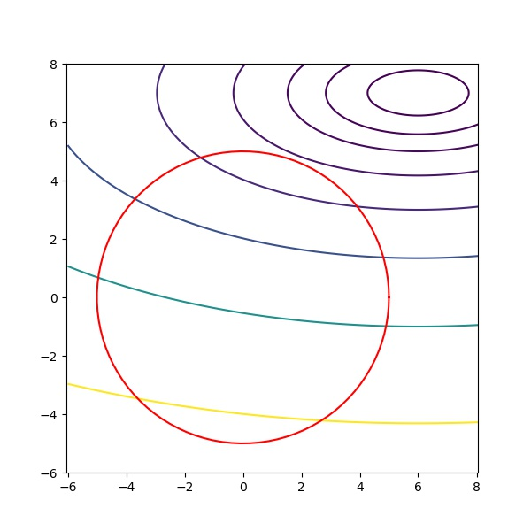

# Examples: Equality Constrained Finite Dimension Optimization


## Example 1

!!!question

    Show that maximizing logistic likelihood is equivalent to minimizing negative log likelihood.

_proof_. Note that maximizing $\mathcal L$ is equivalent to maximizing $\log(\mathcal L)$ since $\log$ is a monotone increasing function. Also, minimizing a function's negative is equivalent to maximizing the function.  
Denote $c_i = \exp(a_i^Ty+\beta), d_j = \exp(b_j^Ty+\beta)$. The likelihood for logistic classification is 

$$\mathcal L = \prod_i \frac{c_i}{1+c_i}\prod_j (1-\frac{d_j}{1+d_j}) = \prod_i \frac{c_i}{1+c_i}\prod_j \frac{1}{1+d_j}$$

Then, the negative log likelihood is 

\begin{align*}
-\log (\mathcal L) &= -\big[\sum_{i}\log(\frac{c_i}{1+c_i}) + \sum_j\log(\frac{1}{1+d_j})\big]\\
&= - \big[\sum_i -\log(\frac{1+c_i}{c_i})+ \sum_j - \log(1+d_j)\big]\\
&= \sum_i \log(\frac{1+c_i}{c_i})+ \sum_j \log(1+d_j)\\
&= \sum_i \log(1 + \exp(a_i^Ty +\beta)^{-1})+ \sum_j \log(1+\exp(b_j^Ty+\beta))\\
&= \sum_i \log(1 + \exp(-a_i^Ty -\beta))+ \sum_j \log(1+\exp(b_j^Ty+\beta))
\end{align*}

Therefore, minimize $\mathcal L$ is quivalent to maximize $-\log(\mathcal L)$

## Example 2

!!! question 

    Show that polynomial approximation can be written in a quadratic form.

_proof_. First, the equation is

$$\sum_{k=1}^m\big(g(x_k) - \sum_{i=0}^n a_i x_k^i\big)^2 = \sum_{k=1}^mg(x_k)^2 - 2\sum_{k=1}^m\big(g(x_k)\sum_{i=0}^n a_i x_k^i\big) + \sum_{k=1}^m\big(\sum_{i=0}^n a_ix_k^i\big)^2$$

The first summation is 

$$\sum_{k=1}^mg(x_k)^2 = c$$

The second summation term is

\begin{align*}
2\sum_{k=1}^m\big(g(x_k)\sum_{i=0}^n a_i x_k^i\big)&= 2\sum_{i=0}^na_i\sum_{k=1}^mg(x_k)x_k^j \\
&= 2\sum a_ib_i\\
&= 2b^Ta
\end{align*}

Define $\vec x_k = (1, x_k, x_k^2,...,x_k^{n})$, then
then last summation term is 

\begin{align*}
\sum_{k=1}^m\big(\sum_{i=0}^n a_ix_k^i\big)^2 &= \sum_{k=1}^m(\vec x_k^T a)^T(\vec x_k^T a)\\
&= \sum_{k=1}^m a^T\vec x_k\vec x_k^T a\\
&= a^T \big[\sum_{k=1}^m \vec x_k\vec x_k^T\big] a
\end{align*}

Note that $\vec x_k \vec x_k^T = Q_k$ where $q_{k_{ij}} = [x_k^{i+j}]$ and $\sum_{k=1}^m Q_k = Q$.  

Therefore, $f(a) = a^TQa - 2b^Ta + c$

## Example 3
!!! question 

    Find the regular points on $M = \{(x, y) \in\mathbb R^2\mid (x-1)^2(x-y)(x+y) = 0\}$.

Note that the set of all feasible points are $\{(x,y)\in\mathbb R^2\mid x=1\}\cup \{(x,y)\in\mathbb R^2\mid x=y\}\cup \{(x,y)\in\mathbb R^2\mid x=-y\}$.  
Let $h(x, y) = (x-1)^2(x-y)(x+y)$, then

$$\frac{\partial h}{\partial y} = -2(x-1)^2y, \frac{\partial}{\partial x} = 4x^3 - 6x^2-2xy^2+2x+2y^2$$

Set $\nabla h(x, y) =0$, we solve $\begin{cases}-2(x-1)^2y = 0\\4x^3 - 6x^2 - 2xy^2 +2x+2y^2=0\end{cases}$  
For the set $\{(x,y)\in\mathbb R^2\mid x=1\}$, obtained 

$$\begin{cases}-2(1-1)^2y = 0\\4 - 6 - 2y^2 +2+2y^2=0\end{cases}$$ 

solves to be $y\in\mathbb R$.  
For the set $\{(x,y)\in\mathbb R^2\mid x=y\}$, obtained 

$$\begin{cases}-2(y-1)^2y = 0\\4y^3 - 6y^2 - 2y^3 +2y+2y^2=0\end{cases}$$

solves to have $x=y=0$ and $x=y=1$  
For the set $\{(x,y)\in\mathbb R^2\mid x=-y\}$, obtained 

$$\begin{cases}-2(-y-1)^2y = 0\\4(-y)^3 - 6(-y)^2 + 2y^3 -2y+2y^2=0\end{cases}$$

solves to have $x=y=0$ and $x=1, y=-1$  
Combine the cases together, we obtained that the regular points are $\{(x,y)\in\mathbb R^2\mid x= 1\}\cup \{(0, 0)\}$

## Example 4

!!! question 

    Consider the minimization problem 

    $$\text{minimize}:f(x,y,z) = (x-\frac y2)^2 + \frac34(y-2)^2+z^2-3$$

    $$\text{subject to}: h_1(x,y,z)=x=0; h_2(x,y,z)=z=0$$


!!!abstract "Part (a)"
    
    Which feasible points are regular.

First, obviously the feasible points are $\{(0, y, 0)\mid y\in\mathbb R\}$. Also, note that $\nabla h_1 = (1, 0, 0), \nabla h_2 = (0, 0, 1)$ are always linearly independent. Therefore, all feasible points are regular 


!!!abstract "Part (b)"

    Find candidates for minimizer.

First note that $\nabla f = \begin{bmatrix}2x-y\\2y-x-3\\2z\end{bmatrix}$. Using the Lagrange multipliers method, let $\lambda_1, \lambda_2 \in\mathbb R$, we obtain the equations

$$\begin{bmatrix}2x-y\\2y-x-3\\2z\end{bmatrix} + \lambda_1 \begin{bmatrix}1\\0\\0\end{bmatrix} + \lambda_2 \begin{bmatrix}0\\0\\1\end{bmatrix} = 0$$

Solve the equations on the constraints $x=0, z=0$, we have 

$$\begin{cases}
-y+\lambda_1 = 0\\
2y-3 = 0\\
\lambda_2 = 0
\end{cases}$$

Which solves to have $y=2/3, \lambda_1 = 2/3, \lambda_2 = 0$
so that the candidate for minimizer is $(0, 2/3, 0)$


!!!abstract "Part (c)"
    
    Check 2nd order condition.

$\nabla^2 f = \begin{bmatrix}2&-1&0\\-1&2&0\\0&0&2\end{bmatrix}, \nabla^2 h_1 = 0, \nabla^2 h_2 = 0$,
$\nabla^2 f + \lambda_1\nabla^2 h_1 + \nabla^2 h_2 = \nabla^2 f$ is a positive semidefinite matrix on $\mathbb R^3$, hence also on $M$. By 2nd order condition, $(0,3/2, 0)$ is a minimizer.

## Example 5

!!! question 
    
    Let Q be symmetric $n\times n$ matrix with eigenvalues $\lambda_1 \leq ...\leq \lambda_n$ and consider minimize $f(x)=\frac{x^TQx}{x^Tx}$ subject to $\sum^n i(x_i^2) = 1$, find the min value in terms of $\lambda$'s.

First, note that for any $x\in\mathbb R^n, a\in\mathbb R$, 

$$f(ax) = \frac{ax^TQax}{ax^Tax} = \frac{a^2x^TQx}{a^2x^Tx} = \frac{x^TQx}{x^Tx}=f(x)$$

Therefore, let $a = \|x\|^{-1}$, we have $f(x') = f(\frac{x}{\|x\|})$ so that $f(x') = \frac{x'^TQx'}{1} = x'^TQx'$ and $\|x'\| = 1$.  
Then, because $Q$ is symmetric,

$$\nabla f(x) = (Q+Q^T)x = 2Qx$$

Let $h(x) = \sum_{i=1}^n i(x_i)^2 - 1$, so that 

$$\nabla h(x) = 2(x_1, 2x_2, ..., nx_n)$$

By Lagrange multiplier, take some $\lambda\in\mathbb R$, and we have

\begin{align*}
2Qx &= \lambda 2(x_1, 2x_2,...,nx_n)
\end{align*}


## Question 6

!!! question 

    optimize $f(x,y) = (x-6)^2 + 5(y-7)^2$ subject to $h(x, y) = x^2+y^2 - 25 =0$.


??? quote "Source code"
    ```python
    --8<-- "apm462/scripts/ecfdoq.py"
    ```


<figure markdown>
   {width="480"}
</figure>

    


!!! question 

    Show that every feasible point is regular.

$\nabla h(x, y) = (2x, 2y)$ can only be $0$ IFF $x=y=0$, while $(0,0)$ is not a feasible point. All feasible points satisfies that $(2x,2y)\neq 0$

!!! question 

    Find all candidates of the the local minimum points.


$$\nabla f(x, y) = (2(x-6), 10(y-7))$$

By Lagrange multiplier, let $\lambda\in\mathbb R$, the system of equations 

$$\begin{cases}
2(x-6) + \lambda2x = 0\\
10(y-7) + \lambda 2y = 0\\
x^2 + y^2 = 25
\end{cases}$$
