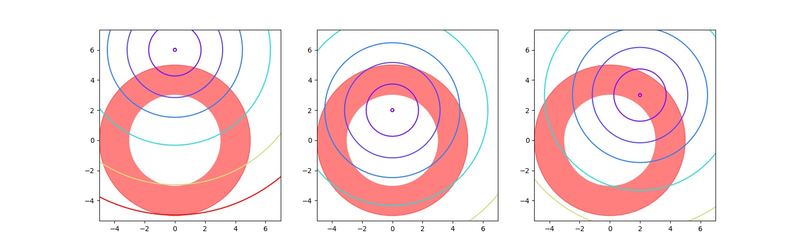

# Examples: Inequality Constrained Finite Dimension Optimization

## Example 1

!!! question

    __Claim__ Let $\lambda_i:\mathbb R^{n(n+1)/2}\rightarrow\mathbb R$ be the function that assigns to a symmetric,
    $n\times n$ matrix A its ith smallest eigenvalue for $1\leq i\leq n$. Prove that
    $\lambda_1$ is a concave function and $\lambda_n$ is a convex function over the space
    of symmetric matrices.

__lemma__ For all symmetric matrix $A, \forall x\in\mathbb R^n. \|x\| = 1, \lambda_n(A) \geq x^TAx, \lambda_1(A) \leq x^TAx$. 

_proof_. Since $A$ is symmetric, by spectral theorem we decompose $A = Q\Lambda Q^T$ where $\Lambda = diag(\lambda_n,...,\lambda_1)$ and $Q$ is orthogonal.  Then, for any $x\in\mathbb R$, 

\begin{align*}
x^TAx &= x^TQ\Lambda Q^Tx\\
&= (Q^Tx)^T\Lambda (Q^Tx)\\
&= y^T\Lambda y &\text{let } y = Q^Tx\\
&= \sum_{i=1}^n\lambda_i y_i^2
\end{align*}


\begin{align*}
\lambda_1\sum_{i=1}^n y_i^2 \leq \sum_{i=1}^n\lambda_i y_i^2\leq \lambda_n \sum_{i=1}^n y_i^2\\
\lambda_1 y^Ty \leq x^TAx \leq \lambda_n y^Ty\\
\end{align*}

Note that $y^T y = x^TQQ^Tx = x^Tx = \|x\| = 1$ so that $\lambda_1 \leq x^TAx \leq \lambda_n$


_proof_. For two arbitrary $n\times n$ symmetric matrices $A, B$, for some $c\in [0, 1]$

\begin{align*}
\lambda_n(cA + (1-c)B) &= \sup_{x\in\mathbb R^n.\|x\|=1}\{x^T(cA+(1-c)B)x\} &\text{by lemma}\\
&= \sup_{x\in\mathbb R^n.\|x\|=1}\{cx^TAx+(1-c)x^TBx\} &\text{linearity}\\
&\leq \sup_{x\in\mathbb R^n.\|x\|=1}\{cx^TAx\} + \sup_{x\in\mathbb R^n.\|x\|=1}\{(1-c)x^TBx\}\\
&= c\sup_{x\in\mathbb R^n.\|x\|=1}\{x^TAx\} + (1-c)\sup_{x\in\mathbb R^n.\|x\|=1}\{x^TBx\}\\
&= c\lambda_n(A) + (1-c)\lambda_n(B)
\end{align*}

similarly, 

\begin{align*}
\lambda_1(cA + (1-c)B) &= \inf_{x\in\mathbb R^n.\|x\|=1}\{x^T(cA+(1-c)B)x\} &\text{by lemma}\\
&\geq \inf_{x\in\mathbb R^n.\|x\|=1}\{cx^TAx\} + \inf_{x\in\mathbb R^n.\|x\|=1}\{(1-c)x^TBx\}\\
&= c\lambda_1(A) + (1-c)\lambda_1(B)
\end{align*}

By definition of concave and convex functions, $\lambda_1$ is concave, $\lambda_n$ is convex.

## Example 2

!!! question 
    
    Find the regular points for

    \begin{align*}
    \text{minimize } &f(x, y) = x+2y\\
    \text{subject to } &y^2 - x \leq 0 \\
    &(x-1)^2 + y^2 = 1\\
    &x \geq 0
    \end{align*}

First, consider the feasible points,  
Since $y^2 = 1 - (x - 1)^2$, 

\begin{align*}
1 - (x-1)^2 - x &\leq 0\\ 
-x^2 + x &\leq 0\\
x &\leq x^2
\end{align*}

Also, $x\geq 0$, implies that $x = 0$ or $x \geq1$.  
So that the set of the feasible points is 

$$S = \{(0, 0)\}\cup \{(x ,y) \mid (x-1)^2 + y^2 = 1, x\geq 1\}$$

Then, we can simply find minimizer on $\{(x ,y) \mid (x-1)^2 + y^2 = 1, x\geq 1\}$.  
Let $h(x, y) = (x-1)^2 + y^2 - 1, g(x ,y) = x$ so that $\nabla h = 2((x-1), y), \nabla g = (1, 0)$. All the points on $S$ are regular.

By Kuhn-Tucker Conditions, take $\lambda \in\mathbb R, \mu \geq 0$ 

\begin{align*}
\big(\begin{matrix}1\\2\end{matrix}\big) + \lambda \big(\begin{matrix}2(x-1)\\2y\end{matrix}\big) + \mu\big(\begin{matrix}-1\\2y\end{matrix}\big) &= 0\\
\mu (y^2 - x)&= 0\\
(x-1)^2 + y^2 &= 1
\end{align*}

If $g$ is inactive, then solving 

$$\big(\begin{matrix}1\\2\end{matrix}\big) + \lambda \big(\begin{matrix}2(x-1)\\2y\end{matrix}\big) = 0, (x-1)^2 + y^2= 1$$

gives solution $(1 + \sqrt{1/5}, \sqrt{4/5}), \lambda = -\frac{1}{2\sqrt{1/5}}$ and $(1 - \sqrt{1/5}, -\sqrt{4/5}), \lambda = \frac{1}{2\sqrt{1/5}}$ while $(1 - \sqrt{1/5}, -\sqrt{4/5})$ is not feasible. 

If $g$ is active, from graphically observations, we consider the point $(1, -1)$, which leads to the solution $\lambda = 0, \mu = 1$.   

The candidates are $(1, -1), (1 + \sqrt{1/5}, \sqrt{4/5})$


\begin{align*}
L &= \nabla^2 f + \lambda \nabla^2 h + \mu\nabla^2 g \\
&= 0 + 2\lambda I + \mu\begin{bmatrix}0&0\\0&1\end{bmatrix}
\end{align*}

If $g$ is inactive, then 

$$L = 2\lambda I = -\frac{1}{\sqrt{1/5}}I$$

is not positive semidefinite on $S$.

If $g$ is active, then 

$$L = \begin{bmatrix}0&0\\0&1\end{bmatrix}$$

is positive semidefinite on $S$. 

The global minimizer is $(1, -1)$ and the minimum is $1 - 2 = -1$ 

## Example 3

!!! question 

    maximize $f(x, y) = xy$ on $x^2 + y^2 \leq 1, x, y > 0$.  
    FONC to find candidates.

Note that maximize $xy$ is equivalent to minimize $-xy$, 
Since $x, y > 0$ are inactive, let $h(x, y) = x^2 + y^2$, note that $h$ will be active, otherwise $f(x, y) =-x y$ have no global minimum. Therefore, take $\lambda\in\mathbb R$, solves

\begin{align*}
\nabla f + \lambda \nabla h = \begin{pmatrix}-y\\-x\end{pmatrix} + \lambda \begin{pmatrix}2x\\2y\end{pmatrix} &= 0\\
x^2 + y^2 &= 1
\end{align*}

substitute $x = \pm \sqrt{1-y^2}, \lambda = \frac{y}{2\sqrt{1-y^2}}$, then $\sqrt{1-y^2} \pm \frac{y^2}{\sqrt{1-y^2}} = 0$, which gives four solutions $(\pm \sqrt{1/2}, \pm\sqrt{1/2})$, and the only feasible solution is $(\sqrt{1/2}, \sqrt{1/2}), \lambda = 1/2$

_SOC to check_

By SOC, 

$$L = \nabla^2 [-xy] + \frac{-1}{2}\nabla^2 [x^2 + y^2] = \begin{bmatrix}0&-1\\-1&0\end{bmatrix} + I= \begin{bmatrix}1&-1\\-1&1\end{bmatrix}$$

Note that $L$ is positive semidefinite everywhere as 

$$\begin{bmatrix}x&y\end{bmatrix} \begin{bmatrix}1&-1\\-1&1\end{bmatrix}\begin{bmatrix}x\\y\end{bmatrix} = (x- y)^2 \geq 0$$

Therefore, $(\sqrt{1/2}, \sqrt{1/2})$ is the local minimizer of $-xy$, hence maximizer of $xy$

Let $x = r\sin\theta, y = r\cos\theta$ so that the problem becomes 
maximize $r^2\sin\theta\cos\theta$ on $|r| \leq 1, \theta\in (0, \pi/2)$, which we can farther assume $r = 1$ since $\sin\theta\cos\theta > 0$ for $0 < \theta<\pi/2$. Therefore, the problem becomes maximizing $\sin\theta\cos\theta$ on $0<\theta <\pi/2$.  
Note that 


\begin{align*}
\frac{d^2}{d^2\theta}\sin\theta\cos\theta &= \frac12\frac{d}{d\theta}\frac{d}{d\theta}\sin(2\theta) &\text{double angle formula}\\
&= -2\sin(2\theta)
\end{align*}


$-2\sin(2\theta) < 0$ for $0 < \theta < \pi/2$ so that the function is concave.  
Therefore, set 

$$\frac{d}{d\theta}\sin\theta\cos\theta = \cos(2\theta) = 0$$

solve to be $\theta = \frac{\pi}{4}$ on $0 < \theta < \pi/2$ and is a maximizer. Therefore, $x = \sin\frac{\pi}{4} = \sqrt{\frac12}, y = \cos\frac{\pi}4 = \sqrt{\frac12}$ is the maximizer for $xy$

## Example 4
!!! question 

    \begin{align*}
    \text{minimize} f(x, y) = (x-a)^2 + (y-b)^2\\
    \text{on } g_1(x, y) = x^2 + y^2 \geq 9, g_2(x, y) = x^2 + y^2 \leq 25
    \end{align*}

??? quote "Source code"
    ```python
    --8<-- "apm462/scripts/icfdoq.py"
    ```


<figure markdown>
   {width="1280"}
</figure>
    
!!! question 

     Show that every feasible point is regular

The set of feasible points is $S = \{(x, y)\mid 9 \leq x^2 + y^2 \leq 25\}$, a.k.a. a donut. Note that $g_1 = g_2$ so that to make sure their derivative are not linearly independent, only one of them can be active for some $a, b$. Then, note that $\nabla g = (2x, 2y)\neq 0$ for $(x,y)\neq 0$, therefore, on our feasible set, all points are regular. 

!!! question 

    Find candidates for local minimum points using FONC.

The Kuhn-Tucker conditions gives 

\begin{align*}\begin{pmatrix}2(x-a)\\2(y-b)\end{pmatrix} + \mu_1\begin{pmatrix}2x\\2y\end{pmatrix}+\mu_2\begin{pmatrix}-2x\\-2y\end{pmatrix} &= 0\\
\mu_1(x^2 + y^2 - 25)&= 0\\
\mu_2(-x^2 - y^2 + 9)&= 0
\end{align*}


#### Case 1
Suppose both of them are inactive, then the minimizer is $(a, b), f(a, b) = 0$, and for this solution to be feasible, $(a, b)$ satisfies that $9 \leq a^2 + b^2 \leq 25$   


#### Case 2
Suppose $g_1$ is active, solves 

\begin{align*}
2(x-a) + 2\mu_1x &= 0\\
2(y-b) + 2\mu_1y &= 0\\
x^2 + y^2 - 25 &= 0
\end{align*}

solves to be one of 

$$(5\frac{a}{\sqrt{a^2+b^2}}, 5\frac{b}{\sqrt{a^2+b^2}}), \mu_1 = \frac{\sqrt{a^2 +b^2}}{5}-1$$

$$(-5\frac{a}{\sqrt{a^2+b^2}}, -5\frac{b}{\sqrt{a^2+b^2}}), \mu_1 = \frac{-\sqrt{a^2 +b^2}}{5}-1$$

Note that $\mu_1 \geq 0$, so the only solution is $(5\frac{a}{\sqrt{a^2+b^2}}, 5\frac{b}{\sqrt{a^2+b^2}}), \mu_1 = \frac{\sqrt{a^2 +b^2}}{5}-1$ and this only holds when $a^2+b^2 \geq 25$


#### Case 3
Suppose $g_2$ is active, solves 

\begin{align*}
2(x-a) - 2\mu_2x &= 0\\
2(y-b) - 2\mu_2y &= 0\\
x^2 + y^2 - 9 &= 0
\end{align*}

solves to be 

$$(3\frac{a}{\sqrt{a^2+b^2}}, 3\frac{b}{\sqrt{a^2+b^2}}), \mu_2 = 1- \frac{\sqrt{a^2 +b^2}}{3}$$

$$(-3\frac{a}{\sqrt{a^2+b^2}}, -3\frac{b}{\sqrt{a^2+b^2}}), \mu_2 = 1 + \frac{\sqrt{a^2 +b^2}}{3}$$

Note that $\mu_2\geq 0$, so that $(3\frac{a}{\sqrt{a^2+b^2}}, 3\frac{b}{\sqrt{a^2+b^2}}), \mu_2 = 1- \frac{\sqrt{a^2 +b^2}}{3}$ only holds when $a^2 + b^2 \leq 9$

#### Case 4
$g_1, g_2$ cannot be active at the same time, as discussed previously

!!! question 

    find the tangent space.

If $g_1$ is active, for $x_0 = \frac{5}{\sqrt{a^2+b^2}}(a, b)$, $T_{x_0}M = \{v\in\mathbb R^2 \mid 2\times\frac{5}{\sqrt{a^2+b^2}}\begin{pmatrix}a\\b\end{pmatrix}\cdot v = 0\} = \{v\in\mathbb R^2 \mid av_1+bv_2 = 0\}$.  

If $g_2$ is active, for $x_0 = \frac{3}{\sqrt{a^2+b^2}}(a, b)$ or $x_0 = -\frac{3}{\sqrt{a^2+b^2}}(a, b)$, it is still a scaled vector of $(a, b)$, hence $T_{x_0}M = \{v\in\mathbb R^2 \mid av_1 + bv_2 = 0\}$.  

If $g_1, g_2$ are both inactive, then is unconstrained and the tangent space is $\mathbb R^2$. 

!!! question 

    Check with SOC.


$$L = \nabla^2 f + (\mu_1 + \mu_2)\nabla^2 g = 2I + 2\mu_1I +(-2\mu_2)I = 2(1+\mu_1 - \mu_2)I$$


When $9 < a^2 + b^2 < 25, \mu_1=\mu_2 =0$, 

$$L = 2I$$

is positive semidefinite everywhere, hence $(a,b)$ is a local minimizer. 

When $\mu_1 = \frac{\sqrt{a^2+b^2}}{5} - 1, \mu_2 = 0, a^2+b^2 \geq 25$, 

$$L = 2(1+ \frac{\sqrt{a^2+b^2}}{5}-1) I = 2(\frac{\sqrt{a^2+b^2}}{5}) I$$

is positive semidefinite everywhere, hence $\frac{5}{\sqrt{a^2+b^2}}(a, b)$ is a local minimizer

When $\mu_2 = 1 - \frac{\sqrt{a^2+b^2}}{3}, \mu_1= 0, a^2 + b^2 \leq 9$, 

$$L = 2(1 - 1+\frac{\sqrt{a^2+b^2}}{3}) = 2(\frac{\sqrt{a^2+b^2}}{3}) I$$

is positive semidefinite everywhere, hence $\frac{3}{\sqrt{a^2+b^2}}(a, b)$ is a local minimizer

When $\mu_2 = 1 + \frac{\sqrt{a^2+b^2}}{3}, \mu_1= 0, a^2 + b^2 \leq 9$, 

$$L = 2(1 - 1 - \frac{\sqrt{a^2+b^2}}{3}) = -2(\frac{\sqrt{a^2+b^2}}{3}) I$$

is negative semidefinite everywhere, hence is not a local minimum. 

__In summary__ the local minimizer is 

$$\begin{cases}
(a, b) &9 < a^2 + b^2 < 25\\
\frac{3}{\sqrt{a^2+b^2}}(a, b) &a^2 + b^2 \leq 9\\
\frac{5}{\sqrt{a^2+b^2}}(a, b) &a^2+b^2 \geq 25
\end{cases}$$

## Example 5
!!! question 

    For $Q$ be an $n\times n$ positive symmetric definite matrix, $a, b\in\mathbb R^{n>0}, c \in\mathbb R^{>0}$.  
    minimize $\frac{1}{2}x^TQx - b^Tx$ subject to $a^Tx \leq c, x > 0$.

Take $\mu_0$ and Kuhn-Tucker conditions gives equations

\begin{align*}
Qx - b + \mu_0 a  &= 0\\
\mu_0(a^Tx - c) &= 0\\
\mu^T x &= 0
\end{align*}

Because all the constraints on $x > 0$ are inactive, they will be excluded from considerations. 

Suppose unconstrained, then the minimizer for the quadratic form will be $x^* = Q^{-1}b$, since $Q$ is symmetric positive definite, $Q^{-1}$ is also symmetric positive definite, also $b > 0$ so that $x^* > 0$, hence such minimizer can exist. 

Suppose $\mu_0 \neq 0, \mu_1,...,\mu_n = 0$, then we have 

$$Qx - b + \mu_0 a = 0, a^Tx = c$$

it can be solved as 

\begin{align*}
x &= Q^{-1}(b-\mu_0 a)\\
a^TQ^{-1}(b-\mu_0 a) &= c\\
a^TQ^{-1}b - c &= a^TQ^{-1}a \mu_0\\
\mu_0 &= \frac{a^TQ^{-1}b - c}{a^TQ^{-1}a}\\
x&= Q^{-1}(b - \frac{a^TQ^{-1}b - c}{a^TQ^{-1}a} \times a)
\end{align*}

Note that since $\mu_0 > 0$, we must have $a^TQ^{-1}b > c$. 


Also, note that for any $x$,

$$L(x) = Q$$

Since $Q$ is positive definite everywhere, any candidate will be a minimizer. 

__In summary__ The minimizer is 

$$\begin{cases}
Q^{-1}b &a^TQ^{-1}b < c\\
Q^{-1}(b - \frac{a^TQ^{-1}b - c}{a^TQ^{-1}a}) &a^TQ^{-1}b \geq c
\end{cases}$$

## Example 6
!!! question 

    minimize $f(x) = -\sum_{i=1}^n \log(a_i+x_i)$ subject to $x_1,...,x_n\geq 0, \sum x_i = 1$.


!!!abstract "Part (a)"

    Show $x_i = \max\{0, \frac{1}{\lambda}-a_i\}$ for some $\lambda \in\mathbb R$.
 
Take $\lambda\in\mathbb R, \mu = (\mu_1,...,\mu_n)\in\mathbb R^{n\geq 0}$, by  Kuhn-Tucker conditions 

\begin{align*}
 -\frac1{a_i+x_i} + \lambda - \mu_i &= 0\\
 \mu_ix_i &= 0\\
\sum_{i=1}^n x_i  &= 1
\end{align*}

for $i = 1,...,n$  

for some $i \in \{1,..,n\}$, if $\mu_i$ is active, then $x_i = 0$, $\lambda = \frac{1}{a_i} + \mu_i$.  
if $\mu_i$ is inactive, then $\lambda - \frac{1}{a_i + x_i} = 0\Rightarrow x_i = \frac{1}{\lambda} - a_i$,  
by our constraint, $x_i \geq 0$ so that $x_i = \max\{0, \frac1{\lambda} - a_i\}$


!!!abstract "Part (b)"
    
    Show that $\lambda$ is unique for each $a$.

Take some $\lambda_1$ s.t. $\sum_{i=1}^n \max\{0, \frac{1}{\lambda_1} - a_i\} = 1$, For any $\lambda_2 \neq \lambda_1$,

Suppose $\frac{1}{\lambda_2} < \frac1{\lambda_1}$, then $\max\{0, \frac{1}{\lambda_2} - a_i\}  \leq \max\{0, \frac{1}{\lambda_1} - a_i\}$. Also, to make $\sum_{i=1}^n \max\{0, \frac{1}{\lambda_1} - a_i\} = 1$, there exists some $j \in \{1,...,n\}, \frac{1}{\lambda_1} - a_j > 0$,  so that $\max\{0, \frac{1}{\lambda_2} - a_j\} < \frac{1}{\lambda_1} - a_j$, therefore 

$$\sum_{i=1}^n \max\{0, \frac{1}{\lambda_2} - a_i\} < \sum_{i=1}^n \max\{0, \frac{1}{\lambda_1} - a_i\} = 1$$


Suppose $\frac{1}{\lambda_2} > \frac1{\lambda_1}$, then $\max\{0, \frac{1}{\lambda_2} - a_i\}  \geq \max\{0, \frac{1}{\lambda_1} - a_i\}$, similarly pick $j$ s.t. $\max\{0, \frac{1}{\lambda_2} - a_i\}  > \frac1{\lambda_1} - a_i$ so that 

$$\sum_{i=1}^n \max\{0, \frac{1}{\lambda_2} - a_i\} >\sum_{i=1}^n \max\{0, \frac{1}{\lambda_1} - a_i\} = 1$$

Therefore, I have shown that any other $\lambda_2$ will not satisfy the constraint, hence such $\lambda$ is unique.

## Example 7

!!! question 

    Consider $f(a, b) = \min_{(x,x^2)\in\mathbb R^2}|(x-a, y-b)|^2$. Write the FOC for a minimizer $(x_0, y_0)$.

For each given $(a, b)$, define 

$$F(x) = |(x-a, y-b)|^2 = (x-a)^2 + (x^2-b)^2$$

so that $\min_{x\in\mathbb R}F(x) = \min_{(x,x^2)\in\mathbb R^2}|(x-a, y-b)|^2$ and the derivative of $F$ is given as

$$\frac{dF}{dx} = 2(x-a) + 4x^3 - 4bx$$

since $F$ is defined on $\mathbb R$, the FOC is that 

$$2(x_0-a) + 4x_0^3 - 4bx_0 = 0$$


!!! question 

    Find the cubic equation $x_0$ must satisfy.

$x_0$ must satisfy the FOC, a.k.a. 

$$4x_0^3 + (2-4b)x_0 - 2a = 0$$


!!! question 

    Find conditions on $x_0$ that guarantee that $(x_0, x^2_0)$ is a local minimizer.

Using SOC, note that 

$$\frac{d^2F}{dx^2} = 12x^2 + 2-4b$$

is postive semidefinite iff $12x^2 + 2 - 4b > 0\Rightarrow |x| > \sqrt{\frac{2b-1}{6}}$

## Example 8
!!! question 

    Let $A$ be $m\times n$ matrix and $b \in\mathbb R^m, c\in\mathbb R^n$, consider the "primal problem".

    $$\max_{Ax \leq b, x\geq 0} c^Tx$$

    and the "dual problem

    $$\min_{A^Tp \geq c, p\geq 0}b^Tp$$


!!! abstract "Part (a)"

    Write the FONC for the primal optimal solution $x^*$.


First, maximizing $c^Tx$ is equivalent of minimizing $-c^Tx$.  
Let $f(x) = -c^Tx, \nabla f(x) = -c$.  
Let $g_i(x) = A_{i\cdot}x - b_i$ for $i=1,2,...,m$ where $A_{i\cdot}$ is the $i$th row of $A, \nabla g_i(x) = A_{i\cdot}$.  
Let $h_j(x) = -x$ for $j = 1,2,...,n, \nabla h_j(x) = -e_j$ where $e_j$ is the elementary vector.  

Using FNOC, take $p_{1*},..., p_{m*} \geq 0, \mu_1,...,\mu_n\geq 0$

\begin{align*}
\nabla f(x_*) + \sum_{i=1}^m p_{i*} \nabla g_i(x_*) + \sum_{i=1}^n
\mu_i\nabla h_i(x_*) = 0\\
-c + \sum_{i=1}^m p_{i*} A_{i\cdot} - \sum_{i=1}^n \mu_i e_i = 0\end{align*}

Let $p_* = (p_{1*},..., p_{m*})\in\mathbb R^m, \mu = (\mu_1,...,\mu_n)\in\mathbb R^n$, the FNOC can be simply written as

\begin{align*}
-c + A^Tp_* - \mu &= 0\\
p_* &\geq 0\\
\mu &\geq 0\\
(Ax_* - b)^Tp_* &= 0\\
\mu^Tx_* &= 0
\end{align*}

!!! abstract "Part (b)"

    Show that the Lagrange mutipliers $p_*$ for the optimal primal $x_*$ satisfy the constraints of the dual problem.

For some Lagrange multiplier $p_*$, we have
$A^Tp_* = \mu+c$ and since $\mu\geq 0$, $A^Tp_* \geq c$, also $p_*\geq 0$, which satisfy the constrained of the dual problem.

!!! abstract "Part (c)"

    Use the comlementary slackness conditions for the primal problem to show that $p_*^TAx_* = p_*^Tb$.

For some Lagrange multiplier $p_*$, we have 

\begin{align*}
(Ax_* - b)^Tp_* &= 0\\
x_*^TA^Tp_* - b^Tp_* &= 0\\
x_*^TA^Tp_* &= b^Tp_*
\end{align*}

taking transpose on both sides,

$$p_*^TAx_* = p_*^Tb$$


!!! abstract "Part (d)"

    Write the FONC for the dual optimal solution $p^*$.


Let $f(p) = b^Tp, \nabla f(p) = 0$,  
Let $g(p) = - A^Tp + c, \nabla g(p) = -A$  
Let $h(p) = -p, \nabla p = -I$  
Using FNOC, take $x_*\in\mathbb R^n, v\in\mathbb R^m$, we have 

\begin{align*}
b - Ax_* - v &= 0\\
x_* &\geq 0\\
v&\geq 0\\
(-A^Tp_*+c)^Tx_* &= 0\\
v^Tp_* &= 0
\end{align*}


!!! abstract "Part (e)"

    Show that the Lagrange mutipliers $x_*$ for the optimal dual $p_*$ satisfy the constraints of the primal problem.

For some Lagrange multiplier $x_*$, we have
$Ax_* = b-v$ and since $v\geq 0$, $Ax_* \leq b$, also $x_*\geq 0$, which satisfy the constrained of the dual problem. 

!!! abstract "Part (f)"

    Use the comlementary slackness conditions for the dual problem to show that $p_*^TAx_* = c^Tx_*$.

For some Lagrange multiplier $x_*$, we have 

\begin{align*}
(-A^Tp_*+c)^Tx_* &= 0\\
-p_*^TAx_* + c^Tx_* &= 0\\
c^Tx_* &= p_*^TAx_*
\end{align*}


!!! abstract "Part (g)"

    Use the complementary slackness conditions to show that $c^Tx_* = p_*^Tb$.

combine part(c) and part(f), we have 

$$c^Tx_* = p_*^TAx_* = p_*^Tb$$


## Example 9

!!! question

    Consider the "continuous" optimization problem

    \begin{align*}
    \text{minimize}\quad&\int c(x)h(x)dx\\
    \text{subject to} \quad& 0\leq h(x)\leq 1\\&\int h(x)dx = 1
    \end{align*}

    The solution is given in the way that $I_s = \{x\mid x(x) \leq s\}$, the volume $|I_s| = \int_{I_s}1dx$ of $I_s$ is an increasing function of $s$, choose $s_0$ s.t. $|I_{s_0}| = 1$, the optimal solution is

    $$h(x) = \mathbb I(x\in I_{s_0})$$

    In economic terms, $h(x)$ is the density of a given resource as a function of the location $x$ and $c(x)$ is the cost of the resource at location $x$. This problem is about wanting to accumulate total of 1 unit of the resource in such a way as to minimize the cost.

    Explain why the solution makes sense in economic terms.

We are collecting all resources lower than some cost $s_0$ and with this cost, we are able to collect exactly enough resources (1 unit of recourses). 

_Consider the discrete problem_

\begin{align*}
\min \quad&\sum_{i=1}^nc_i h_i\\
\text{subject to} \quad &0\leq h_i\leq 1\\
&\sum_{n}h_i = N
\end{align*}

_where $n\geq N$ and $N\in\mathbb N$, $c_i$'s are all distinct.  
Prove that except for possibly one $i$, $h_i$ is $0$ or $1$ for all other $i$'s._

Let $f(h) = c^Th$ where $c = (c_1,...,c_n), h = (h_1,...,h_n), 0\leq h \leq 1, \nabla f(h) = c$,  
Let $g(h) = \vec 1^Th$ where $\vec 1$ is the $\mathbb R^n$ vector with all entries being 1, $\nabla g(h) = \vec 1$,  
Note that $0 \leq h \leq 1$ gives to constraints $-h \leq 0, h\leq 1$.  
By Kuhn-Tucker conditions, take $\lambda\in\mathbb R, \mu_1\in\mathbb R^n, \mu_2\in\mathbb R^n$. 

\begin{align*}
c + \lambda \vec 1 + \mu_1 - \mu_2 &= \vec 0\\
\sum_{i=1}^n h_i = \vec 1^Th &= N\\
\mu_1^Th &= 0\\
\mu_2^T(1-h) &= 0\\
\mu_1 &\geq 0\\
\mu_2 &\geq 0
\end{align*}

Suppose for some $h_i, h_j, 0 < h_i < h_j < 1$ then we must have $\mu_{1i} = \mu_{2i} = \mu_{1j} = \mu_{2j} = 0$, then note that 

$$c_i + \lambda + \mu_{1i} - \mu_{2j} = c_i + \lambda = 0$$


$$c_j + \lambda + \mu_{1j} - \mu_{2j} = c_j + \lambda = 0$$

implies that $c_i = c_j$, contradicts with the fact that all $c_i$'s are distinct.   
Therefore, by contradiction, the statement is proven. 
