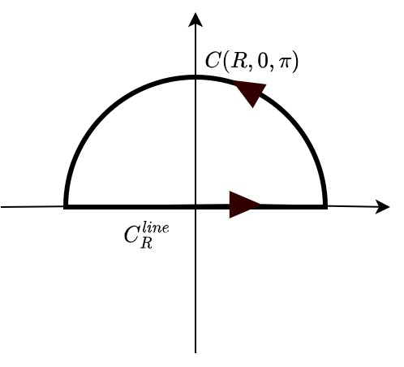

# Jordon's Lemma

## Claim 1
If $zf(z)\rightarrow^{unif.} 0$ as $z\rightarrow\infty$, then 

$$\lim_{R\rightarrow\infty} \int_{C(R,0,\pi)} f(z)dz = 0$$

where $C(R,0,\pi)$ is the top semicircle arc of radius $R$ centered at $0$, rotated ccw. 

_proof_. Note that on the arc, $|z| = R$ so that $|zf(z)| = R |f(z)| \leq \kappa(R)$ so that 
$|f(z)| \leq \frac{\kappa(R)}{R}$. 

Let $\epsilon > 0$. By definition of $\kappa$, take $S$ s.t. $\forall R > S. \kappa(R) < \frac{\epsilon}{\pi}$. Then, with ML inequality we have

$$|\int_{C(R,0,\pi)} f(z)dz| \leq \pi R \frac{\kappa(R)}{R} < \epsilon$$

### Example 1
Compute $\int_{-\infty}^{\infty} (x^2 + 1)^{-1}dx$

​<figure markdown>
{width="480"}
</figure>

For any $R > 0$, expanding $f$ to the complex domain, and consider 

$$\int_{C} \frac{1}{z^2 + 1}dz = 2\pi i Res(f, i) = 2\pi i \frac{1}{2 i} = \pi $$
Also we have 

$$\int_{C} f(z)dz = \int_{C^{line}_R} f(z)dz + \int_{C(R,0,\pi)}f(z)dz$$

Therefore, we can write

$$\lim_{R\rightarrow\infty} \int_{C} \frac{1}{z^2 + 1}dz = \lim_{R\rightarrow\infty} \int_{C^{line}_R} f(z)dz + \lim_{R\rightarrow\infty} \int_{C(R,0,\pi)}f(z)dz = \pi$$

Consider the latter term, because $zf(z) = \frac{z}{z^2+1}\rightarrow^{unif} 0$ as $z\rightarrow\infty$, so that $\lim_{R\rightarrow\infty} \int_{C(R,0,\pi)}f(z)dz = 0$
Note that 

$$\lim_{R\rightarrow\infty} \int_{C^{line}_R} f(z)dz = \lim_{R\rightarrow\infty} \int_{-R}^R f(x)dx = \int_{-\infty}^\infty f(x)dx$$

so that 

$$\pi = \int_{-\infty}^\infty \frac{1}{x^2 + 1}dx + 0$$

## Jordon's Lemma

IF $f(z)\rightarrow^{unif} 0$ as $z\rightarrow \infty$ and $k > 0$ then 

$$\lim_{R\rightarrow\infty} \int_{C(R, 0, \pi) } e^{ikz}f(z)dz = \lim_{R\rightarrow\infty} \int_{C(R, -\pi, 0) }e^{ikz}f(z)dz = 0$$

_proof_. parameterize $C(R,0,\pi)$ with $c(t):[0,\pi] \rightarrow \mathbb C, c(t)= Re^{it}$

\begin{align*}
I_R&:=|\int_{C(R,0,\pi)} e^{ikz} f(z)dz|\\
 &= |\int_0^\pi e^{ikRe^{it}} f(Re^{it}) iRe^{it}dt|\\
&= R|\int_0^\pi e^{kR(i\cos t- \sin t)} f(Re^{it}) ie^{it}dt|\\
&\leq R \int_0^\pi |e^{kR(i\cos t)}|e^{-kR\sin t}||ie^{it}| |f(Re^{it})| dt\\
&= R \int_0^\pi e^{-kR\sin t}|f(Re^{it})| dt\\
&\leq   R \kappa(R) \int_0^\pi e^{-kR\sin t}  dt\\
&= R \kappa(R) 2 \int_0^{\pi/2} e^{-kR\sin t}  dt\\
&\leq R \kappa(R) 2 \int_0^{\pi/2} e^{-kR\frac{2t}{\pi}}  dt &\sin t\geq \frac{2t}{\pi}. \forall t \in [0, \pi/2]\\
&= 2R\kappa(R) \frac{\pi (1-e^{-\pi R})}{2Rk}\\
&\leq \frac{\pi}{k} \kappa(R)
\end{align*}

Since $\lim_{R\rightarrow\infty} \kappa(R) = 0, \lim_{R\rightarrow\infty} |I_R|  = 0$

The proof for the second equation is similar

### Example

$\int_{-\infty}^\infty \frac{\cos x}{x^2+1}$

First, expand to complex domain, 

$$\frac{\cos z}{z^2+1} = \frac{1}{2}\frac{e^{iz}}{x^2+1} + \frac{1}{2}\frac{e^{-iz}}{x^2+1}$$

Let $f_1(z) = \frac{e^{iz}}{x^2+1}, f_2(z) = \frac{e^{-iz}}{x^2+1}$. We can compute $f_1$ on the top semicircle, and $f_2$ on the bottom semicircle. 

\begin{align*}
\lim_{R\rightarrow\infty}\oint_C f_1(z)dz &= \lim_{R\rightarrow\infty}\int_{C^{line}_R} f_1(z)dz + \lim_{R\rightarrow\infty}\int_{C(R, 0, \pi)} f_1(z)dz\\
Res(f_1, i) &= \int_{-\infty}^\infty \frac{e^{iz}}{x^2+1}dx + \lim_{R\rightarrow\infty}\int_{C(R, 0, \pi)} e^{iz}\frac{1}{x^2+1}dz\\
2\pi i\lim_{z\rightarrow i} \frac{e^{iz}}{z+i} &= \int_{-\infty}^\infty \frac{e^{iz}}{x^2+1}dx + 0&\text{Jordon's Lemma}\\
\frac{\pi}{e} &=  \int_{-\infty}^\infty \frac{e^{iz}}{x^2+1}dx
\end{align*}

Simiarly,

\begin{align*}
\lim_{R\rightarrow\infty}\oint_C f_2(z)dz &= \lim_{R\rightarrow\infty}\int_{-C^{line}_R} f_2(z)dz + \lim_{R\rightarrow\infty}\int_{C(R, -\pi, 0)} f_2(z)dz\\
Res(f_2, -i) &= -\int_{-\infty}^\infty \frac{e^{-iz}}{x^2+1}dx + \lim_{R\rightarrow\infty}\int_{C(R, -\pi, 0)} e^{-iz}\frac{1}{x^2+1}dz\\
2\pi i\lim_{z\rightarrow -i} \frac{e^{-iz}}{z-i} &= -\int_{-\infty}^\infty \frac{e^{-iz}}{x^2+1}dx + 0&\text{Jordon's Lemma}\\
\frac{\pi}{e} &=  \int_{-\infty}^\infty \frac{e^{-iz}}{x^2+1}dx
\end{align*}

Therefore, 

$$\frac{\cos z}{z^2+1} = \frac{1}{2}(2\frac{\pi}{e}) = \frac{\pi}{e}$$

Another convinient way is to notice 

$$\int_{-\infty}^\infty \frac{e^{ix}}{x^2+1}dx =\int_{-\infty}^\infty \frac{\cos x}{x^2+1}dx + i\int_{-\infty}^\infty \frac{\sin x}{x^2+1}dx $$

Because $\frac{\sin x}{x^2+1}$ is odd around 0, $\int_{-\infty}^\infty \frac{\sin x}{x^2+1}dx = 0$ and we are left with 

$$\frac{\pi}{e} = \int_{-\infty}^\infty \frac{e^{ix}}{x^2+1}dx =\int_{-\infty}^\infty \frac{\cos x}{x^2+1}dx$$
