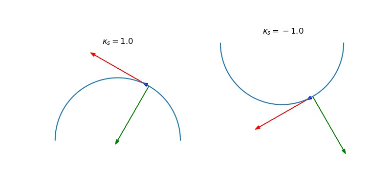

# Plane Curve

## Signed curvature

Suppose $\gamma: \mathbb R\rightarrow \mathbb R^2$ is a unit-speed curve, let $\mathbf t = \gamma'$ be the tangent vector of $\gamma$, and $\mathbf t$ is also a unit vector. Therefore, there are two unit vectors $\mathbf n_s$ and $-\mathbf n_s$ that is perpendicular to $\mathbf t$. By left-handed rules, we conventionally define $\mathbf n_s$ be the __signed unit normal__ of $\gamma$, by rotating $\mathbf t$ c.c.w by $\pi/2$, in other word

$$\mathbf n_s = \begin{bmatrix}0&-1\\1&0\end{bmatrix}\mathbf t$$


Then, note that $\mathbf t' = \gamma''$ is perpendicular to $\mathbf t = \gamma'$. Thus there exists $\kappa_s$ s.t. $\gamma'' = \kappa_s \mathbf n_s$, define $\kappa_s$ be the __signed curvature__ of $\gamma$, since we have that the curvature $\kappa = \|\gamma''\| = \|\kappa_s \mathbf n_s\| = |\kappa_s|$. 

Using this definition, if the curve is to the left of the tangent line, then $\kappa_s > 0$, if to the right of the tangent line, then $\kappa_s < 0$.


For a regular plane curve $\gamma(t)$ (not necessarily unit-speed), we can define unit tangent vector $\mathbf t$, signed unit normal $\mathbf n_s$ and signed curvature $\kappa_s$ 
at each point $\gamma(t)$ via unit-speed parameterizations $\tilde \gamma(s)$, where $s(t)$ is the arc-length. Thus, we have that 

$$\frac{d\mathbf t}{dt} = \frac{d\mathbf t}{ds}\frac{ds}{dt} = \kappa_s \mathbf n_s \|\gamma'\|$$


### Example: signed curvature on a circle
Let $\gamma(t) = (\cos t, \sin t), = \gamma'(t) = (-\sin t, \cos t)$. 

???quote "Source code"

    ```python
    --8<-- "mat363/scripts/plane_curve.py"
    ```


​<figure markdown>
{width="720"}
</figure>

### Claim 1
If $\gamma$ is a unit-speed plane curve, then $\mathbf n'_s = -\kappa_s \mathbf t$.

_proof_. Note that 

\begin{align*}
\gamma'' &= \kappa_s \mathbf n_s\\
\gamma''&= \kappa_s\begin{bmatrix}0&-1\\1&0\end{bmatrix}\mathbf t\\
\begin{bmatrix}0&1\\-1&0\end{bmatrix}\mathbf \gamma''&=\kappa_s \mathbf t\\
-\mathbf n_s' &= \kappa_s \mathbf t
\end{align*}

## Turning angle

Geometrically, the signed curvature can be interpreted as the rate at which the tangent vector rotates. If $\gamma$ is a unit-speed curve, the direction of the tangent vector $\gamma'(s)$ is measured by the angle $\varphi(s)$ s.t. 

$$\gamma'(s) = (\cos\varphi(s), \sin\varphi(s))$$

Note that $\cos, \sin$ are periodic functions for $2\pi$, hence $\varphi$ is not unique. But we can have some guarantee so that $\varphi$ is always smooth. 

The __turning angle__ of $\gamma$ determined by $\varphi(s_0) = \varphi_0$ is a smooth function $\varphi:(a,b)\rightarrow\mathbb R$ s.t. 

$$\forall s\in (a, b). \gamma'(s) = (\cos\varphi(s), \sin\varphi(s)), \varphi(s_0) = \varphi_0$$


### Existence and Uniqueness

__Theorem__ Let $\gamma:(a, b) \rightarrow \mathbb R^2$ be a unit-speed plane curve, fix $s_0\in(a, b), \varphi_0\in\mathbb R$ s.t. 

$$\gamma'(s_0) = (\cos\varphi_0, \sin\varphi_0)$$

Then, $!\exists \varphi: (a, b)\rightarrow \mathbb R$ s.t. $\varphi$ is smooth and $\varphi(s_0) = \varphi_0$ and $\forall s\in(a, b). \gamma'(s) = (\cos\varphi(s), \sin\varphi(s))$

_proof (informal)_. Let  $\gamma'(s) = (f(s), g(s))$. Geometrically speaking, since $\gamma$ is unit-speed, $f^2 + g^2 = 1$ so that the image of $\gamma'(s)$ will be an arc of the unit-circle centered at $0$. Then, fix some $s_0$, we can have the angle $\varphi_0$ defined on the circle. Then, by changing $s$, $\gamma'(s)$ is moving smoothly on the unit circle, hence its corresponding angle will also move smoothly. 

_proof (existence)_. Let $\gamma'(s) = (f(s), g(s))$. Since $\gamma$ is unit-speed, $f^2 + g^2 = 1$.  Define 

$$\varphi(s) = \varphi_0 + \int_{s_0}^{s} f(t)g'(t) - f'(t)g(t)dt$$

Since $f,g$ are both smooth, $\varphi$ will also be smooth. 

Therefore, we only need to show that $f(s) = \cos\varphi(s), g(s) = \sin\varphi(s)$ for all $s$.  
First, we note that we have $\varphi' = fg' - gf', f^2 + g^2 = 1$ and $\frac{d}{dt}(f^2 + g^2) = 2ff'+2gg' = \frac{d}{dt}1 = 0$

Define 

$$F = f\cos\varphi + g\sin\varphi, G = f\sin\varphi - g\cos\varphi$$ 

Then 

$$F' = (f'+g\varphi')\cos\varphi + (g' - f\varphi')\sin\varphi$$

Note that we can then have 

\begin{align*}
f'+g\varphi'   &= f' + g(fg' - gf') &\text{given } \varphi' = fg' - gf'\\
&= f' - f'g^2 + fgg' \\
&= f'f^2 + fgg' &\text{given } f'^2 + g^2 = 1\\
&= f(ff'+gg') \\
&= 0  &\text{given } f'f + g'g = 0\\
g' - f\varphi' &= g' - f(fg' - gf') = 0
\end{align*}

therefore, $F' = 0 + 0 = 0\implies F$ is constant, where $F(s_0) = f(s_0)\cos\varphi_0 + g(s_0)\sin\varphi_0 = f^2(s_0) + g^2(s_0) = 1$  
similarly, $G' = 0$ and we can evaluate $G(s_0) = \cos\varphi_0\sin\varphi_0 - \sin\varphi_0\cos\varphi_0 = 0$
Therefore, we have that 

$$f\cos\varphi + g\sin\varphi = 1, f\sin\varphi - g\cos\varphi = 0$$

solves to be $f = \cos\varphi, g = \sin\varphi$. 

_proof (uniqueness)_. Let $\psi$ by another smooth function satisfying all conditions. Then $\cos(\psi(s)) = \cos(\varphi(s)), \sin(\psi(s)) = \sin(\varphi(s))$, implying that $\psi(s) - \varphi(s) = 2\pi n(s)$ where $n(s): \mathbb R\rightarrow\mathbb N$. However, $n$ need to be smooth since $\varphi, \psi$ are both smooth, hence $n$ must be a constant integer. However, since we define $\varphi, \psi$ from the same $\varphi_0$, we must have $n =0$ and hence $\varphi = \psi$. 

## Turning Angle and Signed Curvature

Geometrically, the signed curvature is the rate at which the tangent vector of the curve rotates. 

__Theorem__ Let $\gamma(s)$ be a unit-speed plane curve, $\varphi(s)$ be a turning angle, then $\kappa_s = \frac{d\varphi}{ds}$. 

_proof_. Note that $\kappa_s$ is defined via $\gamma'' = \kappa_s \mathbf n_s$. Then note, 

\begin{align*}
\gamma'' &= \mathbf t' = \frac{d}{ds}(\cos\varphi(s), \sin\varphi(s)) = \varphi'(s)(-\sin\varphi(s), \cos\varphi(s))\\
\mathbf n_s &= \begin{bmatrix}0&-1\\1&0\end{bmatrix}\mathbf t = \begin{bmatrix}0&-1\\1&0\end{bmatrix}\begin{bmatrix}\cos\varphi(s)\\\sin\varphi(s)\end{bmatrix} = (-\sin\varphi(s), \cos\varphi(s))
\end{align*} 

\begin{align*}
\varphi'(s)(-\sin\varphi(s), \cos\varphi(s)) &=  \kappa_s (-\sin\varphi(s), \cos\varphi(s))\\
 \kappa_s  &= \varphi'(s)
\end{align*}

### Example 1
Find the signed curvature for $\gamma(t) = (t,\cosh t)$. 
First, to find $\varphi$, 

\begin{align*}
\gamma'(t) &= (1, \sinh t)\\
s(t) &= \int_0^t \|\gamma'(t)\| = \int_0^t\sqrt{1+\sinh^2 x}dx = \sinh t
\end{align*}

Define $\varphi$ be the angle between $\gamma'$ and x-axis, then 

\begin{align*}
\tan \varphi = \frac{\sinh t}{1} &= s(t)\\
\frac{d}{ds}\tan \varphi &= \frac{d}{ds} s\\
\sec^2(\varphi) \varphi' &= 1\\
\varphi' &= \sec^2 \varphi\\
\kappa_s &= \varphi' = (1+\tan^2 \varphi) = (1+s^2)
\end{align*}

### Theorem 1
the total signed curvature of a closed plane curve is $2\pi k$ for some integer $k$. 

_proof_. Let $\gamma$ be unit-speed plane curve, since $\gamma$ closed, take $l$ be the arc-length so that $\gamma(s+l) = \gamma(s)$ for any $s$. The total signed curvature is defined as

$$\int_0^l \kappa_s(s)ds =  \int_0^l \varphi'(s)ds =\varphi(l) - \varphi(0)$$

Then, because $\gamma$ is closed, hence periodic, we have that $\gamma'(l) = \gamma'(0)$, which have 

$$(\cos\varphi(l), \sin\varphi(l)) = (\cos\varphi(0), \sin\varphi(0))$$

Therefore, $\varphi(l) - \varphi(0) = 2\pi k$

## Plane Curve via signed curvature
Geometrically, the signed curvature determines where the curve rotates. Intuitively, if we have an __initial direction and starting point__, and we know the signed curvature for all time, then we can recover the curve by turning at each time. 

__Theorem__ Let $k:(a,b)\rightarrow\mathbb R$ be any smooth function. Then, $\exists \gamma:(a,b)\rightarrow\mathbb R^2$ s.t. $\gamma$ is unit-speed and its signed curvature is $k$. Furthermore, if another curve $\tilde \gamma$ also has its signed curvature as $k$, then $\exists M$ be a direct isometry (the image only involves a translation and rotation) s.t. $\tilde\gamma(s) = M(\gamma(s)), \forall s\in(a,b)$

_proof_. Let $s_0\in (a,b)$ and take 

$$\varphi(s) = \int_{s_0}^s k(u)du$$


$$\gamma(s) = (\int_{s_0}^s \cos\varphi(t)dt, \int_{s_0}^s \sin\varphi(t)dt)$$

Note that $\gamma'(s) = (\cos\varphi(s), \sin\varphi(s))$ is unit-speed and 

$$\kappa_s = \frac{d\varphi}{ds} = k(s)$$


Then, assume $\tilde\gamma$ has a smooth turning angle $\tilde\varphi$ and $k(s) = \frac{d\tilde\varphi}{ds}$, then we have that 

$$\tilde\varphi(s) = \int_{s_0}^s k(u)du + \tilde\varphi(s_0) = \varphi(s) + \tilde\varphi(s_0)$$

We can then substitute into $\tilde\gamma$ and verify the isometry properties. 

### Example: k=0

__Claim__ For any regular plane curve $\gamma$, if $\kappa_s = 0$, then $\gamma$ is a an arc of a straight line. 

_proof_. Since $\kappa_s = 0$, then $\kappa = 0$. By definition of curvature, $\kappa = \|\gamma''\| = 0\implies \gamma''(t) = 0$. Therefore $\gamma'(t) = c$ for some constant $c$, and $\gamma(t) = ct+b$ for some constant b. 

### Example: k = c > 0

__Claim__ For any regular plane curve $\gamma$, if $\kappa$ is a positive constant, then $\gamma$ is a circle, or an arc of a circle. 

_proof_. Note that $\kappa_s = \pm\kappa = \pm c$. However, since $\kappa_s$ is smooth ($\gamma'' = \kappa_s\mathbf n_s, \mathbf n_s, \gamma''$ are both smooth), by IVT, $\kappa_s$ must take only one value. 
Then, all we need is to find a circle s.t. its signed curvature is $c$, and then all curves will be isometry of such circle.

When $\kappa_s = c$, $\frac{d\varphi}{ds} = \kappa_s = c$ so that we take $\varphi(s) = cs$. Then we have 

$$\mathbf t(s) = \gamma'(s) = (\cos(cs), \sin(cs))$$

Then, we can take 

$$\gamma(s) = (\frac{1}{c}\sin(cs), -\frac{1}{c}\cos(cs))$$

is a circle. 

When $\kappa_s = -c$, we can have similar results, only with a flip of the sign. 
