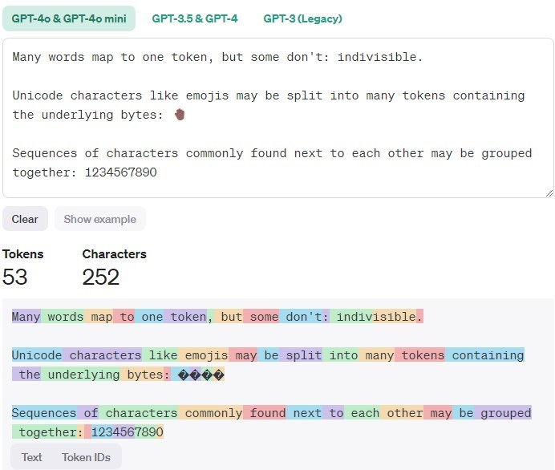
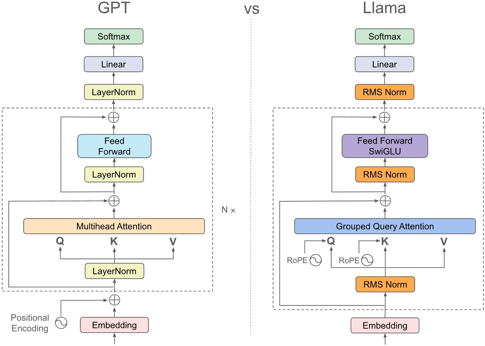

# LLM Basics

The note will focus on transformer-based large language models, their inference pass, and some implementation basics. The note mainly use LLaMA series [@llama2, @llama3] as a model example, and [`hunggingface/transformers`](https://huggingface.co/docs/transformers/index) as a reference for LLM framework implementation. 

Additional resources: 
- [`huggingface/nlp-course`](https://huggingface.co/learn/nlp-course) 
- [GPT from scratch by Jay Mody](https://jaykmody.com/blog/gpt-from-scratch/#setup)

## Pipeline Components

As a high-level view, a LLM inference pipeline consists of 

- [__tokenizer__](#tokenizers): input natural language text stream, output tokens. 
- [__embedding__](#embedding): maps the tokens into a numerical format so that the model can consume. 
- [__model__](#transformers): the actual LLM model, which takes the embedding and outputs according to the model tasks. 
    - A typical transformer model has a `encoder` (plus `positional encoding`) to encode the input into feature vectors, a `decoder` that takes the features and other inputs to generate outputs.  
    - Primarily if we consider the text generation task, we only need a `decoder`. 
- __postprocessing__: Take the outputs from the model (often logits of embeddings), and format them back to text. 

## Tokenizers

In general, tokenizer split the characters into sequences of tokens. In also handles irregular or illegal input, do normalization (striping whitespace, remove accent chars, lowercasing, etc.).  

A simple view is to consider the token as one word, but not always true. Typically, the tokenizer only uses CPU, but not always true for some modern models. 

```py
from tokenizer import Tokenizer
tokenizer = Tokenizer.from_file("tokenizer.json")
output = tokenizer.encode("Hello, y'all! How are you 😁 ?")
print(output.tokens)
# ["Hello", ",", "y", "'", "all", "!", "How", "are", "you", "[UNK]", "?"]
print(output.ids)
# [27253, 16, 93, 11, 5097, 5, 7961, 5112, 6218, 0, 35]
```


Note that the tokenizer is often associated with the specific model. 

<figure markdown="span">
    
<figcaption><a href="https://platform.openai.com/tokenizer">OpenAI tokenizer</a></figcaption>
</figure>

## Embedding
The tokenizer generate a sequence of tokens (or token IDs), but the model cannot directly consume them as input. Using an [`embedding`](https://pytorch.org/docs/stable/generated/torch.nn.Embedding.html), which serve as a fixed size dictionary of all tokens. 

In general, we will also add a positional encoding to add an extra understanding of where the input is within the sentence. 

```py
# embedding is a lookup table of size (n_vocab, dim)
embeddings = Embedding(
    num_embedding=n_vocab, # number of vocab
    embedding_dim=embedding_dim # a configurable dim for embedding
)
# pos_encoder is a Encoding of size (max_seq_len, dim)
pos_encoder = PositionalEncoding(
    seq_len=max_seq_len, # configurable maximum sequence length
    dim=embedding_dim
)
# token_ids: Array[Int], shape (seq_len, )
# x: Array[Float], shape (seq_len, dim)
x = embeddings[token_ids] + pos_encoder[range(len(token_ids))]
```

## Decoder-only Transformers
We focus on the auto-regressive models, or the decoder-only transformer models.   



The embedding is passed through many Transformer blocks, and finally outputs the logits of the vocabulary to generate the next most likely word.

## Attention Module
Consider an intuitive example: we have a set of word keys $k_1, k_2, ..., k_n$ and each word $k_i$ is associated with some feature vector $v_i$, now we have a new word $q$ to query, and we'd like to compute the value vector $v_q = \sum_{i=1}^n a_i v_i$ with some __attention score__ $a_i$, and such $a_i$ represents how similar/relevant is the query to the $i$th word. 

Therefore, let $K\: (n_k\times d_k)$ be the stacked matrix of keys, $V\: (n_k\times d_v)$ be the stacked matrix of value vectors, and $Q: (n_q\times d_v)$ be the stack matrix of queries. We can derive the attention  to be 

$$A = \text{softmax}(\frac{QK^T}{\sqrt{d_k}}) V$$

(See [an intuitive explanation from Jay Mody](https://jaykmody.com/blog/attention-intuition/), and detailed derivation in _Attention is all You Need_[@vaswani2017attention])

### Self-attention
An interesting discovery is that $k$ and $v$ can come from the same source, and we gets __self attention__, i.e. input sequence attend to itself. which means `attention(q=x, k=x, v=x)`, which is just the similarity of all the words $A = \text{softmax}(XX^T/\sqrt{d_k}) X$ to each other in the sentence, and no trainable parameters to embed the global context. 

Therefore, we can introduce projections for the input $Q = W_Q X, K = W_K X, V=W_VX$ and bring it back to original dimension by $Y = W_{proj} A$, all the weight matrices are now trainable. In practice, we can stack $W_Q, W_K, W_V$ into one matrix to combine the multiplication for a better parallelism. 

### Multi-head
To have a truly "large" language model, we want the projections to have more parameters. However, $QK^T$ part of the attention takes 

$$\text{FLOP} = n_Q\times d_K \times d_K \times n_K$$

Multi-head is introduced to reduce computation, in which we split the $d_K, d_V$ into $h$ "heads", i.e. smaller, separated features vectors. We compute attention on each and stack them back, so that the computation is 

$$h(n_q\times \frac{d_K}{h} \times\frac{d_K}{h} \times n_K) = \frac{1}{h}\text{FLOP}$$

### Causal Masking
For a text generation model, all words should only see words before it. Otherwise, it will be biased towards the known answer. 

One natural way is to mask out the relevance in the context. Which means $0$ for all the keys after the current key. However, we need to pass a `softmax` and have $0$ in the output. We can do this by adding a negative-infinity matrix $M$ to $QK^T$. 


### KV Caching for Casual Inference

For text generation tasks with a transformer model, the inference is done as 

```py
prompt_tokens = tokenizer.encode(input_text)

for _ in range(n_next_tokens):
    new_token = model(prompt_tokens)
    prompt_tokens.append(new_token)

output_tokens = tokenizer.decode(prompt_tokens)
```

Because we always want to generate new tokens based on all previous context. However, in each iteration we only have 1 new token, we are always recomputing the prompt tokens. Considering the computation in `attention` module, the overhead is exponential to the `max_sequence_len`. 

However, casual inference masks out tokens after the current token. For each queried token, its attention $A, Q, K, V$ are only relevant to previous tokens. Therefore, for each iteration
- We only need to query the newly generated input.
- We reuse all previous $K,V$, concat with the new $k, v$ w.r.t input $x$. 

The inference becomes

```py
prompt_tokens = tokenizer.encode(input_text)

# context encoding phase
# K_cache, V_cache shape (len(prompt_tokens), ...)
new_token, K_cache, V_cache = model(
    prompt_tokens, K_cache=[], V_cache=[])
propmpt_tokens.append(new_token)

# token generation phase
for _ in range(n_next_tokens):
    # new_K_cache, new_V_cache, shape (1, ...)
    new_token, new_K_cache, new_V_cache = model(
        new_token, K_cache=K_cache, V_cache=V_cache)
    K_cache.append(new_K_cache)
    V_cache.append(new_V_cache)
    prompt_tokens.append(new_token)

output_tokens = tokenizer.decode(prompt_tokens)
```


### Putting all Together

```py
# forward part of Attention module from llama3
# https://github.com/meta-llama/llama3/blob/main/llama/model.py
def forward(
    self,
    x: torch.Tensor,
    start_pos: int,
    freqs_cis: torch.Tensor,
    mask: Optional[torch.Tensor],
):
    bsz, seqlen, _ = x.shape
    
    # projections
    xq, xk, xv = self.wq(x), self.wk(x), self.wv(x)

    xq = xq.view(bsz, seqlen, self.n_local_heads, self.head_dim)
    xk = xk.view(bsz, seqlen, self.n_local_kv_heads, self.head_dim)
    xv = xv.view(bsz, seqlen, self.n_local_kv_heads, self.head_dim)

    # llama3's rotary positional encoding
    # refer to the original paper for detail
    xq, xk = apply_rotary_emb(xq, xk, freqs_cis=freqs_cis)

    # KV caching
    self.cache_k = self.cache_k.to(xq)
    self.cache_v = self.cache_v.to(xq)

    self.cache_k[:bsz, start_pos : start_pos + seqlen] = xk
    self.cache_v[:bsz, start_pos : start_pos + seqlen] = xv

    keys = self.cache_k[:bsz, : start_pos + seqlen]
    values = self.cache_v[:bsz, : start_pos + seqlen]

    # Multi-head

    # repeat k/v heads if n_kv_heads < n_heads
    keys = repeat_kv(
        keys, self.n_rep
    )  # (bs, cache_len + seqlen, n_local_heads, head_dim)
    values = repeat_kv(
        values, self.n_rep
    )  # (bs, cache_len + seqlen, n_local_heads, head_dim)

    xq = xq.transpose(1, 2)  # (bs, n_local_heads, seqlen, head_dim)
    keys = keys.transpose(1, 2)  
    # (bs, n_local_heads, cache_len + seqlen, head_dim)
    values = values.transpose(1, 2)  
    # (bs, n_local_heads, cache_len + seqlen, head_dim)

    # self-attention
    scores = torch.matmul(xq, keys.transpose(2, 3)) / math.sqrt(self.head_dim)
    if mask is not None:
        scores = scores + mask  # (bs, n_local_heads, seqlen, cache_len + seqlen)
    scores = F.softmax(scores.float(), dim=-1).type_as(xq)
    output = torch.matmul(scores, values)  # (bs, n_local_heads, seqlen, head_dim)
    output = output.transpose(1, 2).contiguous().view(bsz, seqlen, -1)

    # projection back
    return self.wo(output)
```

## Feed forward Network
Simple fully connected linear layers to expand and contract the embedding dimension, so that we have more trainable weights for the context. For LLaMA3 the design is a bit different to have more efficiency. 

```py
# https://github.com/meta-llama/llama3/blob/main/llama/model.py
class FeedForward(nn.Module):
    def __init__(
        self,
        dim: int,
        hidden_dim: int,
        multiple_of: int,
        ffn_dim_multiplier: Optional[float],
    ):
        super().__init__()
        hidden_dim = int(2 * hidden_dim / 3)
        # custom dim factor multiplier
        if ffn_dim_multiplier is not None:
            hidden_dim = int(ffn_dim_multiplier * hidden_dim)
        hidden_dim = multiple_of * ((hidden_dim + multiple_of - 1) // multiple_of)

        self.w1 = ColumnParallelLinear(
            dim, hidden_dim, bias=False, gather_output=False, init_method=lambda x: x
        )
        self.w2 = RowParallelLinear(
            hidden_dim, dim, bias=False, input_is_parallel=True, init_method=lambda x: x
        )
        self.w3 = ColumnParallelLinear(
            dim, hidden_dim, bias=False, gather_output=False, init_method=lambda x: x
        )

    def forward(self, x):
        return self.w2(F.silu(self.w1(x)) * self.w3(x))
```

