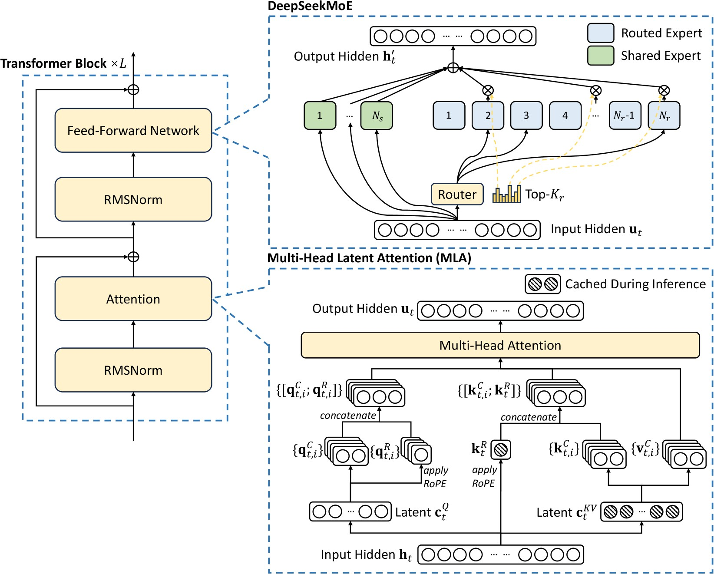

# Mixture of Experts Inference

[Mixtral of Experts](https://arxiv.org/abs/2401.04088) [@mixtral]  
[DeepSeek V3 Technical Report](https://arxiv.org/abs/2412.19437)[@deepseekv3]  
[MoE Explained by HuggingFace](https://huggingface.co/blog/moe)

## Overview
MoE layer is a replacement for the FFN (dense MLP) layer in LLMs. Compared to one dense feed forward layer, MoE gives 

- Better scalability on number of parameters
- Much faster pre-training
- Much faster inference compared to a model with the same number of parameters



MoE layer replaces the dense linear layers with a weighted sum of experts. Where each `expert` is a small FFN, and the weights is provided by the `router` layer. Intuitively, instead of having one big "genius", MoE layer uses several experts and a router to decide which expert will answer. 

## Mixtral
Mixtral[@mixtral] is one of the earliest MoE model. The router network is defined as 

$$G(x) = \text{softmax}(\text{topK}(x\cdot W_g))$$

the router is a linear layer, with topK to force it only have K experts, and softmax activation to make the weight normalized. 

Each expert is just a FFN layer, Mixtral uses SwiGLU from Llama2 [@llama2]. 

```py3
def forward(self, inputs: torch.Tensor) -> torch.Tensor:
    # inputs: (seq_len, hidden_size)

    gate_logits = self.gate(inputs)
    # gate_logits: (seq_len, )
    weights, selected_experts = torch.topk(gate_logits, self.k)
    # selected_experts: (seq_len, k)
    weights = F.softmax(weights, dim=1, dtype=torch.float).to(inputs.dtype)
    # weights: (seq_len, n_experts)
    results = torch.zeros_like(inputs)
    for i, expert in enumerate(self.experts):
        batch_idx, nth_expert = torch.where(selected_experts == i)
        results[batch_idx] += weights[batch_idx, nth_expert, None] * expert(inputs[batch_idx])
    # results: (seq_len, hidden_size)
    return results
```

Mathematically, MoE layer is considered as a "sparse" FFN. If we concatenate all experts, it will be dense linear layers with $(H, I\times n)$ parameters. For each token feature vector, we mask out $(n-k)/n$ rows or columns, where the masked rows are chosen by the router. Therefore, compared to dense models with the same number of parameters, the MoE will only take $k/n$ computations plus some routing overhead (which is small compared to MLP matmuls). 

### Case: Mixtral8x7B
Mixtral8x7B (32 decoder layers) model parameters vs Llama2 70B (80 decoder layers)

|     | Mixtral shape | n_params | Llama2 70B shape | n_params |
| --- | ---           | --- |  --- | --- |
| attn K proj | (4096, 1024) | 4M | (8192, 1024) | 8M |
| attn Q proj |  (4096, 4096) | 16M | (8192, 8192) | 64M |
| attn V proj |  (4096, 4096) | 16M | (8192, 8192) | 64M |
| attn out proj |  (4096, 4096) | 16M | (8192, 8192) | 64M |
| attn normalization | (4096, ) | 4k | (8192, ) | 8k |
| FFN router |  (4096, 8) | 32k | - | -  |
| FFN gate proj |(4096, 14336, 8) | 448M<br>(112M active) | (8192, 28672) | 224M | 
| FFN up proj | (4096, 14336, 8) | 448M<br>(112M active) | (8192, 28672) | 224M | 
| FFN down proj |  (14336, 4096, 8) | 448M<br>(112M active) | (28672, 8192) | 224M | 
| FFN normalization |  (4096, ) | 4k | (8192, ) | 8k |
| total | | $32 \times 1.4 \approx 42$B<br>$32 \times 0.388 \approx 12$B activated | | $80\times 0.872\approx 54$B

Note that Mixtral has similar number of parameters. However, Mixtral only uses $2/8$ of the weights, hence the FFN computations are far smaller. 

## Load Balancing
We have the intuition that each expert model is an expert of some areas of knowledge. However, this is not true. To make the model scalable and efficient, we want a more balanced workload (number of tokens) among the experts. For training, this can be done through auxiliary loss and expert capacity (expert drops tokens if the assigned tokens exceeds its capacity). 
