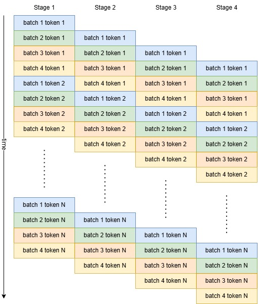

# Parallelism for LLM Inferences

We assume that the accelerators uses the conventional memory hierarchy model. Where CPU - accelerator data movement is slow, so that the accelerator needs to load all data at the beginning onto its dedicated high bandwidth memory (HBM). Then, for computations, data will be loaded from HBM to some small cache/registers. 

We consider the following metrics of an accelerator 
- HBM size measured in GiB. 
- HBM throughput measured in GiB/s. 
- Computational capacity measured in FLOP/s.  
- Collectives operations overhead, this will depends on the connectivity topology (and hence algorithms). 

We consider a ML workload in 3 aspects

- Peak memory (HBM/VRAM/DRAM) usage in GiB
- Model data movement in GiB, how many data are needed to read/write through HBM. 
- Computations in FLOP. The majority of workloads will be matmuls, we often omit non-matmul computations such as activations and normalizations. 

## [Sharding Matrices](https://jax-ml.github.io/scaling-book/sharding/)

When we consider distributing computations, essentially we want to shard matmuls across devices, and collect their results. Consider a matmul 

$$A[I, J]\cdot B[J, K] = C[I, K]$$

$I, K$ are the outer dimension, and $J$ is the inner dimension or contraction dimension. Also note that all batched matmuls can be considered as stacking the batching dimensions on the outer dimensions. 

The take away is that: 

- Sharding on outer dimensions does not need any overhead. $A[I_X, J]\cdot B[J, K_Y] = C[I_X, K_Y]$
- Sharding on inner dimensions computes a partial sum, hence need a all reduce on $C$. 
$\text{AllReduce}(A[I, J_X]\cdot B[J_X, K]) = C[I, K]$

## LLM Workloads 

[Llama3 as an example](llama.md)

In a nutshell, LLM workloads can be considered as $N$ decoder layers. For each decoder, we consider the following operations, underline indicates an "inner" dimension (need reduction/gather). 

- `normalize` $(B, S, \underline{H}) \rightarrow (B, S, \underline{H})$
- `QKV_proj`: $(B, S, \underline{H}) \times (\underline{H}, (n_Q+ n_{KV} + n_{KV})\cdot d)\rightarrow (B, S, (n_Q+n_{KV}+n_{KV}), d)$
- `attention_QK`: $(n, B, S, \underline{d}) \times (n, B, \underline{d}, S_p) \rightarrow (n, B, S, S_p)$
- `attention_(QK)V`: $(n, B, S, \underline{S_p})\times (n,B, \underline{S_p}, d) \rightarrow (n, B, S, d)$
- `output_proj`: $(B, S, \underline{n\cdot d}) \times (\underline{n\cdot d}, H) \rightarrow (B, S, H)$
- `up_proj` and `gate_proj` $(B, S, \underline{H}) \times (\underline{H}, I) \rightarrow (B, S, I)$
- `down_proj` $(B, S, \underline{I}) \times (\underline{I}, H) \rightarrow (B, S, H)$

We need to store the following tensors on HBM

- `QKV_w` $(\underline{H}, (n_Q+ n_K + n_V)\cdot d)$
- `up_w` and `gate_w` $(\underline{H}, I)$
- `down_w` $(\underline{I}, H)$
- `KV_cache` $(B, S_p, n_{KV}, d)$

For parallelism, we are sharding across some of these dimensions, with the considerations of

- Reduce HBM pressure so that we can fit data onto each device.
- Fully utilize computation cores of the devices.
- Reduce latency for single prompt input.
- Minimize possible overhead from communication collectives or replicated computations. 

## Shard on inputs
Shard on the batch size $B$ or sequence length $S$. In general, each device will get a copy of model weight. So shard on inputs does not help much for reducing HBM pressure. 

### Data Parallel (DP)
Shard on batches. In general, data parallel is trivial and requires no communications if there's no batch normalization.

- Throughput: linearly scales with number of devices. 
- Latency: dose not reduce latency since computation per prompt is the same. 
- No CC overhead. 

### Sequence Parallel (SP) 
One special case of data parallel is shard on the sequence length $S$. Typically we can only do this on prefill stage (context encoding) since the prefill sequence length $S = S_p$ is typically long, while at decoding stage (token generation), $S = 1$. 

- HBM usage: does not help much. 
- Throughput: linearly scales when sharded $S$ is long enough. If $S$ is too small, typically the projections will be memory bound and SP does not work. 
- Latency: linearly scales when sharded $S$ is long enough. 
- CC overhead: reduction on self-attention matmul.

## Shard on weights: Tensor Parallel (TP) 
Shard on the model weights. In general, this helps to reduce HBM usage and makes computations faster. 
TP is often case by case.

Some strategies for TP 

 - In general, shard on outer dimensions to avoid collectives.
 - For several successive matmuls, we way not need to gather outputs. 
 - Consider the balance between collective overhead (for inner dimensions) and shard on very small dimensions (not saturating compute). 
 - In some cases, replicate operations will be faster than collectives. 

TP scaling characteristics

- HBM usage: each device takes $1/\text{TP}$ model weights, with some possible overhead.
- Throughput: linearly scales when TP is small. When TP is large, we typically see more overhead and device FLOP utilizations will drop. 
- Latency: linearly scales when TP is small. 
- CC overhead: case by case, overall cannot avoid CC overhead. 

### Sharding Attention
Consider the official llama3 modeling code for [attention module](https://github.com/meta-llama/llama3/blob/main/llama/model.py#L100-L127). 

For multi-head attention (MHA) each Q,K,V head is computed in parallel. Each of $Q,K,V$ head are of the shape $(B, n, S, d)$ where $B$ is batch size, $n$ is number of heads, $S$ is sequence length, $d$ is head dim (which is often small). Therefore, we can directly shard the computations by the head, without many overhead. 

For group query attention (GQA), each K and V heads will be shared for multiple Q heads by broadcasting the same K and V head to the same number of Q heads. For `llama-3-70b`, we have $n_Q=64, n_K=8, n_V=8$, thus 8 Q heads share 1 K and 1 V head. Consider TP8, each device gets $\underline{n}_{Q} = 8, \underline{n}_{K} = 1, \underline{n}_V=1$. However, if we go TP16, we still need K and V head exist on each device to do the computation, i.e. each device gets $\underline{n}_{Q} = 4, \underline{n}_{K} = 1, \underline{n}_V=1$. Therefore, we have to replicate K and V head and introduces overhead. 

### Expert Parallel (EP)
For [Mixture of Expert (MoE) architecture](https://huggingface.co/blog/moe), the big feed forward network is replaced with many small MLPs (experts) . Given the input to FFN $(B, S, H)$, each token $s\in S$ goes to a small number of experts. Because the experts are small, TP sharding on the already small dimensions will cause more overhead. Instead, each device will get a few unsharded experts. Since each device gets the full $(B, S, H)$ input, each device can compute the router and only keeps tokens that will go through its experts. After the computations, we will do a partial sum on the full $S$ to gather all results. 

For EP, we need to consider capacity factor, i.e. how imbalance the tokens are distributed to the experts. If the routing is imbalanced, some devices will get much more tokens to process, hence synchronization overhead. 

## Pipeline Parallel (PP)
Shard on the number of layers. Each device will only compute a few layers of the model. At each time step, the device will receive the input data from previous pipeline stage (device), compute the layers, and then send the result to the next stage. However, PP requires the stages get balanced amount of work, otherwise all devices have to wait on the slowest stage and introduce huge overhead. 

For LLMs, the majority of the workload are decoder layers, where input and output shapes are both $(B, S, H)$. For token generation, $S = 1$ so that we that the send/recv communication is typically small. Also, token generation is auto-regressive, as illustrated below:

The overhead for pipelines are

- The idle time at the beginning and the end. For token generation, since the number of generated tokens are typically very large. This overhead is really small. 
- Any load imbalance among stages where all other stages are idle. 
- Send/recv communications in between stage. However, note that send buffer (input) and recv buffer (output) are different, so we can hide this overhead if send and recv are async. 
- The number of batches have to be greater or equal to the number of stages.

PP scaling characteristics
- HBM usage: each device takes $1/\text{PP}$ model weights and $1/\text{PP}$ KV cache. 
- Throughput: linearly scales. However, with more PP stages, we need larger batch size, and hence large KV cache. Also, keeping a balanced workload will be harder for too many PP stages.
- Latency: does not help.  
- CC overhead: send/recv. 

### Sequence Pipeline Parallel (SPP)
For prefill, similar to SP, partition the input tokens into chunks and do pipeline parallel on the chunks. Compared to token generation, typically the idling time at the beginning and the end will be larger. Since the number of chunks can be partitioned is typically way smaller than the number of generated tokens. 

## Case Study: `llama-3-70b` 