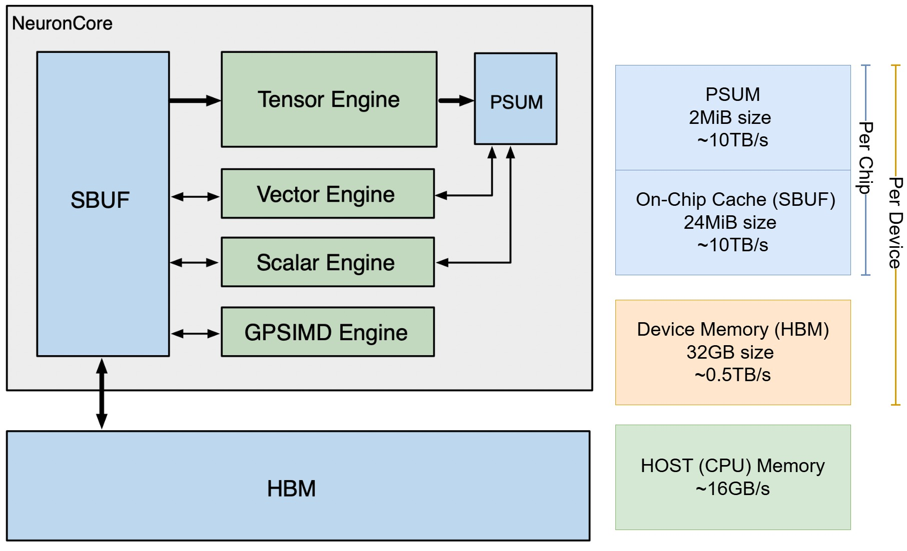
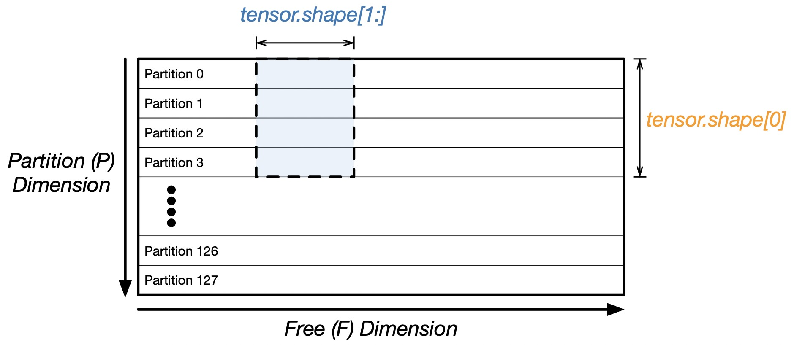
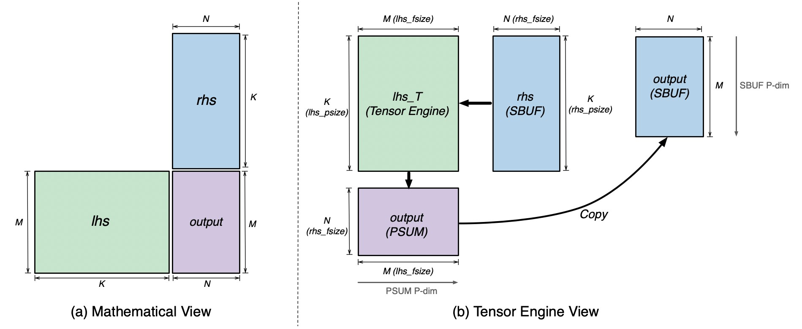

# AWS Trainium and NKI kernel

Based on [Stanford CS149 Assignment](https://github.com/stanford-cs149/asst4-trainium), [:simple-amazon: NKI kernel Docs](https://awsdocs-neuron.readthedocs-hosted.com/en/latest/general/nki/index.html)

## [Trainium Hardware Architecture](https://awsdocs-neuron.readthedocs-hosted.com/en/latest/general/nki/trainium_inferentia2_arch.html)
{ width=720 }

- __HBM__: High bandwidth memory, device memory. Host to device should be managed by ML framework or external of NKI kernel. 
- __SBUF__: State buffer. Software-managed on-chip SRAM. In NKI programming, on-chip SRAM is not a hardware managerd "cache", __HBM to SBUF needs explicit `load` and `store`.__ 
- __PSUM__: Partial Sum Buffer, a small, dedicated memory designed for storing matrix multiplication results. 
- __Tensor Engine__: for matmuls, or other operators that can be executed as matmuls. The engine has 128x128 systolic processing elements, which streams input data from SBUF and write output to PSUM. 
- __Vector Engine__: for vector operations that depends on multiple elements from input tensors (vector reduction, element-wise binary operations). VectorE consists of 128 parallel vector lanes. 
- __Scaler Engine__: for element-wise operations, where every element in the output tensor only depends on one element of the input tensor. Usually used for hardware-accelerated activation functions. ScalarE consists of 128 parallel vector lanes. 
- __GpSimd Engine__: for general SIMD operations. Basically a 8-core CPU, with 512-bit vector machine. 

### Systolic Arrays
Trainium chips are operated in systolic arrays, hence all data movements and computations are tiled. From the hardware perspective, the on-chip memories, SBUF and PSUM, are arranged as 2D memory arrays. The first dimension is the partition dimension `P` with `nki.tile_size.pmax = 128` memory partitions that can be read and written in parallel by compute engines. The second dimension is the free dimension `F` where elements are read and written sequentially.

{ width=560 }

### `PSUM` Constraints
Remind that `PSUM` is the small, dedicated on-chip memory for matmul reduction operations. Currently, its size is `2MiB`. The hardware design poses a constraint for tiles in PSUM, `nki.tile_size.psum_fmax == 512`, which comes from `2MiB / 128 / 32B`. 

For matrix multiplicaion of size $(M, K) \times (K, N)$. The contraction dimension $K$  consider how matrix is mapped onto tensorE and PSUM. We define that input tiles F dimension size must not exceed `M_per_tile = nki.tile_size.gemm_stationary_fmax == 128` on the left-hand side (LHS), or `N_per_tile = nki.tile_size.gemm_moving_fmax == 512` on the right hand size (RHS). More explanation in [Tensor Engine: Matrix Multiplication](#tensor-engine-matrix-multiplication).


## NKI (Neuron Kernel Interface)
NKI kernels are written in Python. Essentially, NKI programming and some optimization considerations are

1. Loading data from HBM to on-chip SBUF

    - How to minimize the data movement.
    - How to do data tiling so that we can fully use the 128 lane.

2. Computations on the compute engines

    - How to overlap computations on different cores. 

3. Storing outputs from SBUF back to HBM

Each NKI kernel is a python function decorated with `@nki.jit`, and the arguments should be tensors already reside in HBM. NKI kernels can be directly inserted into ML frameworks (PyTorch, Tensorflow). 

```py
@nki.jit
def vector_add(a_vec: Tensor, b_vec: Tensor) -> Tensor:
    # Allocate space for the output vector in HBM
    out = nl.ndarray(shape=a_vec.shape, dtype=a_vec.dtype, buffer=nl.hbm)

    # Load the input vectors from HBM into variables stored in SBUF 
    a = nl.load(a_vec)
    b = nl.load(b_vec)

    # Add the input vectors
    res = nl.add(a, b)

    # Store the result into HBM
    nl.store(out, value=res)

    return out
```

NKI provides a `nki.baremetal` decorator function to directly run kernels from numpy arrays. 

```py
vec_size = nki.tile_size.pmax # 128
a = np.random.rand(vec_size, dtype=np.float32)
b = np.random.rand(vec_size, dtype=np.float32)
out = nki.baremetal(vector_add)(a, b)
```

## Data Tiling

The on-chip memories, SBUF and PSUM, store data that is arranged as 2D memory arrays. The first dimension of the 2D array is called the "partition dimension" P. The second dimension is referred to as the "free dimension" F (more details later). For vector add, we have `P = vec_size, F = 1`

### Partition Dimension
Note that if we run the above code with `vec_size > 128`, we get 

```
> a = nl.load(a_vec)

Value Error: number of partition in src[12800, 1] of 'load' 
exceed architecture limitation of 128.
```


NeuronCores loads 128 elements in parallel along the P-dim in each cycle, which means the max size of P dimension for each `nl.load` is 128. Therefore, we need to manually tile of data into 128 chunks. 

```py
@nki.jit
def vector_add_tiled(a_vec, b_vec):

    CHUNK_SIZE = nki.tile_size.pmax  # 128

    out = nl.ndarray(shape=a_vec.shape, dtype=a_vec.dtype, buffer=nl.hbm)
    M = a_vec.shape[0]

    # nl.affine_range assumes there are no loop-carried dependencies
    # and allow more aggressive optimizations for the compiler pipelining
    for m in nl.affine_range((M // ROW_CHUNK)):

        # Allocate row-chunk sized tiles for the input vectors
        a_tile = nl.ndarray((CHUNK_SIZE, 1), dtype=a_vec.dtype, buffer=nl.sbuf)
        b_tile = nl.ndarray((CHUNK_SIZE, 1), dtype=b_vec.dtype, buffer=nl.sbuf)
        
        # Load a chunk of rows
        a_tile[...] = nl.load(a_vec[m * CHUNK_SIZE : (m + 1) * CHUNK_SIZE])
        b_tile[...] = nl.load(b_vec[m * CHUNK_SIZE : (m + 1) * CHUNK_SIZE])

        res = nl.add(a_tile, b_tile)
        nl.store(out[m * CHUNK_SIZE : (m + 1) * CHUNK_SIZE], value=res)
    
    return out
```

### Free Dimension
The compiler is responsible the `store` and `load` are converted into direct memory access (DMA) instructions. Similar to how CUDA hides the data loading to threads, NeuronCore has 16 DMA engines to move multiple lanes of data in parallel / in pipeline. DMA are parallelized over the free dimension. In addition, the computation engines support pipelining over the free dimension. 

```py
@nki.jit
def vector_add_stream(a_vec, b_vec):

    # The maximum size of our Partition Dimension
    PARTITION_DIM = nki.tile_size.pmax # 128

    # Free dim is a tunable parameter, and it depends on
    # compiler optimizations/hardware specifications
    FREE_DIM = 200

    # The total size of each tile
    TILE_M = PARTITION_DIM * FREE_DIM

    # Get the total number of vector rows
    M = a_vec.shape[0]

    
    # Reshape the the input vectors
    a_vec_re = a_vec.reshape((M // TILE_M, PARTITION_DIM, FREE_DIM))
    b_vec_re = b_vec.reshape((M // TILE_M, PARTITION_DIM, FREE_DIM))

    # Allocate space for the reshaped output vector in HBM
    out = nl.ndarray(shape=a_vec_re.shape, dtype=a_vec_re.dtype, buffer=nl.hbm)

    # Loop over the total number of tiles
    for m in nl.affine_range((M // TILE_M)):

        # Allocate space for a reshaped tile
        a_tile = nl.ndarray((PARTITION_DIM, FREE_DIM), dtype=a_vec.dtype, buffer=nl.sbuf)
        b_tile = nl.ndarray((PARTITION_DIM, FREE_DIM), dtype=a_vec.dtype, buffer=nl.sbuf)

        # Load the input tiles
        a_tile = nl.load(a_vec_re[m])
        b_tile = nl.load(b_vec_re[m])

        # Add the tiles together
        res = nl.add(a_tile, b_tile)

        # Store the result tile into HBM
        nl.store(out[m], value=res)

    # Reshape the output vector into its original shape
    out = out.reshape((M,))

    return out
```

### Data Movement and Computation
F-dim is a tunable parameter, each DMA transfer has an overhead. However, F-dim is not always a "bigger means better" thing. Choosing a smaller F-dim may allow a better pipelining. In this case, since `add` requires small computation cycles, smaller free-dim means more but quicker data movement, and allow for more overlapping between the engines. In practice, we need to profile and decide the dimension size to harness better performance. 

## Tensor Engine: Matrix Multiplication 



Consider the matmul, note that the hardware constrains that PSUM can only hold $128\times 512$ elements. Thus, `TILE_M = nki.tile_size.gemm_stationary_fmax == 128`, `TILE_N = nki.tile_size.gemm_moving_fmax == 512`. In addition, the contraction dimension $K$ has to be loaded in parallel and do element-wise multiplication, thus `TILE_K = nki.tile_size.pmax = 128`.

Similar to any parallel programming architecture, data locality (reducing data loading) is a key optimization. Check [Matrix Multiplications notes](/csc367/matrix.html#blocked-tiled-matrix-multiplication). Reordering loop (`nkm` instead `mnk` to avoid reloading lhs elements) and blocked matmul apply to our case. 

For trainium, `SBUF` is `24MiB`. Assuming that we know the dtype and the rough shape of matrices (so that we can better choose number of tiles per block), we can compute the number of blocks s.t. data movement is minimized. 

??? quote "nki blocked matmul"
    ```python
    --8<-- "notes/scripts/nki_matmul.py"
    ```

