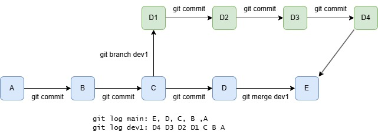

# Git Cheatsheet

[Git Documentation](https://git-scm.com/doc)
[Github glossary](https://docs.github.com/en/get-started/learning-about-github/github-glossary)

## Commonly Used Commands
Discard the last commit (completely remove the commit from working dir and history)
```bash 
git reset --hard HEAD^1
```

Throw away all local commits
```bash
git reset --hard origin/<branch_name>
```


Download all submodule while cloning the repo
```bash
git clone --recurse-submodules [URL]
```

Download all submodules in the repo
```bash
git submodule update --init --recursive
```

Completely remove a file (not only work dir but also in history commits) from the repo and repo history. This is really important if accidentally pushed confidential files like API keys.  
```bash
git filter-branch --tree-filter 'rm -f my_file' HEAD
git push -f # this changes the entire commit history
```

## Commit and Worktree
Each `commit` is a file snapshot of the repo, indexed by the a unique hash (SHA, 40 char long checksum hash). 

Git history is managed as tree graphs (`worktree`), each commit is a node of the tree. When creating a new commit with `git commit -m "[message]"`, we create a new node, and its parent is pointing to the previous commit. 

`branch` is a line of development. It can be materialized as a snapshot of the tree. The working tree is associated at most one branch (it might be `detached`, which is not associated with any named branch), `git branch [branch-name]` creates such a new branch and `git merge [branch-name]` merges two branches into one. 



`HEAD` is the reference to the current node (which commit and branch).

`branch` 
### Reference Examples
- `git reset [commit]` undoes all commits after [commit], preserving changes locally
- `git reset --hard [commit]` discards all history and back to the specified commit
- `git revert [commit]` create a new commit, which the file changes are reverting the given commit.
- `git branch [branch-name]` create a new branch
- `git checkout [branch-name]` switch to the specified branch 
- `git merge [branch-name]` combine the specified branch into the current branch. 
- `git branch -d [branch-name]` delete branch
- `git tag [tag-name]` create a tag from the current commit, usually for tagging specific versions for release. 


## Basic Commands Reference

### Repos and Sync Remote
- `git init` init repository
- `git clone [URL]` clone repository
- `git fetch` download the __history__ (without updating the files) from all remote tracking branches
- `git merge` combine remote tracking branch into current local branch
- `git pull` update current local branch with new commits from corresponding remote branch
- `git push` updates all local branch commits to corresponding remote branch

### Commit Changes
- `git add [file]` add files to be tracked
- `git status` show the working tree status
- `git commit -m "[message]"` create a commit (a file snapshot)

### Inspect History
- `git log` list commit history for the current branch
- `git diff [snap1] [snap2]` diff the two branches/commits
- `git show [commit]` outputs metadata and changes of the commit

### Configure repo 
- `git config --global user.name "[name]"` config the name shown in the git metadata, `--global` means setup for all repos on this machine. 
- `git config --local user.email "[email address]"` config the email, `--local` means setup for this repo on this machine only. 

### `.gitignore`
Files to be excluded from being tracked (cache, build artifacts, binaries, etc.). Each line is a file pattern to be excluded.

- [Github .gitignore templates](https://github.com/github/gitignore)
- [C++.gitignore](https://raw.githubusercontent.com/github/gitignore/refs/heads/main/C%2B%2B.gitignore)
- [Python.gitignore](https://raw.githubusercontent.com/github/gitignore/refs/heads/main/Python.gitignore)

### Stash Temporary Changes
`git stash` maintain a stack of file changes snapshot

- `git stash` save currently staged changes (without creating a commit) and push the snapshot to the stack, and revert them in the local dir
- `git stash pop` pop the stack and write the stashed changes to the local dir
- `git stash drop` discard the top of the stack

### Submodules
Submodule is to link another repo into the current repo, so that we can use them as a library without copying and syncing their changes. 

`git submodules` is implemented as `.gitmodule` file, where each entry in 

```bash
[submodule "lib1"]
    path = lib1
    url = https://example.com/demo/lib1
```

- `git submodule add [url]` add the repo as a submodule to current dir, it can also add specific branch/commit/tag, see the `help` doc. 
- `git submodule update [submodule]` update the submodule according to how it is configured. 