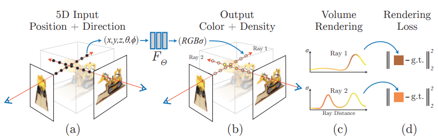

# Neural Radiance Fields based Rendering

## View synthesis and image-based rendering
Given a sampling of 2D images (views) of a scene and additional intrinsic parameters, the goal is to reproduce new images from other view angles. 

To achieve this goal, some popular classes of approaches will be 
 - mesh-based reconstruction: see the images as 2D projections of the object, and reconstruct the object as a 3D mesh. However, this method is very difficult to optimize (loss landscape, large DOF) and often requires a template mesh with a fixed topology. 
 - volumetric approach: store object features on a 3D voxel grid. Much easier to optimize but the quality is largely limited by the size / resolution of the voxel grid, due to 3D time and space complexity. 

The problem can be viewed as an interpolation problem. We are given a set of views (viewing rays and their collective lights), and we want to interpolate views in between, hence "synthesis". 

## NeRF
[NeRF: Representing Scenes as Neural Radiance Fields for View Synthesis](https://arxiv.org/pdf/2003.08934.pdf)  
github: https://github.com/bmild/nerf  
website: https://www.matthewtancik.com/nerf

### NeRF Scene Representation
The representation can be seen as a funciton 

$$F_\Theta(\mathbf x, \mathbf d) \rightarrow (\mathbf c,\sigma)$$

 - __Input__ the 3D location $\mathbf x = (x, y, z)$ and 2D viewing direction $(\theta, \phi)$. In practice, we express the direction using $\mathbf d$, as a 3D Cartesian unit vector. 
 - __Output__  the color $\mathbf c =(R,G,B)$ and volume density $\sigma$. To help understand, the output can be imagined as `RGBA` value of a point $\mathbf x$ of a semi-transparent object, viewed from angle $\mathbf d$.

### MLP Architecture
 $\Theta$ is the set of parameters for MLP. The arch of the MLP is very simple: 8 fully connected layers to process $\mathbf x$ and outputs $\sigma$ and a $256$-dim feature vector, and then concat with $\mathbf d$, to through another fully-connected layer to produce $\mathbf c$. In this case, the volume density $\sigma$ open depends on position, and is not dependent on viewing angles. 

### Volume Rendering with Radian Fields
For classical volume rendering, given a ray $\mathbf r(t) = \mathbf e + t\mathbf d$, the color of a ray is seen as an accumulation of colors near $t_n$ and far $t_f$ bounds, i.e. an integral 

$$C(\mathbf r) = \int_{t_n}^{t_f} T(t)\sigma(\mathbf r(t)) \mathbf c(\mathbf r(t), \mathbf d)dt, T(t) = \exp(-\int_{t_n}^t \sigma(\mathbf r(s))ds)$$

To compute this integral, numerically estimate it using quadrature. However, if we only estimate the value using discretized voxel grids (as previous approaches), the representation's resolution is limited, because the network won't learn our points. To account for the continuity, uniformally sampling each point from a evenly-spaced partition of $[t_n, t_f]$, i.e. 

$$t_i \sim \text{Unif}(t_n + \frac{i-1}{N}(t_f-t_n), t_n + \frac{i}{N}(t_f-t_n))$$

Then by Gaussian quadrature, we have the estimation

$$\hat{C}(\mathbf r) = \sum_{i=1}^N T_i (1 - e^{-\sigma_i (t_{i+1} - t_i)})\mathbf c_i, T_i = \exp(\sum_{j=0}^i -\sigma_i(t_{i+1}-t_i))$$

### High Frequency Encoding

> This is consistent with recent work by Rahaman et al., which shows that deep networks are biased towards learning lower frequency functions. They additionally show that mapping the inputs to a higher
dimensional space using high frequency functions before passing them to the
network enables better fitting of data that contains high frequency variation. 

Instead of directly inputting $(\mathbf x, \mathbf d)$, apply the encoding function 

$$\gamma: \mathbb R\rightarrow \mathbb R^{2L}, \gamma(p) = (\sin(2^0\pi p), \cos(2^0\pi p), ..., \sin(2^{L-1}\pi p), \cos(2^{L-1}\pi p))$$

Specifically, for $\mathbf x$, choose $L = 10$, for $\mathbf d$, choose $L=4$

### Hierarchical Volume Sampling
In the volume rendering function, we don't bother to sample many points on free space and occulated regions (low $\sigma$). Since the inaccuracy in those regions won't have much impact on the final color. Therefore, we can take an hierarchical approach. First, coarsely partition the ray into $N_c$ pieces, and compute the coarse color

$$\hat{C}_c(\mathbf r) = \sum_{i=1}^{N_c} w_i \mathbf c_i, w_i = T_i(1-\exp(-\sigma_i(t_{i+1}-t_i)))$$

Then, using the weights $w_i$'s, we can get a piecewise-constant PDF by normalizing $w_i$'s, and sample finer positions $N_f$ from the distribution using inverse tranform sampling, and compute $\hat C_f$ from the fine partition. 

In this way, we won't a very fine partition grid, but achieve similar results by focusing on important regions. 

### Implementation details

The input training data will be a set of images and their camera poses (from intrinsic parameters), and scene bounds. 

Assuming the camera models are perspective models, we can sample viewing rays for each image (and their respective camera models). For training, we have the sampled rays $\mathbf r$ abd ground truth color $C(\mathbf r)$, and the loss is defined as 

$$\mathcal L = \sum_{\mathbf r\in \mathbb R}\big(\|\hat C_c(\mathbf r) - C(\mathbf r)\|_2^2 + \|\hat C_f(\mathbf r) - C(\mathbf r)\|_2^2\big)$$

For inference (rendering), given the viewing pose and image plane, we need to cast rays for each pixel, do coarse and then fine partitions, samplings, and coloring, and finally collect the color of the pixel. 

With the density $\sigma$, we can also reconstruct meshes using marching cude algorithm. 
