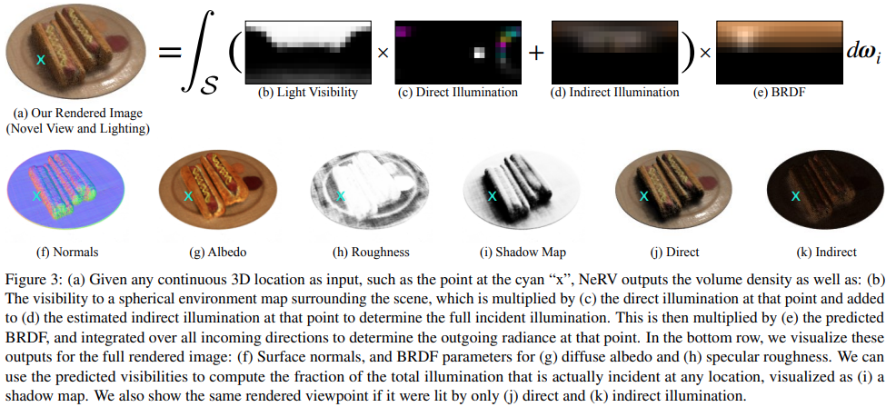
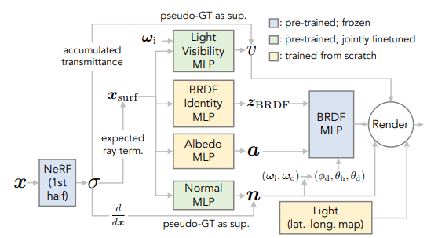

# Variants of NeRF based Rendering

## Neural Sparse Voxel Fields
[Neural Sparse Voxel Fields](https://arxiv.org/pdf/2007.11571.pdf)  
github: https://github.com/facebookresearch/NSVF  
website: https://lingjie0206.github.io/papers/NSVF/

The largest limitation for NeRF is that NeRF is not efficient. According to the author of NSVF
 > Although NeRF performs
importance sampling along the ray, due to allocating fixed computational budget for every ray, it
cannot exploit this opportunity to improve rendering speed.

The main idea behind NSVF is to using bounding volume hierachy and sparse voxel octree to model a scene in sparse hierarchical structure for acceleration. 

### Voxel-bounded Implicit Fields
For a scene, assume that the scene are contained within a set of sparse voxels $\mathcal V = \{V_1,...,V_K\}$.  
For each point $\mathbf x$ and its viewing direction $\mathbf d$, we first find $i$ where $\mathbf x\in V_i$, then 

$$F_\Theta(\mathbf x, \mathbf d) = F_{\theta}^i (g_i(\mathbf x), \mathbf d)$$ 

where each $g_i$ is defined as  

$$g_i(\mathbf x) = \zeta\circ \chi \circ \tilde g_i\circ p (\mathbf x)$$

 - $p(\mathbf x) = (v_1, v_2, ..., v_8)$ find the 8 vertices of $V_i$
 - $g_i$ are feature vectors stored at each vertex. 
 - $\chi$ is the triniliear interpolation to interpolate $\mathbf x$
 - $\zeta$ is the post-processing function, hence we use positional encoding as of NeRF.
 
And each $F^i_\theta$ is a MLP with shared parameters $\theta$

### Volume Rendering
Assuming that we have obtained the voxels, do ray-voxel intersections using AABB tree and then for each ray
 - if the ray hits some voxel, sample point only from the voxels by rejection sampling and accumalate color by volume rendering equation $\hat{C}(\mathbf r) = \sum_{i=1}^N T_i (1 - e^{-\sigma_i (t_{i+1} - t_i)})\mathbf c_i$
 where $\mathbf c_i$ is obtained from Voxel-bounded Implicit Fields
- if the ray does not hit, then add an additional transparency term $\alpha(\mathbf r) = \exp{\sum_{i=1}^N -\sigma_i (t_{i+1}-t_i)}$ abd learnable RGB bg color $\mathbf c_{bg} \in\mathbb R^3$, and the color of non-hit is $\alpha\mathbf c_{bg}$

### Learning
The loss function is defined as of NeRF, plus an additional transparency loss 

$$\mathcal L = \mathcal L_{\mathbf c} + \lambda \Omega(\alpha(\mathbf r))$$

where $\Omega$ is the beta-distribution regularization. 

For the voxel, initialize the bounding box that roughly encloses the scene, and then during the training, periodically prune $V_i$ if 

$$\min(\exp(-\sigma(\mathbf x_j))) > \gamma, \mathbf x_j \in V_i$$ 

where $\mathbf x_j$ is uniformaly sampled in $V_i$ ($16^3$ samples in the paper), and $\gamma$ is a threshold ($0.5$ in the paper). 

After certain steps of training, reduce the ray-marching step size (partition length) and voxel side-length (by half in the paper). The voxel representations on the newly created vertices will be tri-linear interpolation. 

## VolSDF
[Volume Rendering of Neural Implicit Surfaces](https://arxiv.org/pdf/2106.12052.pdf)  
website: https://lioryariv.github.io/volsdf/  
github: https://github.com/lioryariv/volsdf

Although NeRF performs well for view synthesis. The mesh reconstruction by marching cubes on $\sigma$ is quite noisy. According to VolSDF, 
> NeRF is non-trivial to find a proper threshold to extract surfaces from the predicted density, and the recovered geometry is far from satisfactory.

Instead of using the "transparency" $\sigma$, the paper uses signed distance regularized with an Eikonal loss to get a less noisy mesh surface, while preserving high fidelity. 

### Density as transformed SDF
Let $\Omega \subset \mathbb R^3$ be the space occupied by some object, and $M = \partial \Omega$ be its surface. Using indicator $\mathbb I_\Omega(x) = \mathbb I (x\in\Omega)$ and SDF 

$$d_\Omega(x) = (-1)^{\mathbb I_{\Omega}(x)}\min_{y\in M} \|x-y\|_2$$

Then, instead of defining $\sigma$ through a MLP as in NeRF, the paper model the density using a certain transformation of a learnable SDF 

$$\sigma = \alpha F_\beta(-d_\Omega(x))$$

where $F_\beta$ is the CDF of the Laplace distribution $X\sim Laplace(0, \beta)$, 

$$F_X(x) = \begin{cases} \frac{\exp(s/\beta)}{2}&x\leq 0\\1-\frac{\exp(-x/\beta)}{2}&x>0\end{cases}$$

Intuitively, $\sigma$ models a homogeneous object with a constant density $\alpha$ that smoothly decreases near the object's boundary, the smoothness is controlled by $\beta$. 

## NeRV: Neural Reflectance and Visibility Fields for Relighting and View Synthesis

Page (https://pratulsrinivasan.github.io/nerv/)  
paper(https://pratulsrinivasan.github.io/nerv/)

### Light Model

In the original NeRF model, we only consider the radiance, or the light emitted at $x$ from direction $d$, denote it as $L_e(\mathbf x, \mathbf d_0)$. In NeRV, we replace this term with the standard reflectance light $L_r(\mathbf x, \mathbf d_0)$, which considers the light from all directions

$$L_r(\mathbf x, \mathbf d_0) = \int_S L_i(\mathbf x, \mathbf d_i) R(\mathbf x, \mathbf d_i, \mathbf d_0)d\mathbf d_i$$

where $L_i$ is the incoming radiance and $R$ is the refleactance or transforming term. Practically, $L_i$ is implemented as direction and indirect (one bounce) illunimnations and $R$ is implemented using standard microfacet BRDF. 

### Nerual Reflectance Fields for R
The idea is to use two networks,  
A shape MLP function $\text{MLP}_s: \mathbf x\rightarrow \sigma$ to capture the surface, and then $\nabla_\mathbf x \text{MLP}_s$ will be the normal of the surface. Optionally, we can fine tune the normals with another MLP.     
A reflactance MLP function $\text{MLP}_r:\mathbf x \rightarrow (\mathbf a, \gamma)$ to be albedo color and roughness, which are the parameters to microfacet BRDF. 

### Light Transport for L

$L_i = L_e + L_r$ can be decomposed into the direct (light directly from environment) and indirect (ilght reflected from other surfaces/objects and the shadow). 

For direct light, we consider 

$$L_e(\mathbf x, \mathbf d_i) = V(\mathbf x, \mathbf d_i) E(\mathbf x, -\mathbf d_i)$$

where $V$ is the light visibility, which is approximated by a MLP (similar to $\sigma$ term in the original NeRF). and $E$ is the environment light map, which is an spherical (hemi-spherical) light map. 

For indirect light, due to computation limit, we only consider the first bounce, and encode it as the indirect light map and shadow map. 

### Limitations

Lots of parameters to be estimated by MLPs, much more intensive MLP computations and very expensive integrals (discretized to the light maps, a good approximation need at least 128 direction). 

Microfacet BRDF has very limited expressive power. Also, the approximation is not very good. The object loses plenty of the fidelity. 

### NeRFactor
NeRFactor: Neural Factorization of Shape and Reflectance Under an Unknown Illumination  
Page (https://xiuming.info/projects/nerfactor/)  
Paper (https://arxiv.org/pdf/2106.01970.pdf)

The idea and light modelling is similar to NeRV. but NeRFactor provides a more feasible training and evaluating pipeline. Also, replace the Microfacet BRDF with a data-driven MERL-BRDF model, adding much better expressive power. 

