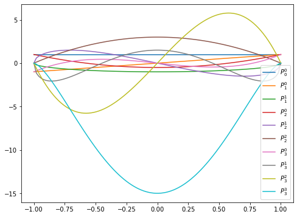
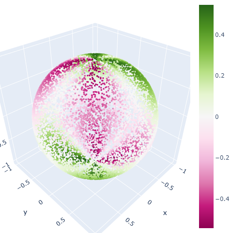

# Spherical Harmonic Lighting

[Spherical Harmonic Lighting:
The Gritty Details 
](http://www.cse.chalmers.se/~uffe/xjobb/Readings/GlobalIllumination/Spherical%20Harmonic%20Lighting%20-%20the%20gritty%20details.pdf)


__Spherical Harmonic Lighting__ A efficient method for capturing and displaying Global Illumination solutions across the surface of an object. 

## Background
### Light Modeling

For a point $x$ at the surface, the reflected light intensity from viewing direction $ \mathbf d_0$ is modelled as 

\begin{align*}
L(x,  \mathbf d_0) &= L_e(x,  \mathbf d_0) + \int_S f_r(x,  \mathbf d_i -  \mathbf d_0) L_r(x',  \mathbf d_i) G(x,x') \mathbf I(x\text{ see } x')d\: \mathbf d_i\\
\end{align*}

where $S$ is the unit sphere centered at $x$ and  
$L_e(x,  \mathbf d_0)$ is the direct emission light  
$f_r(x,  \mathbf d_i -  \mathbf d_0)$ is the BRDF term, transforming incoming light $ \mathbf d_i$ to $\mathbf d_0$  
$L_r(x,x')$ the the light reflected from $x'$ to $x$  
$G(x, x')$ is the geometric relationship between $x$ and $x'$  

Of course, this computation is intractable and we do lots compromises (given up some terms, simplify the model). 

### Monte Carlo Integration

Known that the expectation is defined as

$$E(f(x)) = \int f(x)p(x) dx$$

for any function $f$, thus if we have that $f' = f/p$, we have

$$E(\frac{f(x)}{p(x)}) = \int \frac{f(x)}{p(x)}p(x) dx = \int f(x)dx \approx \hat E(\frac{f(x)}{p(x)}) = \frac{\sum^N f(x_i)/{p(x_i)}}{N}$$

More over, if we can uniformally sample $N$ points on the sphere surface, then we have $p(x_i) = 1/4\pi$ is constant. so that the equation is reduced to summing samples.

Note that uniform sampling from polar coordinate $(\theta\in [0,2\pi), \phi\in[-\pi/2,\pi/2))$ is not a uniform sampling over the sphere, since we are sampling over the circles with different radius $\sin\phi$. 

Instead, we transforms from unit square $(u,v)$ 

$$(2\pi u, 2\cos^{-1}(\sqrt{1-v}))\rightarrow (\theta,\phi)$$


```js
function sphere_sample(N) {
    const positions = new Float32Array(N * 3);
    for (let i = 0; i < N; i++) {
        // uniform sample from [0, 1) * [0, 1)
        const u = Math.random();
        const v = Math.random();
        // transform to polar
        const theta = 2 * PI * u;
        const phi = 2 * Math.acos(Math.sqrt(1 - v));
        // transform to xyz
        positions[3 * i] = Math.cos(theta) * Math.sin(phi);
        positions[3 * i + 1] = Math.sin(theta) * Math.sin(phi);
        positions[3 * i + 2] = Math.cos(phi);
    }
    return positions;
}
```

<iframe src="./assets/sphere_sample.html" height=480 width="100%" />


### Orthogonal Basis Functions

Define two functions are orthogonal if 

$$\langle f, g\rangle = \int f(x)g(x)dx = 0$$

Using the inner product, we can project function $f$ onto a basis function $g$. For example, if we use a set of linear basis functions $B_i$, then we can project each piece of $f$ onto the piecewise basis, and approximate it by scaling each piece with the dot product. 

#### Associated Legendre Polynomials
Orthogonal Polynomials are sets of polynomials s.t. 

$$\int_{-1}^1 F_m(x)F_n(x)dx = c\cdot \mathbb I(n=m)$$

furthermore, if $c=1$, then the family of polynomials is called __orthonormal basis functions__. 

In particular, we are interested in __Associated Legendre Polynomials__. First, we have __Legendre Polynomials__, which is a particular case for orthonormal basis functions

$$P_n(x) = \frac{1}{2^n n!}\frac{d^n}{dx^n}(x^2-1)^n$$

then, __Associated Legendre Polynomials__ is defined based on $P_n$ as 

$$P_l^m(x)= (-1)^m (1-x^2)^{m/2}\frac{d^m}{dx^m}P_l(x)$$

where $l$ is the degree.band indexm and $m$ is the order. $l,m\in\mathbb N. m\leq l. P_l^m:[-1,1]\rightarrow\mathbb R$

There are some good property of ALP, which makes it easy to recurse.

\begin{align*}
&(1)&(l-m)P_l^m &= x(2l-1)P_{l-1}^m - (l+m-1)P^m_{l-2}\\
&(2)&P_m^m &= (-1)^m (2m-1)!!(1-x^2)^{m/2}\\
&(3)&P_{m+1}^m &= x(2m+1)P_m^m
\end{align*}

where $n!! = n\times (n-2)\times (n-4) \times ... \times 1\text{ or }0$ where $1,0$ depends on whether $n$ is odd or even. 


```python
def ALP(m, l, x):
    if l == 0: return np.ones_like(x)
    # first, raise to p^m_m term by eq2
    pmm = 1
    if m > 0:
        somx2 = ((1.- x) * (1. + x)) ** .5
        fact = 1
        for _ in range(1, m+1):
            pmm *= -fact * somx2
            fact += 2.
    if l == m: 
        return pmm
    # p^m_{m+1} term by eq3
    pmmp1 = x * (2. * m + 1.) * pmm
    if l == m + 1:
        return pmmp1
    # start to raise l  by eq1
    pll = 0
    for ll in range(m+2, l+1):
        pll = ((2. * ll - 1.) * x * pmmp1 - (ll + m - 1.) * pmm) / (ll - m)
        pmm = pmmp1
        pmmp1 = pll
    return pll
```


```python
x = np.linspace(-1, 1, 100)
plt.figure(figsize=(8,6))
for l in range(4):
    for m in range(l+1):
        plt.plot(x, ALP(m,l,x), label=fr"$P_{l}^{m}$")
plt.legend();
```


    

    


## Spherical Harmonics
Using the standard spherical coordinates 

$$(x,y,z) = (\sin\theta\cos\phi,\sin\theta\sin\phi,\cos\theta)$$

the spherical harmonics is 

$$y_l^m(\theta,\phi) = \begin{cases}
\sqrt 2 K_l^m \cos (m\phi) P_l^m (\cos\theta) &m>0\\
\sqrt 2 K_l^m \sin (-m\phi) P_l^{-m} (\cos\theta) &m<0\\
K_l^0P_l^0(\cos\theta)&m=0
\end{cases}$$

where $K$ is the scaling factor to normalize the functions

$$K_l^m = \sqrt{\frac{(2l+1)(l-|m|)!}{4\pi(l+|m|)!}}$$

[Wiki for the visualizations and analytic formulas](https://en.wikipedia.org/wiki/Table_of_spherical_harmonics)


```python
from math import factorial

def SH(m, l, theta, phi):
    K = (2. * l + 1) * factorial(l-abs(m)) / (4. * np.pi * factorial(l+abs(m)))
    K = np.sqrt(K)
    if m == 0:
        return K * ALP(0, l, np.cos(theta))
    elif m > 0:
        return np.sqrt(2) * K * np.cos(m * phi) * ALP(m, l, np.cos(theta))
    else:
        return np.sqrt(2) * K * np.sin(-m * phi) * ALP(-m, l, np.cos(theta))

theta, phi = uniform_sphere(10000)
x, y, z = sphere2xyz(theta, phi)
sh_c = SH(1, 2, theta, phi)
fig = go.Figure(data=[go.Scatter3d(
    x=x, y=y, z=z, mode='markers', 
    marker={'size': 2, 'color': sh_c, 'showscale': True})])
fig.update_layout(height=480, width=480, margin=dict(l=0, r=0, b=0, t=0))
Image(fig.to_image(format="png"))
```




### SH Projection

The projection onto SH is hence 

$$c_l^m = \int_S f(s) y_l^m(s)ds$$

which can be evaluated using Monte-Carlo integration (since we have our unit sphere uniform sampling). 

and the reconstruction is 

$$\tilde f(s) = \sum_{l=0}^{n-l}\sum_{m=-l}^l c_l^m y_l^m(s) = \sum_{i=0}^{n^2} c_i y_i(s)$$

where $i = l(l+1)+m$ is used to flatten the nested indexes into 1D. 

Thus, we can connect everything together. 

## Properties

### Rotation Invariance
SH functions are orthonormal, thus suppose that $g:= f\circ R$ where $R\in SO(3)$, then $\tilde g = \tilde f \circ R$ is the same approximation of $g$. Thus, if we do rotations of the light field (viewing from different angles, or in a dynamic lighting environment). 


### Integration to dot product

For the reflectance models, the light is an integral over a sampled area

$$\int_S L(s) t(s)ds$$

where $L$ is the incoming light from direction $s$, and $t$ is the transfer function (e.g. BRDF). However, if we use spherical harmonics to approximate $L$ and $t$, and take $L_i, t_i$ be the SH coefs. Then we have that 

$$\int_S \tilde L(s) \tilde t(s)ds = \sum_{i=0}^{n^2} L_i t_i$$

which is the dot product of two coef vectors. 
