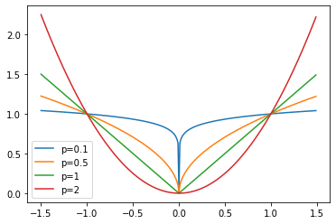

# Sparse Iterative Closest Point

<a href="https://lgg.epfl.ch/publications/2014/sparseicp/paper.pdf">Sparse Iterative Closest Point</a>  
<a href="https://github.com/OpenGP/sparseicp">C++ Implementation</a>

## Registration and ICP
Check the Notes on  <a href="../csc419/registration.html">CSC419 - Registration</a>

### Problems with ICP
- Incorrect closest-point correspondences.
- Not robust to utliers, or the correspondence is not ideal on the target shape.
- The solution for defining outliers require lots of coefficients tuning

## Model Outliers using Sparsity

Let the distance between each correspondence be $z$. Therefore, the ideal model should have inliners having $\lVert z\rVert_2\approx 0$ and the outliers having $\lVert z\rVert_2 \gg 0$. However, this is not enforced in ICP. For other ICP related methods, the outlier is achieved by other heuristics. In this paper, the author tries to enforce this by replacing the euclidean distance with other $l_p$ norm, where $p<1$. 

### Sparsity Enforcement By l<sub>p</sub> Norm

$l_p$ norm is defined as 

$$L_p(\textbf z) = (\sum_i |z_i|^p)^{1/p}$$

Then, $l_0$ norm is $L_0(\mathbf z) = \sum \mathbb I(z_i = 0)$, i.e. the number of non-zero elements.  
$l_1$ norm is $L_1(\mathbf z) = \sum |z_i|$, i.e. the absolute sum of elements.   
$l_2$ norm is Euclidean norm.

From the $l_p$ norm's definition, obviously the best option for enforcing sparsity is to use $l_0$ norm, but $l_0$ norm is non-convex, it is unable to optimize. 

$l_1$ regularization is a very simple technique used in many fields.such as machine learning (lasso regression). Where $l_2$ regularizations (ridge regression) aims to regularizes the weights, $l_1$ regularizations will more likely to reduce some weights (variables) to 0. 

Instead of using $p=1$, the paper chooses to use $p<1$ as a relaxation of $l_0$ norm. In this case, the problem is non-convex, and the efficient optimization is a bit different. The author proposes Alternating Direction Method of Multipliers (ADMM) to tackle this problem. 


```python
import matplotlib.pyplot as plt
import numpy as np
x = np.arange(-1.5, 1.5, 0.01)
for p in (0.1, 0.5, 1, 2):
    plt.plot(x, np.abs(x)**p, label=f"p={p}")
plt.legend();
```


    

    


## Robust Distance Function

The original ICP works as the correspondence and rigid matching steps, i.e. 

$$\arg\min_Y \sum^n d(Rx_i + t, y_i)$$

$$\arg\min_{R, t} d(Rx_i + t, y_i), R \in SO(k), t\in \mathbb R^k$$

Typically, $d(\cdot) = \|\cdot\|^2_2$
In our case, we use $d(\cdot) = \|\cdot\|_2^p$, note that the norm is still Euclidean norm so that we penalize only on the corresponding points, instead of penalizing individual xyz-coordinates. 

## Numerical Optimization

Now, we have the optimization question, but this is non-convex and non-smooth. 

$$\arg\min_Y \sum^n \|Rx_i + t, y_i\|^p_2$$

$$\arg\min_{R, t} \|Rx_i + t, y_i\|^p_2, R \in SO(k), t\in \mathbb R^k$$

### Correspondence Step
Note that this optimization is the same as original ICP, since we are still to find closest point. 

### Rigid Matching Step
Consider the optimization question

$$\arg\min_{R, t} \|Rx_i + t, y_i\|^p_2, R \in SO(k), t\in \mathbb R^k$$

Introduce $Z = \{z_1,...,z_n\}, z_i = Rx_i + t - y_i$, so that the question becomes constrained

\begin{align*}
&&\arg\min_{R, t, Z} \|z_i\|^p_2\\
&\text{subject to} &R \in SO(k), t\in \mathbb R^k\\
&&Rx_i + t - y_i - z_i = 0
\end{align*}

Denote $\delta_i = Rx_i + t - y_i - z_i$. We can solve the problem using augmented Lagrangian methods

$$\mathcal L(R, t, Z, \Lambda) = \sum^n \|z_i\|^p_2 + \lambda_i^T\delta_i+\frac\mu 2\|\delta_i\|_2^2$$

where $\Lambda = \{\lambda_i\in\mathbb R^k:i=1,...,n\}$ is a set of Lagrange multipliers and $\mu>0$ is the penalty weight. 

Optimize the equation by ADMM

\begin{align*}
&(1)&\arg\min_Z\sum^n \|z_i\|_2^p + \frac\mu 2\|z_i - h_i\|_2^2\\
&(2)&\arg\min_{R,t}\sum^n \|Rx_i + t - c_i\|_2^2\\
&(3)&\lambda_i = \lambda_i + \mu\delta_i
\end{align*}

where $c_i = y_i + z_i - \frac{\lambda_i}\mu, h_i = Rx_i + t - y_i + \frac{\lambda_i}\mu$.

Then, $(1)$ is separable for each $z_i$ and then can be solved by shrink operator and $(2)$ is the typical ICP step.
