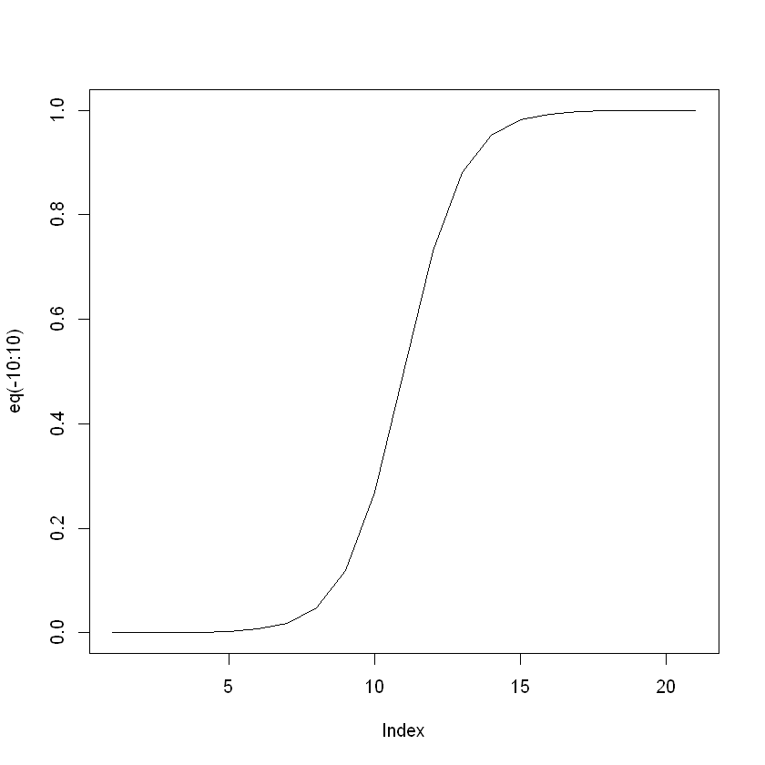
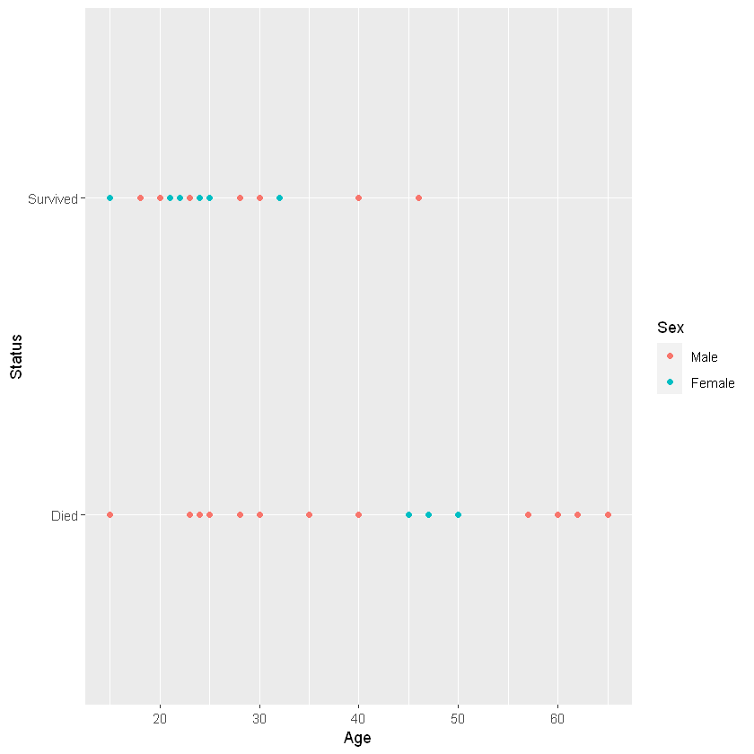
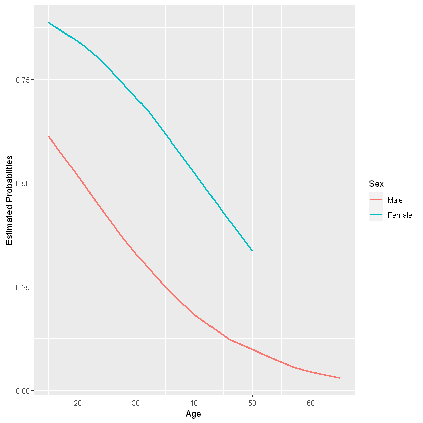

## Case Study: Donner Party


```R
library(Sleuth2)
donner = case2001
Age = donner$Age
Sex = donner$Sex
Status = donner$Status
```


```R
# contingency table
xtabs(~Status+Sex, data=donner)
```


              Sex
    Status     Male Female
      Died       20      5
      Survived   10     10


```R
summary(Age)
```


       Min. 1st Qu.  Median    Mean 3rd Qu.    Max. 
       15.0    24.0    28.0    31.8    40.0    65.0 


Response $Y_i=\{0,1\}$ survived or died <br>
Predictor: $X_i$ age/sex

#### Model
$Y_i\mid X_i=\mathbb{I}$(response is in category of interest)$\sim Bernoulli(\pi_i)$ <br>
$E(Y_i\mid X_i)=\pi_i, var(Y_i\mid X_i)=\pi_1(1-\pi_i)$

## Generalized Linear Models
Having response $Y$ can a set of explanatory variables $X_1,...,X_p$

Want $E(Y)$ as a linear function in the parameters, ie. $g(E(Y))=X\beta$

Key idea: find the link function $g$ such that the model is true

Some link functions

| link | function | usual distribution of $Y\mid X$ | 
| --- | --- | --- |
|identity| $g(\mu)=\mu$ | normal |
|log | $g(\mu)=\log\mu,\mu>0$ | Poisson(count data) |
|logistic | $g(\mu)=\log(\mu/(1-\mu)),0<\mu<1$ | Bernoulli(binary),Binomial |

### GLM vs. Transformation

- For transformation, transforming $Y$ so it has an approximate normal distribution with constant variance
- For GLM, distribution of $Y$ not restricted to Normal
- Model parameters describe $g(E(Y))$ rather than $E(g(Y))$
- GLM provide a unified theory of modeling that encompasses the most important models for continuous and discrete variables

## Binary Logistic Regression

- Let $\pi=P("success"),0<\pi<1$
- The **odds** in favor of success is $\frac{\pi}{1-\pi}$
- The **log odds** is $\log(\frac{\pi}{1-\pi})$

### Model
$\log(\frac{\pi}{1-\pi}) = \beta_0 + \beta_1X_1+...+\beta_pX_p$

Let the linear predictor $\eta=\beta_0 + \beta_1X_1+...+\beta_pX_p$, then **Logistic function** is $\pi(\eta)=\frac{e^{\eta}}{1+e^\eta}$


```R
eq <- function(x){exp(x)/(1+exp(x))}
plot(eq(-10:10), type='l')
```


    

    


- log-odds $\log(\frac{\pi}{1-\pi})\in(-\infty, \infty)$, is increasing function.
- Predicts the natural log of the odds for a subject bing in one category or another
- Regression coefficients can be used to estimate odds ratio for each of the independent variables
- Tell which predictors can be used to determine if a subject was in a category of interest

### MLE
- Date: $Y_i=\mathbb{I}(\text{if response is in category of interest})$
- Model: $P(Y_i=y_1)=\pi_i^{y_{i}}(1-\pi_i)^{1-y_{i}}$
- Assumption: The observations are independent.
- Joint density: 

    $$P(Y_1=y_1,...,Y_n=y_n)=\prod_1^n \pi_i^{y_{i}}(1-\pi_i)^{1-y_{i}}$$ 
    
    $$\pi_i = \frac{\exp(\beta_0+\beta_1X_{i1}+...+\beta_pX_{ip})}{1+\exp(\beta_0+\beta_1X_{i1}+...+\beta_pX_{ip})}$$

Likelihood function: plug in observed data and think of the joint density as a function of $\beta$'s

$$\mathcal{L}(\beta_0,...,\beta_p)=\prod_{1^n}\pi_i\vec\beta^{y_i}(1-\pi_i{\vec\beta})^{1-y_i}$$

There is no explicit expression for the max likelihood estimators. Two iterative numerical solution methods are Newton-Raphson algorithm and Fisher scoring or IWLS (In R, **glm()**)


```R
# additive
fita<-glm(Status~Age+Sex, family=binomial, data=donner)
summary(fita)
```


    
    Call:
    glm(formula = Status ~ Age + Sex, family = binomial, data = donner)
    
    Deviance Residuals: 
        Min       1Q   Median       3Q      Max  
    -1.7445  -1.0441  -0.3029   0.8877   2.0472  
    
    Coefficients:
                Estimate Std. Error z value Pr(>|z|)  
    (Intercept)  1.63312    1.11018   1.471   0.1413  
    Age         -0.07820    0.03728  -2.097   0.0359 *
    SexFemale    1.59729    0.75547   2.114   0.0345 *
    ---
    Signif. codes:  0 '***' 0.001 '**' 0.01 '*' 0.05 '.' 0.1 ' ' 1
    
    (Dispersion parameter for binomial family taken to be 1)
    
        Null deviance: 61.827  on 44  degrees of freedom
    Residual deviance: 51.256  on 42  degrees of freedom
    AIC: 57.256
    
    Number of Fisher Scoring iterations: 4
    


```R
anova(fita)
```


<table>
<caption>A anova: 3 × 4</caption>
<thead>
	<tr><th></th><th scope=col>Df</th><th scope=col>Deviance</th><th scope=col>Resid. Df</th><th scope=col>Resid. Dev</th></tr>
	<tr><th></th><th scope=col>&lt;int&gt;</th><th scope=col>&lt;dbl&gt;</th><th scope=col>&lt;int&gt;</th><th scope=col>&lt;dbl&gt;</th></tr>
</thead>
<tbody>
	<tr><th scope=row>NULL</th><td>NA</td><td>      NA</td><td>44</td><td>61.82654</td></tr>
	<tr><th scope=row>Age</th><td> 1</td><td>5.535820</td><td>43</td><td>56.29072</td></tr>
	<tr><th scope=row>Sex</th><td> 1</td><td>5.034437</td><td>42</td><td>51.25628</td></tr>
</tbody>
</table>


```R
# modelling "Died"
Status2 = relevel(Status, ref="Survived")
fitad <- glm(Status2 ~ Age + Sex, family=binomial, data=donner)
summary(fitad)
```


    
    Call:
    glm(formula = Status2 ~ Age + Sex, family = binomial, data = donner)
    
    Deviance Residuals: 
        Min       1Q   Median       3Q      Max  
    -2.0472  -0.8877   0.3029   1.0441   1.7445  
    
    Coefficients:
                Estimate Std. Error z value Pr(>|z|)  
    (Intercept) -1.63312    1.11018  -1.471   0.1413  
    Age          0.07820    0.03728   2.097   0.0359 *
    SexFemale   -1.59729    0.75547  -2.114   0.0345 *
    ---
    Signif. codes:  0 '***' 0.001 '**' 0.01 '*' 0.05 '.' 0.1 ' ' 1
    
    (Dispersion parameter for binomial family taken to be 1)
    
        Null deviance: 61.827  on 44  degrees of freedom
    Residual deviance: 51.256  on 42  degrees of freedom
    AIC: 57.256
    
    Number of Fisher Scoring iterations: 4
    


```R
# Reference group as "Male"
Sex2 = relevel(Sex, ref="Male")
fitadf <- glm(Status2~Age + Sex2, family=binomial, data=donner)
summary(fitadf)
```


    
    Call:
    glm(formula = Status2 ~ Age + Sex2, family = binomial, data = donner)
    
    Deviance Residuals: 
        Min       1Q   Median       3Q      Max  
    -2.0472  -0.8877   0.3029   1.0441   1.7445  
    
    Coefficients:
                Estimate Std. Error z value Pr(>|z|)  
    (Intercept) -1.63312    1.11018  -1.471   0.1413  
    Age          0.07820    0.03728   2.097   0.0359 *
    Sex2Female  -1.59729    0.75547  -2.114   0.0345 *
    ---
    Signif. codes:  0 '***' 0.001 '**' 0.01 '*' 0.05 '.' 0.1 ' ' 1
    
    (Dispersion parameter for binomial family taken to be 1)
    
        Null deviance: 61.827  on 44  degrees of freedom
    Residual deviance: 51.256  on 42  degrees of freedom
    AIC: 57.256
    
    Number of Fisher Scoring iterations: 4
    


```R
# Additive model for survived
fitasf <- glm(Status~Age + Sex2, family=binomial, data=donner)
summary(fitasf)
```


    
    Call:
    glm(formula = Status ~ Age + Sex2, family = binomial, data = donner)
    
    Deviance Residuals: 
        Min       1Q   Median       3Q      Max  
    -1.7445  -1.0441  -0.3029   0.8877   2.0472  
    
    Coefficients:
                Estimate Std. Error z value Pr(>|z|)  
    (Intercept)  1.63312    1.11018   1.471   0.1413  
    Age         -0.07820    0.03728  -2.097   0.0359 *
    Sex2Female   1.59729    0.75547   2.114   0.0345 *
    ---
    Signif. codes:  0 '***' 0.001 '**' 0.01 '*' 0.05 '.' 0.1 ' ' 1
    
    (Dispersion parameter for binomial family taken to be 1)
    
        Null deviance: 61.827  on 44  degrees of freedom
    Residual deviance: 51.256  on 42  degrees of freedom
    AIC: 57.256
    
    Number of Fisher Scoring iterations: 4
    


```R
# the order of independent variable does not metter
fitsaf <- glm(Status~ Sex2+Age, family=binomial, data=donner)
summary(fitsaf)
```


    
    Call:
    glm(formula = Status ~ Sex2 + Age, family = binomial, data = donner)
    
    Deviance Residuals: 
        Min       1Q   Median       3Q      Max  
    -1.7445  -1.0441  -0.3029   0.8877   2.0472  
    
    Coefficients:
                Estimate Std. Error z value Pr(>|z|)  
    (Intercept)  1.63312    1.11018   1.471   0.1413  
    Sex2Female   1.59729    0.75547   2.114   0.0345 *
    Age         -0.07820    0.03728  -2.097   0.0359 *
    ---
    Signif. codes:  0 '***' 0.001 '**' 0.01 '*' 0.05 '.' 0.1 ' ' 1
    
    (Dispersion parameter for binomial family taken to be 1)
    
        Null deviance: 61.827  on 44  degrees of freedom
    Residual deviance: 51.256  on 42  degrees of freedom
    AIC: 57.256
    
    Number of Fisher Scoring iterations: 4
    


```R
anova(fitasf)
```


<table>
<caption>A anova: 3 × 4</caption>
<thead>
	<tr><th></th><th scope=col>Df</th><th scope=col>Deviance</th><th scope=col>Resid. Df</th><th scope=col>Resid. Dev</th></tr>
	<tr><th></th><th scope=col>&lt;int&gt;</th><th scope=col>&lt;dbl&gt;</th><th scope=col>&lt;int&gt;</th><th scope=col>&lt;dbl&gt;</th></tr>
</thead>
<tbody>
	<tr><th scope=row>NULL</th><td>NA</td><td>      NA</td><td>44</td><td>61.82654</td></tr>
	<tr><th scope=row>Age</th><td> 1</td><td>5.535820</td><td>43</td><td>56.29072</td></tr>
	<tr><th scope=row>Sex2</th><td> 1</td><td>5.034437</td><td>42</td><td>51.25628</td></tr>
</tbody>
</table>


```R
anova(fitsaf)
```


<table>
<caption>A anova: 3 × 4</caption>
<thead>
	<tr><th></th><th scope=col>Df</th><th scope=col>Deviance</th><th scope=col>Resid. Df</th><th scope=col>Resid. Dev</th></tr>
	<tr><th></th><th scope=col>&lt;int&gt;</th><th scope=col>&lt;dbl&gt;</th><th scope=col>&lt;int&gt;</th><th scope=col>&lt;dbl&gt;</th></tr>
</thead>
<tbody>
	<tr><th scope=row>NULL</th><td>NA</td><td>      NA</td><td>44</td><td>61.82654</td></tr>
	<tr><th scope=row>Sex2</th><td> 1</td><td>4.540267</td><td>43</td><td>57.28628</td></tr>
	<tr><th scope=row>Age</th><td> 1</td><td>6.029991</td><td>42</td><td>51.25628</td></tr>
</tbody>
</table>


```R
# Higher order model with 3 higher order/interaction terms
fitfull <- glm(Status~Age + Sex2 + Age:Sex2+I(Age^2)+I(Age^2):Sex2, family=binomial, data=donner)
summary(fitfull)
```


    
    Call:
    glm(formula = Status ~ Age + Sex2 + Age:Sex2 + I(Age^2) + I(Age^2):Sex2, 
        family = binomial, data = donner)
    
    Deviance Residuals: 
        Min       1Q   Median       3Q      Max  
    -2.3396  -0.9757  -0.3438   0.5269   1.5901  
    
    Coefficients:
                         Estimate Std. Error z value Pr(>|z|)
    (Intercept)         -3.318484   3.940184  -0.842    0.400
    Age                  0.183031   0.226632   0.808    0.419
    Sex2Female           0.265286  10.455222   0.025    0.980
    I(Age^2)            -0.002803   0.002985  -0.939    0.348
    Age:Sex2Female       0.299877   0.696050   0.431    0.667
    Sex2Female:I(Age^2) -0.007356   0.010689  -0.688    0.491
    
    (Dispersion parameter for binomial family taken to be 1)
    
        Null deviance: 61.827  on 44  degrees of freedom
    Residual deviance: 45.361  on 39  degrees of freedom
    AIC: 57.361
    
    Number of Fisher Scoring iterations: 5
    


```R
# interaction model
fitas <- glm(Status~Age*Sex2, family=binomial,data=donner)
summary(fitas)
```


    
    Call:
    glm(formula = Status ~ Age * Sex2, family = binomial, data = donner)
    
    Deviance Residuals: 
        Min       1Q   Median       3Q      Max  
    -2.2279  -0.9388  -0.5550   0.7794   1.6998  
    
    Coefficients:
                   Estimate Std. Error z value Pr(>|z|)  
    (Intercept)     0.31834    1.13103   0.281   0.7784  
    Age            -0.03248    0.03527  -0.921   0.3571  
    Sex2Female      6.92805    3.39887   2.038   0.0415 *
    Age:Sex2Female -0.16160    0.09426  -1.714   0.0865 .
    ---
    Signif. codes:  0 '***' 0.001 '**' 0.01 '*' 0.05 '.' 0.1 ' ' 1
    
    (Dispersion parameter for binomial family taken to be 1)
    
        Null deviance: 61.827  on 44  degrees of freedom
    Residual deviance: 47.346  on 41  degrees of freedom
    AIC: 55.346
    
    Number of Fisher Scoring iterations: 5
    


```R
anova(fitasf, test="Chisq")
```


<table>
<caption>A anova: 3 × 5</caption>
<thead>
	<tr><th></th><th scope=col>Df</th><th scope=col>Deviance</th><th scope=col>Resid. Df</th><th scope=col>Resid. Dev</th><th scope=col>Pr(&gt;Chi)</th></tr>
	<tr><th></th><th scope=col>&lt;int&gt;</th><th scope=col>&lt;dbl&gt;</th><th scope=col>&lt;int&gt;</th><th scope=col>&lt;dbl&gt;</th><th scope=col>&lt;dbl&gt;</th></tr>
</thead>
<tbody>
	<tr><th scope=row>NULL</th><td>NA</td><td>      NA</td><td>44</td><td>61.82654</td><td>        NA</td></tr>
	<tr><th scope=row>Age</th><td> 1</td><td>5.535820</td><td>43</td><td>56.29072</td><td>0.01863103</td></tr>
	<tr><th scope=row>Sex2</th><td> 1</td><td>5.034437</td><td>42</td><td>51.25628</td><td>0.02484816</td></tr>
</tbody>
</table>


```R
vcov(fitasf, digits=3)
```


<table>
<caption>A matrix: 3 × 3 of type dbl</caption>
<thead>
	<tr><th></th><th scope=col>(Intercept)</th><th scope=col>Age</th><th scope=col>Sex2Female</th></tr>
</thead>
<tbody>
	<tr><th scope=row>(Intercept)</th><td> 1.23250837</td><td>-0.038472741</td><td> 0.06007099</td></tr>
	<tr><th scope=row>Age</th><td>-0.03847274</td><td> 0.001390134</td><td>-0.00823197</td></tr>
	<tr><th scope=row>Sex2Female</th><td> 0.06007099</td><td>-0.008231970</td><td> 0.57073339</td></tr>
</tbody>
</table>


```R
cbind(bhat=coef(fitasf), confint.default(fitasf)) # CI for beta's
```


<table>
<caption>A matrix: 3 × 3 of type dbl</caption>
<thead>
	<tr><th></th><th scope=col>bhat</th><th scope=col>2.5 %</th><th scope=col>97.5 %</th></tr>
</thead>
<tbody>
	<tr><th scope=row>(Intercept)</th><td> 1.63312031</td><td>-0.5428002</td><td> 3.809040837</td></tr>
	<tr><th scope=row>Age</th><td>-0.07820407</td><td>-0.1512803</td><td>-0.005127799</td></tr>
	<tr><th scope=row>Sex2Female</th><td> 1.59729350</td><td> 0.1166015</td><td> 3.077985503</td></tr>
</tbody>
</table>


```R
exp(coef(fitasf)) # odd ratios
```


    (Intercept) 5.11982524825608
    Age         0.924775685984312
    Sex2Female  4.93964517580916


```R
exp(cbind(OR=coef(fitasf), confint.default(fitasf))) # Ci for odd ratios
```


<table>
<caption>A matrix: 3 × 3 of type dbl</caption>
<thead>
	<tr><th></th><th scope=col>OR</th><th scope=col>2.5 %</th><th scope=col>97.5 %</th></tr>
</thead>
<tbody>
	<tr><th scope=row>(Intercept)</th><td>5.1198252</td><td>0.5811187</td><td>45.1071530</td></tr>
	<tr><th scope=row>Age</th><td>0.9247757</td><td>0.8596067</td><td> 0.9948853</td></tr>
	<tr><th scope=row>Sex2Female</th><td>4.9396452</td><td>1.1236716</td><td>21.7146143</td></tr>
</tbody>
</table>


### Wald Chi-sq Procedures
logistic regression inference on a single $\beta$  

- Hypotheses: $H_0:\beta_j=0,H_a:\beta_j\neq 0$
- Test statistic: $z=\hat\beta_j/se(\hat\beta_j)$, $\hat\beta_j$ is MLE for $\beta_j$
- By standard large-sample results, MLE's are normally distributed. Thus, for large $n$, under $H_0$, z is an observation from an approx. $N(0,1)$. Note that $Z^2\sim \chi_1$, we can use chisq for p-value
- 95% CI: $\hat\beta_j \pm 1.96se(\hat\beta_j)$

Since the logistic function is monotonic, we can expand CI by doing monotonic transformation (e.x. multiplication and exp)


```R
# Wald test
library(aod)
wald.test(Sigma=vcov(fitasf), b=coef(fitasf), Terms=2:3)
```


    Wald test:
    ----------
    Chi-squared test:
    X2 = 6.9, df = 2, P(> X2) = 0.032


```R
wald.test(Sigma=vcov(fitas), b=coef(fitas), Terms=4)
```


    Wald test:
    ----------
    Chi-squared test:
    X2 = 2.9, df = 1, P(> X2) = 0.086


### Model Assumptions
- Underlying probability model for response is Bernoulli
- Observations are independent
- The form of the model is correct
     - Linear relationship between logits and explanatory variables
     - All relevant variables are included; irrelevant ones excluded
- Sample size is large enough for valid inference

B Logistic R vs. Linear R
- both utilize MLR's for the $\beta$'s
- Less assumption to check for than in linear regression
     - No need to check for outliers
     - No residual plots
     - Variance is not constant
 
Need to test
- (designing aspect) Independence of observations 
- (inference) Form of the model: test higher-order terms such as non-linear in X, interaction, and higher order interaction

#### Wald cs. LRT test
- Walk test on single $\beta = 0$, LRT find $k\geq 1$ $\beta$'s. 
- LRT compares nested models
- LRT allow small to moderate sample sizes $\beta$ near boundary of parameter space

### Comparing models: Likelihood Ratio Test
- Idea: compare likelihood of data under Full model, $\mathcal{L}_F$ to likelihood under REDUCED model $\mathcal{L}_R$ of same data. the likelihood ratio $\mathcal{L}_R/\mathcal{L}F$ where $\mathcal{L}_R\leq \mathcal{L}_F$
- Hypothesis: $H_0:\beta_1=...\beta_k=0$ (Reduced model is appropriate, fits data as swll as Full model)$H_a:$ at least one of betas is not 0 (full model is better)
- Test statistic: Deviance (residual)

$$G^2 = -2\log\mathcal{L}_R - (-2\log\mathcal{L}_F)=-2\log(\mathcal{L}_R/\mathcal{L}_F)\sim \chi^2_k$$

For large $n$, under $H_0$, $G^2$ is an observation from a chi-square distribution with $k$ d.f.

## Exercise
Models 

\begin{align*}
log(\frac{\pi_i}{1-\pi_i}) &= \\&(1) a_0+a_1Age_i+a_2I_{Female, i}\\ 
&(2) \beta_0 +\beta_1Age_i+\beta_2 I_{female_i,i} + \beta_3Age_i*I_{female,i}+\beta_4Age_i^2 + \beta_5Age_i^2*I_{Female, i} \\
&(3) \gamma_0 + \gamma_1Age_i + \gamma_2I_{Female, i} + \gamma_3Age_i *I_{Female, i}\end{align*}


```R
# additive model (model 1)
fitadd <- glm(Status~Age + Sex, family=binomial, donner)
summary(fitadd)
```


    
    Call:
    glm(formula = Status ~ Age + Sex, family = binomial, data = donner)
    
    Deviance Residuals: 
        Min       1Q   Median       3Q      Max  
    -1.7445  -1.0441  -0.3029   0.8877   2.0472  
    
    Coefficients:
                Estimate Std. Error z value Pr(>|z|)  
    (Intercept)  1.63312    1.11018   1.471   0.1413  
    Age         -0.07820    0.03728  -2.097   0.0359 *
    SexFemale    1.59729    0.75547   2.114   0.0345 *
    ---
    Signif. codes:  0 '***' 0.001 '**' 0.01 '*' 0.05 '.' 0.1 ' ' 1
    
    (Dispersion parameter for binomial family taken to be 1)
    
        Null deviance: 61.827  on 44  degrees of freedom
    Residual deviance: 51.256  on 42  degrees of freedom
    AIC: 57.256
    
    Number of Fisher Scoring iterations: 4
    


```R
# full model (model 2)
fitfull <- glm(Status~Age + Sex + Age: Sex + I(Age^2) + I(Age^2):Sex, 
               family=binomial, donner)
summary(fitfull)
```


    
    Call:
    glm(formula = Status ~ Age + Sex + Age:Sex + I(Age^2) + I(Age^2):Sex, 
        family = binomial, data = donner)
    
    Deviance Residuals: 
        Min       1Q   Median       3Q      Max  
    -2.3396  -0.9757  -0.3438   0.5269   1.5901  
    
    Coefficients:
                        Estimate Std. Error z value Pr(>|z|)
    (Intercept)        -3.318484   3.940184  -0.842    0.400
    Age                 0.183031   0.226632   0.808    0.419
    SexFemale           0.265286  10.455222   0.025    0.980
    I(Age^2)           -0.002803   0.002985  -0.939    0.348
    Age:SexFemale       0.299877   0.696050   0.431    0.667
    SexFemale:I(Age^2) -0.007356   0.010689  -0.688    0.491
    
    (Dispersion parameter for binomial family taken to be 1)
    
        Null deviance: 61.827  on 44  degrees of freedom
    Residual deviance: 45.361  on 39  degrees of freedom
    AIC: 57.361
    
    Number of Fisher Scoring iterations: 5
    


```R
# interative model (model 3)
fitint <- glm(Status~Age*Sex, family=binomial, donner)
summary(fitint)
```


    
    Call:
    glm(formula = Status ~ Age * Sex, family = binomial, data = donner)
    
    Deviance Residuals: 
        Min       1Q   Median       3Q      Max  
    -2.2279  -0.9388  -0.5550   0.7794   1.6998  
    
    Coefficients:
                  Estimate Std. Error z value Pr(>|z|)  
    (Intercept)    0.31834    1.13103   0.281   0.7784  
    Age           -0.03248    0.03527  -0.921   0.3571  
    SexFemale      6.92805    3.39887   2.038   0.0415 *
    Age:SexFemale -0.16160    0.09426  -1.714   0.0865 .
    ---
    Signif. codes:  0 '***' 0.001 '**' 0.01 '*' 0.05 '.' 0.1 ' ' 1
    
    (Dispersion parameter for binomial family taken to be 1)
    
        Null deviance: 61.827  on 44  degrees of freedom
    Residual deviance: 47.346  on 41  degrees of freedom
    AIC: 55.346
    
    Number of Fisher Scoring iterations: 5
    


```R
# p-value for model2 vs. model1
1 - pchisq(5.895, 3)
```


    0.11683196297711


!!!question "Q1" 

    Using R output determine whether a model with the 3 higher order polynomial terms and interaction term is an improvement over the additive model


Higher order interaction vs. additive
Hypotheses: $H_0:\beta_3=\beta_4=\beta_5 = 0$

Test statistic $G^2 = 51.256 - 45.361 = 5.895\sim \chi^2_3$

p-value: 0.12

Conclusion: There is some evidence that the additive model is better than the higher order model


!!!question "Q2"
    
    determine whether the effect of Age on the odds of survival differ with Sex

Hypothesis: $H_0: \gamma_3 = 0$

Test statistic (LRT): $51.256 - 47.346 = 3.91\sim \chi^2_1$

p-value(LRT): 0.048

Test statistic (Wald): $-0.16160/0.09426 = -1.71\sim N(0,1)$

p-value(Wald): 0.0865
 
(Shown in R-output)

Conclusion: There is inconclusive evidence that the interactive model is better than the additive model


```R
# p-value for Q2 LRT
1 - pchisq(51.256-47.346, 1)
```


    0.0479995973077516


!!!question "Q3"
    
    determine whether or not the additive model fits better then the Null model

Hypothesis: $H_0: a_i = 0, i\neq 0$

Test statistic: $G^2 = 61.827 - 51.256=10.571\sim \chi_2^2$

p-value: 0.005

Conclusion: There is strong evidence that age and sex are relevant factors for estimating the odds of survival


```R
# p-value for Q3
1 - pchisq(61.827-51.256, 2)
```


    0.00506449930534014


## AIC & BIC
Akaike's Information Criterion  

$$AIC=-2log\mathcal{L}+2(p+1)$$

Schwarz's (Bayesian Information) Criterion  

$$-2log\mathcal{L}+(p+1)\log N$$

$p$ number of variables, $N$ sample size

Smaller means better model fit  
BIC applies stronger penalty for model complexity than AIC

AIC Rule of Thumb: one model fits better if $diff(AIC) > 10$, equivalent if $diff(AIC)<2$

For the example, we can choose the simplest additive model


## Estimated probability of survival


```R
phats <- predict.glm(fitasf, type="response")
phats[1:5]
```


    1   0.458700966259221
    2   0.525540478323231
    3   0.183166067768785
    4   0.328935876664949
    5   0.364335972178779


```R
library(ggplot2)
ggplot(donner, aes(x=Age, y=Status, color=Sex))+geom_point()
```


    

    


```R
ggplot(donner, aes(x=Age, y=phats)) + ylab("Estimated Probablities")+geom_line(aes(color=Sex), size=1)
```


    

    

