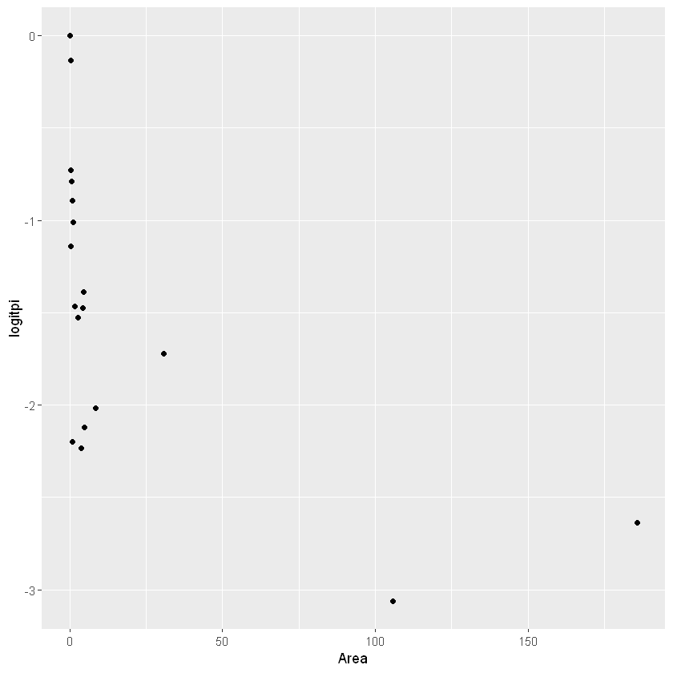
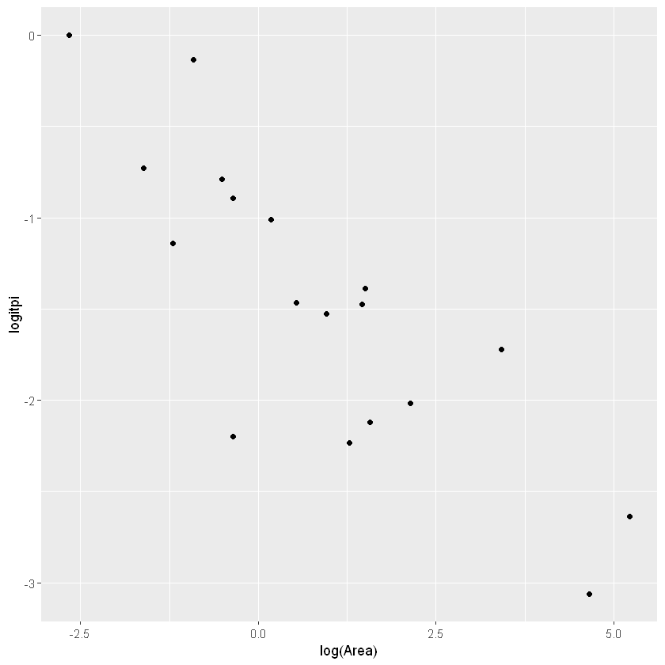
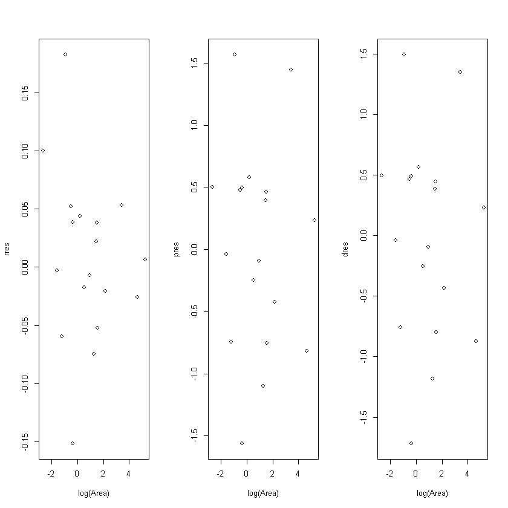

# Binomial Logistic Regression

## Y ~ Binomial(m, π)

$P(Y=y)={m\choose y} \pi^y (1-\pi)^{m-y}$
v.s. Bernoulli => $\pi$ remains the same in binomial, while in Bernoulli case it is independent for each $X_i$

$E(Y)=m\pi$, $var(Y)=m\pi(1-\pi)$

Consider modelling $Y.m$ be the proportion of success out of $m$ independent Bernoulli trials 
$E(Y/m)=\pi, var(Y/m)=\pi(1-\pi)/m$


```R
library(Sleuth3)
library(ggplot2)
krunnit = case2101

Extinct = krunnit$Extinct # number of "success"
AtRisk = krunnit$AtRisk
Area = krunnit$Area

pis = Extinct/AtRisk
NExtinct = AtRisk - Extinct # number of "failure"
logitpi = log(pis/(1-(pis)))
logarea = log(Area)
case2101
```


<table>
<caption>A data.frame: 18 × 4</caption>
<thead>
	<tr><th scope=col>Island</th><th scope=col>Area</th><th scope=col>AtRisk</th><th scope=col>Extinct</th></tr>
	<tr><th scope=col>&lt;fct&gt;</th><th scope=col>&lt;dbl&gt;</th><th scope=col>&lt;int&gt;</th><th scope=col>&lt;int&gt;</th></tr>
</thead>
<tbody>
	<tr><td>Ulkokrunni     </td><td>185.80</td><td>75</td><td> 5</td></tr>
	<tr><td>Maakrunni      </td><td>105.80</td><td>67</td><td> 3</td></tr>
	<tr><td>Ristikari      </td><td> 30.70</td><td>66</td><td>10</td></tr>
	<tr><td>Isonkivenletto </td><td>  8.50</td><td>51</td><td> 6</td></tr>
	<tr><td>Hietakraasukka </td><td>  4.80</td><td>28</td><td> 3</td></tr>
	<tr><td>Kraasukka      </td><td>  4.50</td><td>20</td><td> 4</td></tr>
	<tr><td>Lansiletto     </td><td>  4.30</td><td>43</td><td> 8</td></tr>
	<tr><td>Pihlajakari    </td><td>  3.60</td><td>31</td><td> 3</td></tr>
	<tr><td>Tyni           </td><td>  2.60</td><td>28</td><td> 5</td></tr>
	<tr><td>Tasasenletto   </td><td>  1.70</td><td>32</td><td> 6</td></tr>
	<tr><td>Raiska         </td><td>  1.20</td><td>30</td><td> 8</td></tr>
	<tr><td>Pohjanletto    </td><td>  0.70</td><td>20</td><td> 2</td></tr>
	<tr><td>Toro           </td><td>  0.70</td><td>31</td><td> 9</td></tr>
	<tr><td>Luusiletto     </td><td>  0.60</td><td>16</td><td> 5</td></tr>
	<tr><td>Vatunginletto  </td><td>  0.40</td><td>15</td><td> 7</td></tr>
	<tr><td>Vatunginnokka  </td><td>  0.30</td><td>33</td><td> 8</td></tr>
	<tr><td>Tiirakari      </td><td>  0.20</td><td>40</td><td>13</td></tr>
	<tr><td>Ristikarenletto</td><td>  0.07</td><td> 6</td><td> 3</td></tr>
</tbody>
</table>


Let $\pi_i$ be the probability of extinction for each island, assume that this is the same for each species for bird on a particular island

Assume species survival is independent.  
Then $Y_i\sim Binomial(m_i,\pi_i)$

Unlike binary logistic model for Bernoulli distribution, we can estimate $\pi_i$ from the data. 

Observed response proportion $\bar{\pi_i} = y_i/m_i$

Observed or empirical logits: (S-"saturated)

$$\log(\frac{\bar{\pi}_{S,i}}{1 - \bar{\pi}_{S,i}}) = \log(\frac{y_i}{m_i-y_i})$$


```R
ggplot(krunnit, aes(x=Area, y=logitpi)) + geom_point()
```

​<figure markdown>
{width="480"}
</figure>

```R
ggplot(krunnit, aes(x=log(Area), y=logitpi)) + geom_point()
```


​<figure markdown>
{width="480"}
</figure>
    


Then the proposed model is based on plot

$$\log(\frac{\pi_i}{1-\pi_i})=\beta_0 + \beta_1 \log(Area_i)$$


```R
# cbind(Extinct, NExtinct ~ log(Area) is the way to represent it in R
fitbl <- glm(cbind(Extinct, NExtinct)~log(Area), family=binomial, data=krunnit)
summary(fitbl)
```


    
    Call:
    glm(formula = cbind(Extinct, NExtinct) ~ log(Area), family = binomial, 
        data = krunnit)
    
    Deviance Residuals: 
         Min        1Q    Median        3Q       Max  
    -1.71726  -0.67722   0.09726   0.48365   1.49545  
    
    Coefficients:
                Estimate Std. Error z value Pr(>|z|)    
    (Intercept) -1.19620    0.11845 -10.099  < 2e-16 ***
    log(Area)   -0.29710    0.05485  -5.416 6.08e-08 ***
    ---
    Signif. codes:  0 '***' 0.001 '**' 0.01 '*' 0.05 '.' 0.1 ' ' 1
    
    (Dispersion parameter for binomial family taken to be 1)
    
        Null deviance: 45.338  on 17  degrees of freedom
    Residual deviance: 12.062  on 16  degrees of freedom
    AIC: 75.394
    
    Number of Fisher Scoring iterations: 4
    


```R
anova(fitbl, test="Chisq")
```


<table>
<caption>A anova: 2 × 5</caption>
<thead>
	<tr><th></th><th scope=col>Df</th><th scope=col>Deviance</th><th scope=col>Resid. Df</th><th scope=col>Resid. Dev</th><th scope=col>Pr(&gt;Chi)</th></tr>
	<tr><th></th><th scope=col>&lt;int&gt;</th><th scope=col>&lt;dbl&gt;</th><th scope=col>&lt;int&gt;</th><th scope=col>&lt;dbl&gt;</th><th scope=col>&lt;dbl&gt;</th></tr>
</thead>
<tbody>
	<tr><th scope=row>NULL</th><td>NA</td><td>      NA</td><td>17</td><td>45.33802</td><td>          NA</td></tr>
	<tr><th scope=row>log(Area)</th><td> 1</td><td>33.27651</td><td>16</td><td>12.06151</td><td>7.994246e-09</td></tr>
</tbody>
</table>


```R
vcov(fitbl) # variance co-variance matrix
```


<table>
<caption>A matrix: 2 × 2 of type dbl</caption>
<thead>
	<tr><th></th><th scope=col>(Intercept)</th><th scope=col>log(Area)</th></tr>
</thead>
<tbody>
	<tr><th scope=row>(Intercept)</th><td> 0.014029452</td><td>-0.002602237</td></tr>
	<tr><th scope=row>log(Area)</th><td>-0.002602237</td><td> 0.003008830</td></tr>
</tbody>
</table>


```R
# 95% CI for beta
CL = cbind(bhat=coef(fitbl), confint.default(fitbl))
CL
```


<table>
<caption>A matrix: 2 × 3 of type dbl</caption>
<thead>
	<tr><th></th><th scope=col>bhat</th><th scope=col>2.5 %</th><th scope=col>97.5 %</th></tr>
</thead>
<tbody>
	<tr><th scope=row>(Intercept)</th><td>-1.1961955</td><td>-1.4283454</td><td>-0.9640456</td></tr>
	<tr><th scope=row>log(Area)</th><td>-0.2971037</td><td>-0.4046132</td><td>-0.1895942</td></tr>
</tbody>
</table>


### Model summary

\# observations: 18  
\# coefficients: 2  
fitted model $logit(\hat\pi) = -1.196-0.297\log(Area)$


Wald procedures still work the same

$H_0:\beta_1=0$  
$z=\frac{\hat\beta_1}{se(\hat\beta_1)}\sim N(0,1)$  
CI: $\hat\beta_1\pm t_{\alpha,1}se(\hat\beta_1)$

## Interpretation of beta1

Model: 

$$logit(\pi) = \beta_0 + \beta_1\log(x)\Rightarrow\\
\\frac{pi}{1-\pi} = e^{\beta_0}e^{\beta_1\log(x)} = e^{\beta_0}x^{\beta_1}$$

CHanging $x$ by a factor of $h$ will change the odds by a multiplicative factor of $h^{\beta_1}$

Example:
Halving island area changes odds by a factor of $0.5^{-0.2971} = 1.23$

Therefore, the odds of extinction on a smaller island are 123% of the odds of extinction on an island double its size. 

Halving of area is associated with an increase in the odds of extinction by an estimated 23%. An approximate 95% confidence interval for the percentage change in odds is 14%-32%


```R
# CI of beta's for halfing area
0.5^(CL)
```


<table>
<caption>A matrix: 2 × 3 of type dbl</caption>
<thead>
	<tr><th></th><th scope=col>bhat</th><th scope=col>2.5 %</th><th scope=col>97.5 %</th></tr>
</thead>
<tbody>
	<tr><th scope=row>(Intercept)</th><td>2.291346</td><td>2.691379</td><td>1.950773</td></tr>
	<tr><th scope=row>log(Area)</th><td>1.228675</td><td>1.323734</td><td>1.140443</td></tr>
</tbody>
</table>


```R
phats = predict.glm(fitbl, type="response")
options(digits=4)
rbind(Extinct, NExtinct, pis, phats)
```


<table>
<caption>A matrix: 4 × 18 of type dbl</caption>
<thead>
	<tr><th></th><th scope=col>1</th><th scope=col>2</th><th scope=col>3</th><th scope=col>4</th><th scope=col>5</th><th scope=col>6</th><th scope=col>7</th><th scope=col>8</th><th scope=col>9</th><th scope=col>10</th><th scope=col>11</th><th scope=col>12</th><th scope=col>13</th><th scope=col>14</th><th scope=col>15</th><th scope=col>16</th><th scope=col>17</th><th scope=col>18</th></tr>
</thead>
<tbody>
	<tr><th scope=row>Extinct</th><td> 5.00000</td><td> 3.00000</td><td>10.00000</td><td> 6.0000</td><td> 3.0000</td><td> 4.000</td><td> 8.0000</td><td> 3.00000</td><td> 5.0000</td><td> 6.0000</td><td> 8.0000</td><td> 2.0000</td><td> 9.0000</td><td> 5.0000</td><td>7.0000</td><td> 8.0000</td><td>13.0000</td><td>3.0000</td></tr>
	<tr><th scope=row>NExtinct</th><td>70.00000</td><td>64.00000</td><td>56.00000</td><td>45.0000</td><td>25.0000</td><td>16.000</td><td>35.0000</td><td>28.00000</td><td>23.0000</td><td>26.0000</td><td>22.0000</td><td>18.0000</td><td>22.0000</td><td>11.0000</td><td>8.0000</td><td>25.0000</td><td>27.0000</td><td>3.0000</td></tr>
	<tr><th scope=row>pis</th><td> 0.06667</td><td> 0.04478</td><td> 0.15152</td><td> 0.1176</td><td> 0.1071</td><td> 0.200</td><td> 0.1860</td><td> 0.09677</td><td> 0.1786</td><td> 0.1875</td><td> 0.2667</td><td> 0.1000</td><td> 0.2903</td><td> 0.3125</td><td>0.4667</td><td> 0.2424</td><td> 0.3250</td><td>0.5000</td></tr>
	<tr><th scope=row>phats</th><td> 0.06017</td><td> 0.07036</td><td> 0.09854</td><td> 0.1380</td><td> 0.1595</td><td> 0.162</td><td> 0.1639</td><td> 0.17125</td><td> 0.1854</td><td> 0.2052</td><td> 0.2226</td><td> 0.2516</td><td> 0.2516</td><td> 0.2603</td><td>0.2842</td><td> 0.3019</td><td> 0.3278</td><td>0.3998</td></tr>
</tbody>
</table>


Question: estimate the probability of extinction for a species on the Ulkokrunni island (Area $= 185.5 km^2$)

$logit(\hat\pi_{M,1}=)-1.196 - 0.297\log(185.5) = -2.75$

$\hat\pi_{M,1} = 0.06$


```R
logit_result = -1.196 - 0.297 * log(185.5)
pi_m1 = exp(logit_result) / (1+ exp(logit_result))
print(logit_result)
print(pi_m1)
```

    [1] -2.747
    [1] 0.06024
    

## Diagnostics

Model assumptions

 - Underlying probability model is Binomial  variance non constant, is a function of the mean
 - Observation independent
 - The form of the model is correct  
  - Liner relationship between logits and explanatory variables
  - All relevant variables are included, irrelevant ones excluded
 - Sample size is large enough for valid inferences
  - outliers

### Saturated Model
Model that fits exactly with the data  
Most general model possible for the data

Consider one explanatory variable, X with $n$ unique levels for the outcome, $Y\sim Binomial(m,\pi)$

**Saturated Model** as many parameter coefficients as $n$

**Fitted Model**  nested within a FULL model, has (p+1) parameters

**Null Model**L intercept only

### Checking model adequacy: Form of the model - Deviance Goodness of Fit Test

Form of Hypothesis: $H_0: $ reduced model, $H_a: $ Full model

Deviance GOF test compares the fitted model $M$ to the saturated model $S$

Test Statistic: 

$$Deviance = -2\log(\mathcal{L}_R/\mathcal{L}_F)\sim \chi^2_{n-p-1}$$

This is an asymptotic approximation, so it works better if each $m_i>5$


```R
summary(fitbl)
```


    
    Call:
    glm(formula = cbind(Extinct, NExtinct) ~ log(Area), family = binomial, 
        data = krunnit)
    
    Deviance Residuals: 
        Min       1Q   Median       3Q      Max  
    -1.7173  -0.6772   0.0973   0.4837   1.4954  
    
    Coefficients:
                Estimate Std. Error z value Pr(>|z|)    
    (Intercept)  -1.1962     0.1184  -10.10  < 2e-16 ***
    log(Area)    -0.2971     0.0549   -5.42  6.1e-08 ***
    ---
    Signif. codes:  0 '***' 0.001 '**' 0.01 '*' 0.05 '.' 0.1 ' ' 1
    
    (Dispersion parameter for binomial family taken to be 1)
    
        Null deviance: 45.338  on 17  degrees of freedom
    Residual deviance: 12.062  on 16  degrees of freedom
    AIC: 75.39
    
    Number of Fisher Scoring iterations: 4
    


**Example** Deviance GOF with R-output
$H_0:$ Fitted model $logit(\pi)~\log(Area)$   
$H_a: $ Saturated model

Test statistic: $Deviance = 12.062$ (Residual deviance)

Distribution: $Deviance\sim \chi^2_{18-2}$

p-value: $P(\chi^2_{16}\leq 12.062) = 0.74$

Conclusion: the data are consistent with $H_0$; the simpler model with linear function of log(Area) is adequate (fit as well as the saturated model)


```R
# calculate p-value for example
1 - pchisq(12.062, 16)
```


0.739700862578766


Small deviance leads to larger p-value and vice versa.

Large p-value means:
 - fitted model is adequate
 - Test is not powerful enough to detect inadequacies
 
Small p-value means:
 - fitted model is not adequate, consider a more complex model with more explanatory variables or higher order terms and so on OR
 - response distribution is not adequately modeled by the Binomial distribution, OR
 - There are severe outliers

### Outliers
**Response (raw) residuals**

$$\hat\pi_{S,i}-\hat\pi_{M,i}=y_i/M_i-\hat\pi_{M,i}$$

**Standardized residuals**  
- Pearson Residuals: uses estimate of s.d. of $Y$
  
$$P_{res,i}=\frac{y_i-m_i\hat\pi_{M,i}}{\sqrt{m_i\hat\pi_{M,i}(1-\hat\pi_{M,i})}}$$

- Deviance Residuals: defined so that the sum of the square of the residuals is the deviance
  
$$D_{res,i}=sign(y_i-m_i\hat\pi_{<i})\sqrt{2(y_i\log(\frac{y_i}{m_i\hat\pi_{M,i}})+(m_i-y_i)\log(\frac{m_i-y_i}{m_i-m_i\pi\hat\pi_{M,i}}))}$$


```R
# response residuals
rres = residuals(fitbl, type="response")
# pearson residuals
pres = residuals(fitbl, type="pearson")
# Deviance residuals
dres = residuals(fitbl, type="deviance")
cbind(pis, phats, rres, pres, dres)
```


<table>
<thead>
	<tr><th></th><th scope=col>pis</th><th scope=col>phats</th><th scope=col>rres</th><th scope=col>pres</th><th scope=col>dres</th></tr>
</thead>
<tbody>
	<tr><th scope=row>1</th><td>0.06667</td><td>0.06017</td><td> 0.006493</td><td> 0.23646</td><td> 0.23266</td></tr>
	<tr><th scope=row>2</th><td>0.04478</td><td>0.07036</td><td>-0.025585</td><td>-0.81883</td><td>-0.87369</td></tr>
	<tr><th scope=row>3</th><td>0.15152</td><td>0.09854</td><td> 0.052975</td><td> 1.44400</td><td> 1.34958</td></tr>
	<tr><th scope=row>4</th><td>0.11765</td><td>0.13800</td><td>-0.020351</td><td>-0.42139</td><td>-0.43071</td></tr>
	<tr><th scope=row>5</th><td>0.10714</td><td>0.15946</td><td>-0.052319</td><td>-0.75619</td><td>-0.79584</td></tr>
	<tr><th scope=row>6</th><td>0.20000</td><td>0.16205</td><td> 0.037951</td><td> 0.46058</td><td> 0.44746</td></tr>
	<tr><th scope=row>7</th><td>0.18605</td><td>0.16389</td><td> 0.022155</td><td> 0.39247</td><td> 0.38577</td></tr>
	<tr><th scope=row>8</th><td>0.09677</td><td>0.17125</td><td>-0.074480</td><td>-1.10075</td><td>-1.18097</td></tr>
	<tr><th scope=row>9</th><td>0.17857</td><td>0.18542</td><td>-0.006844</td><td>-0.09318</td><td>-0.09363</td></tr>
	<tr><th scope=row>10</th><td>0.18750</td><td>0.20524</td><td>-0.017742</td><td>-0.24850</td><td>-0.25127</td></tr>
	<tr><th scope=row>11</th><td>0.26667</td><td>0.22264</td><td> 0.044030</td><td> 0.57969</td><td> 0.56727</td></tr>
	<tr><th scope=row>12</th><td>0.10000</td><td>0.25158</td><td>-0.151576</td><td>-1.56220</td><td>-1.71726</td></tr>
	<tr><th scope=row>13</th><td>0.29032</td><td>0.25158</td><td> 0.038747</td><td> 0.49717</td><td> 0.48934</td></tr>
	<tr><th scope=row>14</th><td>0.31250</td><td>0.26030</td><td> 0.052203</td><td> 0.47588</td><td> 0.46659</td></tr>
	<tr><th scope=row>15</th><td>0.46667</td><td>0.28415</td><td> 0.182515</td><td> 1.56733</td><td> 1.49545</td></tr>
	<tr><th scope=row>16</th><td>0.24242</td><td>0.30185</td><td>-0.059429</td><td>-0.74367</td><td>-0.75939</td></tr>
	<tr><th scope=row>17</th><td>0.32500</td><td>0.32783</td><td>-0.002828</td><td>-0.03810</td><td>-0.03813</td></tr>
	<tr><th scope=row>18</th><td>0.50000</td><td>0.39984</td><td> 0.100157</td><td> 0.50082</td><td> 0.49570</td></tr>
</tbody>
</table>


```R
par(mfrow=c(1,3))
plot(log(Area), rres)
plot(log(Area), pres)
plot(log(Area), dres)

```

​<figure markdown>
{width="480"}
</figure>

**Pearson vs Deviance Residuals**

 - Both asymptotically to $N(0,1)$
 - Possible outlier if $|res|>2$
 - Definite outlier if $|res|>3$
 - Under small $n$ $D_{res}$ closer to $N(0,1)$ then $P_{res}$
 - When $\hat\pi$ close to extreme (0, 1), $P_{res}$ are unstable

## Problems and Solutions

### Issues Related to General Linear Models

extrapolation  

- Don't make inferences/predictions outside range of observed data
- Model may no longer be appropriate

Multicollinearity  
Consequences includes

 - unstable fitted equation
 - Coefficient that should be statistically significant while not
 - Coefficient may have wrong sign
 - Sometimes large $se(\beta)$
 - Sometimes numerical procedure to find MLEs does not converge
 
Influential Points

Model: overfit issue, should build model on training data (cross validation)


### Problems specific to Logistic Regression

Extra-binomial variation (over dispersion)
 - variance of $Y_i$ greater than $m_i\pi_i(1-\pi_i)$
 - Does not bias $\hat\beta$'s but se of $\hat\beta$'s will be too small 
 
Solution: add one more parameter to the model, $\phi$-dispersion parameter. Then $var(Y_i)=\phi m_i\pi_i(1-\pi_i)$

Complete separation

 - One or a linear combination of explanatory variables perfectly predict whether $Y=1\lor 0$
 - In Binary response, when $y_i=1,\hat y_i=1$, then $\sum_{i=1}^n\{y_i\log(\hat y_i + (1-y_i)\log(1-\hat y_i))=0\}$
 - MLE cannot be computed
 
Quasi-complete separation:

- explanatory variables predict $Y=1\lor 0$ almost perfectly
- MLE are numerically unstable

Solution: simplify the model. Try other methods like penalized maximum likelihood, exact logistic regression, Bayesian methods

## Conclusions about Logistic Regression

**False** Logistic regression describes population proportion of probability as a linear function of explanatory variables. 

Non-linear $\hat\pi = e^{\hat\mu}/(1+e^{\hat\mu})$

Hence Logistic regression is a nonlinear regression model

## Extra-binomial variation

Suppose $X_1,...,X_m$ are not independent but identically distributed $\sim Bernoulli(\pi)$. Further suppose $\forall X_i,X_j. cov(X_1,X_j)=\rho, \rho>0$.

Let $Y_1=\sum_i^{m_1}X_i$

Then 

$$var(Y_i)= \sum_i^{m_1}var(X_i) + \sum_{i\neq j} cov(X_i,X_j)\\
= m_1\pi(1-\pi)+\sum_{i\neq j} \rho\sqrt{var(X_i)var(X_j)}\\ 
=m_1\pi(1-\pi) + m_1(m_1-1)\rho\pi(1-\pi)\\
>m_1\pi(1-\pi)$$

Therefore, the model for variance:

$$var(Y_i)=\psi m_i\pi_i(1-\pi_i)$$

estimate of $\hat\psi$ by scaled Pearson chi-square statistic

$$\hat\psi = \sum_i^n \frac{P^2_{res,i}}{n-(p+1)}=\frac{\text{sum of squared Pearson residuals}}{d.f.}$$

$\hat\psi>>1$ indicates evidence of over-dispersion

$\psi$ does not effect $E(Y_i)$, hence using over-dispersion does not change $\hat\beta$

The standard errors under this assumption is $se_{\psi}(\hat\beta)=\sqrt{\hat\psi}se(\hat\beta)$


The following two ways are equivalent


```R
# manually conpute the psi hat
psihat = sum(residuals(fitbl, type="pearson")^2/fitbl$df.residual)
psihat
```


    0.73257293737338


```R
# apply the dispersion
summary(fitbl, dispersion=psihat)
```


    
    Call:
    glm(formula = cbind(Extinct, NExtinct) ~ log(Area), family = binomial, 
        data = krunnit)
    
    Deviance Residuals: 
        Min       1Q   Median       3Q      Max  
    -1.7173  -0.6772   0.0973   0.4837   1.4954  
    
    Coefficients:
                Estimate Std. Error z value Pr(>|z|)    
    (Intercept)  -1.1962     0.1014  -11.80  < 2e-16 ***
    log(Area)    -0.2971     0.0469   -6.33  2.5e-10 ***
    ---
    Signif. codes:  0 '***' 0.001 '**' 0.01 '*' 0.05 '.' 0.1 ' ' 1
    
    (Dispersion parameter for binomial family taken to be 0.7326)
    
        Null deviance: 45.338  on 17  degrees of freedom
    Residual deviance: 12.062  on 16  degrees of freedom
    AIC: 75.39
    
    Number of Fisher Scoring iterations: 4
    


```R
# use quasi binomial family
fitbl2 <- glm(cbind(Extinct, NExtinct)~log(Area), family=quasibinomial, data=krunnit)
fitbl2
```


    
    Call:  glm(formula = cbind(Extinct, NExtinct) ~ log(Area), family = quasibinomial, 
        data = krunnit)
    
    Coefficients:
    (Intercept)    log(Area)  
         -1.196       -0.297  
    
    Degrees of Freedom: 17 Total (i.e. Null);  16 Residual
    Null Deviance:	    45.3 
    Residual Deviance: 12.1 	AIC: NA


## Using Logistic Regression for Classification

Want: $y^*\mid (x_1^*, ...,x_p^*)= \mathbb{I}$

Do: calculate $\hat\pi_M^*$ be the estimated probability that $y^*=1$ based on the fitted model given $X_i=x_i^*$, then predict that $y^* = \mathbb{I}(\hat\pi_M^* \text{is large enough})$

Need: a good cutoff $\hat\pi_M^*$ 

### Classification

Try different cutoffs and see which gives fewest incorrect classifications

- Useful if proportion of 1's and 0's in date reflect their relative proportions in the population
- Likely to overestimate. To overcome,cross-validation (training group vs. validation group)


### Confusion Matrix
https://en.wikipedia.org/wiki/Confusion_matrix

Choose a cutoff probability based on one of the 5 criteria for success of classification that is most important to you 

Examples 

 - High sensitivity makes good screening test
 - High specificity makes a good confirmatory test
 - A screening test followed by a confirmatory test is good (but expensive) diagnostic procedure
