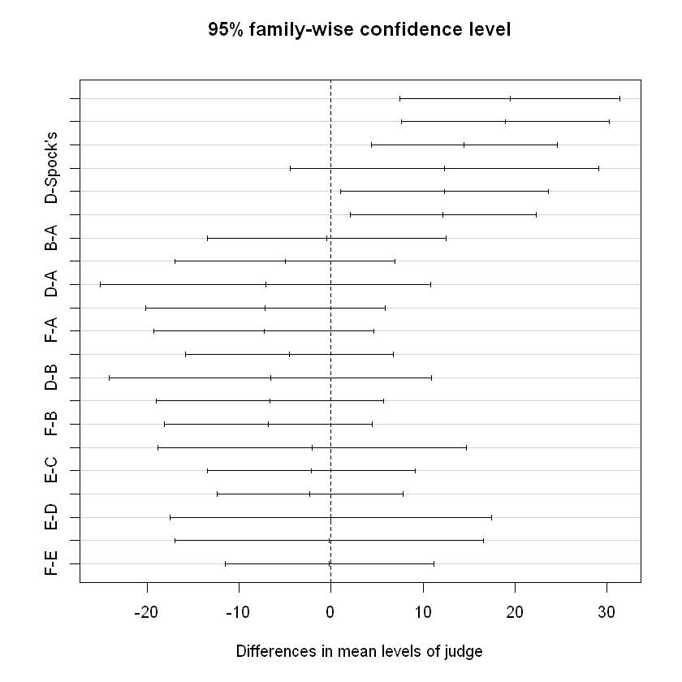
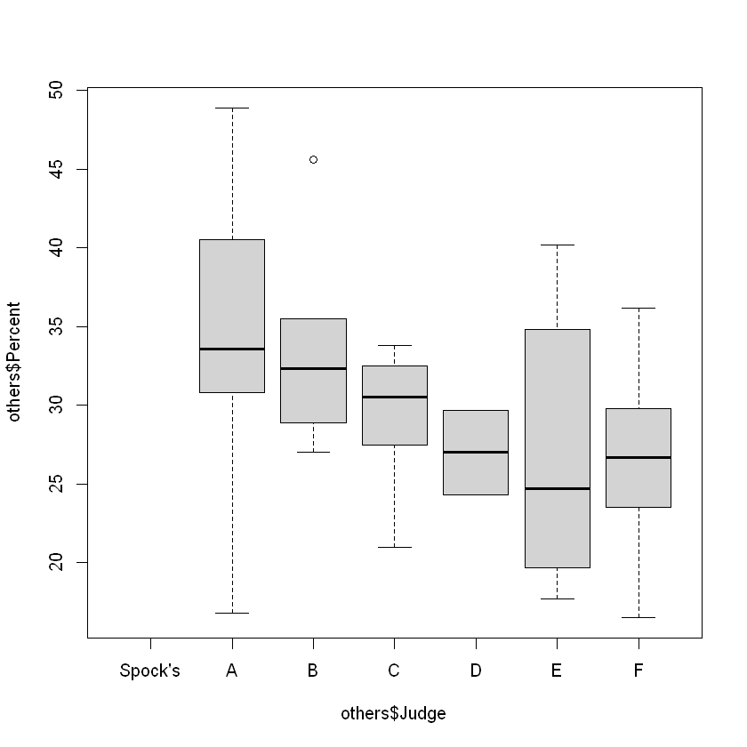
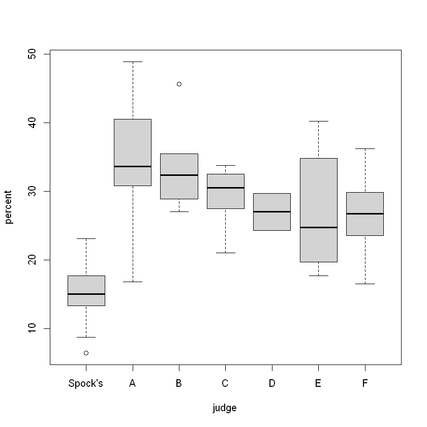
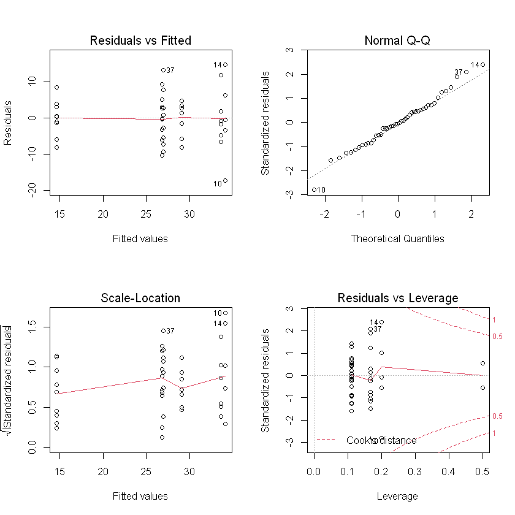
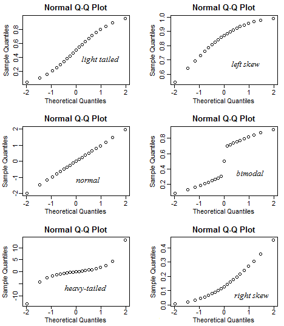

# Multi Comparisons and One Way ANOVA

## Multiple Comparisons
- post hoc procedure: further comparisons after significant result from overall One-way ANOVA
- If the result for One-way ANOVA is good enough, i.e.some pairs are evidently true, we may omit some pairs to remove the number of tests
- Max of $G \choose 2$ pairwise comparisons
- Major issue: increased chance of making at least one Type I error when carrying out many tests, $E(\#errors)=\#tests \times \alpha$
- Two common solutions: based on controlling family Type I error rate, choose 
    - Bonferroni
    - Tukey's

_**Example**_
$P(\text{committing at least 1 Type I error})$ ?

- For n independent tests: $P = 1-(1-\alpha)^n$

### Bonferroni's Method
- Based on Bonferroni's inequality $P(A\cup B) \leq P(A)+P(B)$, hence $P(\cup A_i)\leq \sum P(A_i), A_i:=$ the event that $i$th test results in a Type I error. 
- Method: conduct each of $k=G \choose 2$ pairwise tests at level $\alpha / k$
- CI: $|\bar{y}_i - \bar{y}_j|\pm t_{\alpha/2k} S_p \sqrt{n_i^{-1} + n_j^{-1}}$ 
- Conservative: overall Type I error rate is usually much less than $\alpha$ if tests are not mutually independent. 
- Type II error inflation.

### Tukey's Approach
- Usually less conservative than Bonferroni, particularly if group sample size are similar. Controls the overall Type I error rate of $\alpha$, simultaneous CI converage rate is $1-\alpha$. 

#### Studentized Range distribution
- $\mathcal{X}= \{X_1,...,X_n\}, X_i\in N(\mu,\sigma^2)$. Determine the distribution of the max and min of $\mathcal{X}$. 
- $X_{(n)}:=\max{\mathcal{X}}, X_{(1)};=\min{\mathcal{X}}$, Range $:= X_{(n)}-X{(1)}$
- Based on $n$ observations from $X$, the Studentized range statistic is $Q_{stat} = Range / s, s=$ sample std. 
- Based on $G$ group means, with $n$ observations per group: 
  
    $$\bar{Q}_g = \frac{\sqrt{n}(\bar{y}_{(g)} - \bar{y}_{(1)})}{s_v}$$

$s_v$ estimator of the pooled std. $v=N-G=G(n-1)$ d.f. 

- If there are $G$ groups, then there is a max of $k$ pairwise differences
- Controlling overall simultaneous Type I error rate v.s. Individual Type I error rate
- Find a pairwise significant difference
     - Compare method-wise significant difference, $c(\alpha)$ with $|\bar{y}_i - \bar{y}_j|$ OR 
     - determine whether CI contains 0 OR 
     - Compare $p$ with $\alpha$
- $s=\sqrt{MSE}$ with d.f. $=v=d.f.Error$

#### Tukey's Honestly Significant Difference (HSD) 
- let $q(G,v,\alpha)/t^*:=$ the critical value from the Studentized Range distribution. 
- Family rate $=\alpha$
- Tukey's HSD $=q(G,v,\alpha) \frac{s}{\sqrt{n}}$

## Case Study
Bonferroni

 - $H_0:\mu_i - \mu_j = 0, H_a: \mu_i\neq \mu_j$  
 - $t = \frac{\bar{x}_i - \bar{x}_j}{S_p \sqrt{n_i^{-1} + n_j^{-1}}}$
 - $p = 2P(T_{\alpha/2k}> |t|)$


```R
# import data
library(Sleuth2)
jury = case0502
percent = case0502$Percent
judge = case0502$Judge
```


```R
judge = relevel(judge, ref="Spock's")
pairwise.t.test(percent, judge, p.adj='bonf')
```


    
    	Pairwise comparisons using t tests with pooled SD 
    
    data:  percent and judge 
    
      Spock's A       B       C       D       E      
    A 0.00022 -       -       -       -       -      
    B 0.00013 1.00000 -       -       -       -      
    C 0.00150 1.00000 1.00000 -       -       -      
    D 0.57777 1.00000 1.00000 1.00000 -       -      
    E 0.03408 1.00000 1.00000 1.00000 1.00000 -      
    F 0.01254 1.00000 1.00000 1.00000 1.00000 1.00000
    
    P value adjustment method: bonferroni 


```R
# CI
lmod=lm(percent~judge)
confint(lmod, level = 1- 0.05/nlevels(judge))
```


<table>
<caption>A matrix: 7 × 2 of type dbl</caption>
<thead>
	<tr><th></th><th scope=col>0.357 %</th><th scope=col>99.643 %</th></tr>
</thead>
<tbody>
	<tr><th scope=row>(Intercept)</th><td> 8.078085</td><td>21.16636</td></tr>
	<tr><th scope=row>judgeA</th><td> 8.547341</td><td>30.44821</td></tr>
	<tr><th scope=row>judgeB</th><td> 8.647254</td><td>29.34163</td></tr>
	<tr><th scope=row>judgeC</th><td> 5.222969</td><td>23.73259</td></tr>
	<tr><th scope=row>judgeD</th><td>-2.969585</td><td>27.72514</td></tr>
	<tr><th scope=row>judgeE</th><td> 1.997255</td><td>22.69163</td></tr>
	<tr><th scope=row>judgeF</th><td> 2.922970</td><td>21.43259</td></tr>
</tbody>
</table>


```R
amod = aov(percent~judge)
hsd = TukeyHSD(amod, 'judge')
hsd
```


      Tukey multiple comparisons of means
        95% family-wise confidence level
    
    Fit: aov(formula = percent ~ judge)
    
    $judge
                     diff        lwr       upr     p adj
    A-Spock's 19.49777727   7.514685 31.480870 0.0001992
    B-Spock's 18.99444405   7.671486 30.317402 0.0001224
    C-Spock's 14.47777732   4.350216 24.605339 0.0012936
    D-Spock's 12.37777758  -4.416883 29.172438 0.2744263
    E-Spock's 12.34444443   1.021486 23.667402 0.0248789
    F-Spock's 12.17777766   2.050216 22.305339 0.0098340
    B-A       -0.50333322 -13.512422 12.505755 0.9999997
    C-A       -5.01999995 -17.003092  6.963092 0.8470098
    D-A       -7.11999969 -25.094638 10.854639 0.8777485
    E-A       -7.15333284 -20.162421  5.855755 0.6146239
    F-A       -7.31999961 -19.303092  4.663093 0.4936380
    C-B       -4.51666673 -15.839625  6.806291 0.8742030
    D-B       -6.61666648 -24.158118 10.924785 0.9003280
    E-B       -6.64999962 -19.053679  5.753679 0.6418003
    F-B       -6.81666639 -18.139624  4.506292 0.5109582
    D-C       -2.09999975 -18.894661 14.694661 0.9996956
    E-C       -2.13333289 -13.456291  9.189625 0.9968973
    F-C       -2.29999966 -12.427561  7.827562 0.9914731
    E-D       -0.03333314 -17.574784 17.508118 1.0000000
    F-D       -0.19999992 -16.994661 16.594661 1.0000000
    F-E       -0.16666677 -11.489625 11.156291 1.0000000
    


```R
plot(hsd)
```


    

    


## Linear Regression Model 
 - $Y_{N\times 1}=X_{N\times(p+1)}\beta_{(p+1)\times 1} + \epsilon_{N\times 1}$, response $Y$ continuous, explanatory $X$ categorical and/or continuous 
 - $Y$ is linear in the $\beta$'s i.e. no predictor is a linear function or combination of other predictors
 - $\hat{\beta}=(X'X)^{-1}X'Y$ Least square Estimate, need$rank(X'X)=rank(X)\Rightarrow$ columns of $X$ must be linear independent
 - Null hypothesis $H_0: \beta = \vec{0}$. Assumptions
  - Appropriate Linear Model
  - Uncorrelated Errors
  - $\vec{\epsilon}\sim N(\vec{0},\sigma^2I)$. 
 - Sum of Squares Decomposition 
 
    \begin{align*}SST&=SSE+SSR\\
    \sum_i^N(Y_i-\bar{Y})^2 &= \sum_i^N (Y_i-\hat{Y}_i)^2 + \sum_i^N(\hat{Y}_i - \bar{Y})^2
    \end{align*}
 

## One-Way ANOVA
- Need one factor (categorical variable) with at least 2 levels $(G\geq 2)$
- Aim: Compare $G$ group means
  
    $$H_0:\mu_1=\mu_2=...=\mu_G, H_a:\exists i\neq j. \mu_i\neq \mu_j$$

- Predictors are indicator variables that classify the observations one way (into $G$ groups)
     - special case of a general linear model
     - equivalent to GLM with one-way classification (one factor)
     - GLM uses $G-1$ dummy variables
- ANOVA: compare means by analyzing variability

## One Way Expectations and Estimates

\begin{align*}
E(Y_i)&=(\beta_0 + \beta_1,...,\beta_0 +\beta_{G-1}, \beta_0)^T\\
\hat{Y}_i &= (b_0+b_1,...,b_0 + b_{G-1}, b_0)^T\\
\hat{\beta} &= (b_0,...,b_{G-1})^T = (\bar{y}_G, \bar{y}_1-\bar{y}_G,...,\bar{y}_{G-1}-\bar{y}_G)^T
\end{align*}

Then, the null hypothesis is $H_0: \beta_i=\mu_i-\mu_0 = 0\Rightarrow$ the equal mean of $i$th group and the compared group

In this case, for $SST$, $N=\sum_1^G n_i,\hat{Y}_i=$ mean of observations for group $g$ from which the $i$th observation belongs, $\bar{Y}=\frac{\sum_{g=1}^{G}\sum_{j=1}^{n_g} y_{gj}}{N}$ is the grand mean 

\begin{align*}
SSReg &= \sum_{g=1}^G n_g(\bar{Y}_g-\bar{Y})^2\\
RSS &= \sum_{g=1}^G \sum_{g} (Y_i-\bar{Y}_g)^2
\end{align*}


```R
# import data
library(Sleuth2)
jury = case0502
percent = case0502$Percent
judge = case0502$Judge
```


```R
table(judge)
```


    judge
    Spock's       A       B       C       D       E       F 
          9       5       6       9       2       6       9 


```R
with(jury, tapply(percent, judge, mean))
```


    Spock's     14.6222224235535
    A           34.1199996948242
    B           33.6166664759318
    C           29.0999997456868
    D           27
    E           26.9666668574015
    F           26.800000084771


### Compare 6 judges (exclude Spock)


```R
others = subset(jury, judge != "Spock's") 
boxplot(others$Percent~others$Judge, data=others)
```


    

    


```R
summary(aov(others$Percent~others$Judge))
```


                 Df Sum Sq Mean Sq F value Pr(>F)
    others$Judge  5  326.5   65.29   1.218  0.324
    Residuals    31 1661.3   53.59               


### Rule of thumb
Not a formal way, not a quick check whether equal variance


```R
sss <- with(others, tapply(others$Percent, others$Judge, sd))
sss
```


    Spock's     <NA>
    A           11.9418181005452
    B           6.58222301297842
    C           4.59292918339244
    D           3.81837769736668
    E           9.01014223675898
    F           5.96887758208529


```R
max(sss, na.rm=T); min(sss, na.rm=T)
```


    11.9418181005452
    3.81837769736668


```R
max(sss, na.rm=T) / min(sss, na.rm=T) > 2
```
    
    TRUE


```R
bartlett.test(others$Percent, others$Judge)
```
    
    	Bartlett test of homogeneity of variances
    
    data:  others$Percent and others$Judge
    Bartlett's K-squared = 6.3125, df = 5, p-value = 0.277
    


The small p-value may due to the uneven and small group sizes

### Compare all 7 judges


```R
boxplot(percent~judge)
```


    

    

```R
summary(aov(percent~judge))
```


                Df Sum Sq Mean Sq F value  Pr(>F)    
    judge        6   1927   321.2   6.718 6.1e-05 ***
    Residuals   39   1864    47.8                    
    ---
    Signif. codes:  0 '***' 0.001 '**' 0.01 '*' 0.05 '.' 0.1 ' ' 1


```R
summary(lm(percent~judge))
```


    
    Call:
    lm(formula = percent ~ judge)
    
    Residuals:
        Min      1Q  Median      3Q     Max 
    -17.320  -4.367  -0.250   3.319  14.780 
    
    Coefficients:
                Estimate Std. Error t value Pr(>|t|)    
    (Intercept)   14.622      2.305   6.344 1.72e-07 ***
    judgeA        19.498      3.857   5.056 1.05e-05 ***
    judgeB        18.994      3.644   5.212 6.39e-06 ***
    judgeC        14.478      3.259   4.442 7.15e-05 ***
    judgeD        12.378      5.405   2.290 0.027513 *  
    judgeE        12.344      3.644   3.388 0.001623 ** 
    judgeF        12.178      3.259   3.736 0.000597 ***
    ---
    Signif. codes:  0 '***' 0.001 '**' 0.01 '*' 0.05 '.' 0.1 ' ' 1
    
    Residual standard error: 6.914 on 39 degrees of freedom
    Multiple R-squared:  0.5083,	Adjusted R-squared:  0.4326 
    F-statistic: 6.718 on 6 and 39 DF,  p-value: 6.096e-05
    


```R
par(mfrow=c(2,2))
plot(lm(percent~judge))
```


    

    


```R
ssa = with(jury, tapply(percent,judge,sd))
ssa
```

    Spock's     5.03879411343757
    A           11.9418181005452
    B           6.58222301297842
    C           4.59292918339244
    D           3.81837769736668
    E           9.01014223675898
    F           5.96887758208529


```R
max(ssa) / min(ssa) > 2
```


    TRUE


```R
bartlett.test(percent~judge)
```


    
    	Bartlett test of homogeneity of variances
    
    data:  percent by judge
    Bartlett's K-squared = 7.7582, df = 6, p-value = 0.2564
    


- Residual vs Fitted: No obvious pattern, assume equal variance (also by rule of thumb and Bartlett)
- Normal Q-Q: overall OK
- Outliers: see Residual vs leverage, not influential point. 


