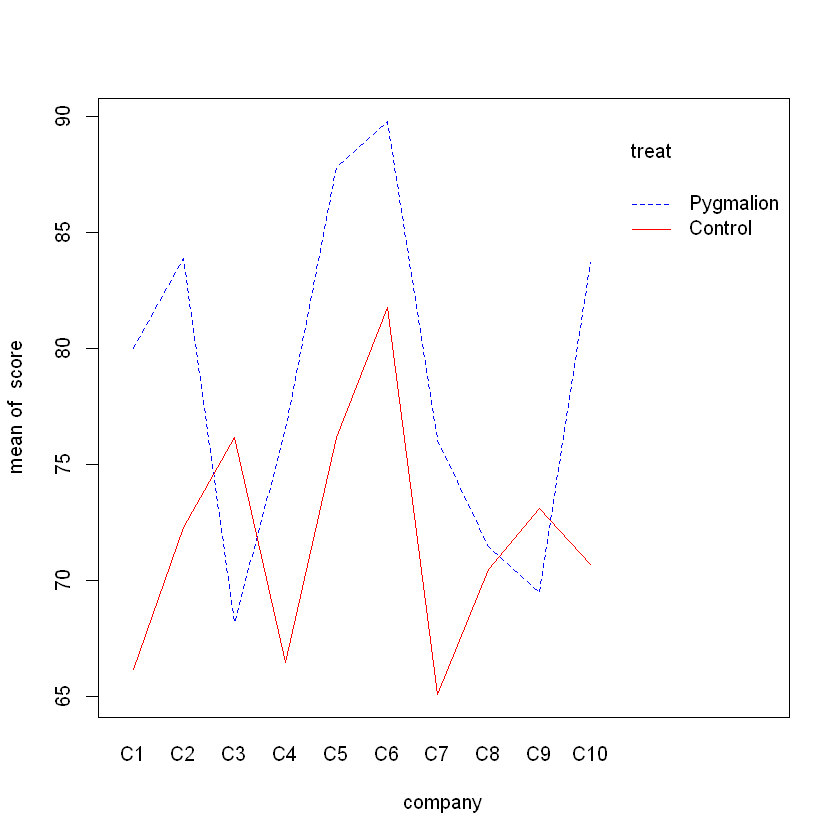

# Two Way ANOVA

## Two Way ANOVA
- Extension of One-way ANOVA, a special case of a GLM.
- Two factors, each with $\geq 2$ levels. 
- Uses a maximum of $(G_1-1) + (G_2 - 1) +(G_1-1)(G_2 - 1)$ (individual + interactions)indicator variables

### Two types of factors
 - FIXED effect: data has been gathered from all the levels of the factor that are of interest
 - Random effect: interest is in all possible levels of factor, but only a random sample of levels is included in the data. 

## Case Study The Pygmalion Effect


```R
library(Sleuth2)
data = case1302
head(data)
score = data$Score
company = as.factor(data$Company)
treat = as.factor(data$Treat)
```


<table>
<caption>A data.frame: 6 × 3</caption>
<thead>
	<tr><th></th><th scope=col>Company</th><th scope=col>Treat</th><th scope=col>Score</th></tr>
	<tr><th></th><th scope=col>&lt;fct&gt;</th><th scope=col>&lt;fct&gt;</th><th scope=col>&lt;dbl&gt;</th></tr>
</thead>
<tbody>
	<tr><th scope=row>1</th><td>C1</td><td>Pygmalion</td><td>80.0</td></tr>
	<tr><th scope=row>2</th><td>C1</td><td>Control  </td><td>63.2</td></tr>
	<tr><th scope=row>3</th><td>C1</td><td>Control  </td><td>69.2</td></tr>
	<tr><th scope=row>4</th><td>C2</td><td>Pygmalion</td><td>83.9</td></tr>
	<tr><th scope=row>5</th><td>C2</td><td>Control  </td><td>63.1</td></tr>
	<tr><th scope=row>6</th><td>C2</td><td>Control  </td><td>81.5</td></tr>
</tbody>
</table>


```R
library(ggplot2)
ggplot(data, aes(x=company, y=score, fill=company)) + geom_boxplot()
```
    

    

```R
ggplot(data, aes(x=treat, y=score, fill=treat))+geom_boxplot()
```


```R
interaction.plot(company, treat, score, col=c('blue','red'))
```



```R
interaction.plot(treat, company, score, col=c('blue','red','green','purple','black'))
```


    


 - Response: score on a test 
 - Factors: 
    1. Company: 10 levels (C1,...,C10)
    2. Treatment: 2 levels (Pygmalion, Control)
 - Aim: investigate the interaction between Company and Treatment
 - Method: Fit a Two-Way ANOVA

### Variables
- $Y_i$ score for $i$th platoon
- Explanatory: $9(\mathbb{I}_{C_m, i})+1(\mathbb{I}_{P_n,i})+9(Interaction)$ <br>
For each indicter: $\mathbb{I_{C_m,i}}=I$(ith platoon is from Company m), $\mathbb{I_{P_n,i}}=I$(ith platoon is 'Pygmalion')

### Overall test and Partial Test
Overall test $H_0: \beta = \vec{0}$ <br>
Partial test $H_0: $ subset of $\beta$ are $0$ <br>
Test statistic: 

\begin{align*}
F &= \frac{(SSReg_{\text{full}} - SSReg_{\text{reduced}}) / d.f._{\text{reduced}}} {MSE_{\text{full}}}\\
  &= \frac{(RSS_{\text{full}} - RSS_{\text{reduced}}) / d.f._{\text{reduced}}} {MSE_{\text{full}}} \\
  &\sim F_{d.f._{\text{full}}, d.f._{\text{error}}}
\end{align*}

We can use partial test to see if the interaction terms are needed

## Interactive Model


```R
model_i = lm(score~company*treat)
summary(model_i)
```

    Call:
    lm(formula = score ~ company * treat)
    
    Residuals:
       Min     1Q Median     3Q    Max 
      -9.2   -2.3    0.0    2.3    9.2 
    
    Coefficients:
                            Estimate Std. Error t value Pr(>|t|)    
    (Intercept)               80.000      7.204  11.105 1.49e-06 ***
    companyC2                  3.900     10.188   0.383    0.711    
    companyC3                -11.800     10.188  -1.158    0.277    
    companyC4                 -3.500     10.188  -0.344    0.739    
    companyC5                  7.800     10.188   0.766    0.463    
    companyC6                  9.800     10.188   0.962    0.361    
    companyC7                 -3.900     10.188  -0.383    0.711    
    companyC8                 -8.500     10.188  -0.834    0.426    
    companyC9                -10.500     10.188  -1.031    0.330    
    companyC10                 3.700     10.188   0.363    0.725    
    treatControl             -13.800      8.823  -1.564    0.152    
    companyC2:treatControl     2.200     12.477   0.176    0.864    
    companyC3:treatControl    21.800     13.477   1.618    0.140    
    companyC4:treatControl     3.800     12.477   0.305    0.768    
    companyC5:treatControl     2.200     12.477   0.176    0.864    
    companyC6:treatControl     5.800     12.477   0.465    0.653    
    companyC7:treatControl     2.800     12.477   0.224    0.827    
    companyC8:treatControl    12.800     12.477   1.026    0.332    
    companyC9:treatControl    17.400     12.477   1.395    0.197    
    companyC10:treatControl    0.800     12.477   0.064    0.950    
    ---
    Signif. codes:  0 '***' 0.001 '**' 0.01 '*' 0.05 '.' 0.1 ' ' 1
    
    Residual standard error: 7.204 on 9 degrees of freedom
    Multiple R-squared:  0.7388,	Adjusted R-squared:  0.1875 
    F-statistic:  1.34 on 19 and 9 DF,  p-value: 0.3358

```R
anova(model_i)
```


<table>
<caption>A anova: 4 × 5</caption>
<thead>
	<tr><th></th><th scope=col>Df</th><th scope=col>Sum Sq</th><th scope=col>Mean Sq</th><th scope=col>F value</th><th scope=col>Pr(&gt;F)</th></tr>
	<tr><th></th><th scope=col>&lt;int&gt;</th><th scope=col>&lt;dbl&gt;</th><th scope=col>&lt;dbl&gt;</th><th scope=col>&lt;dbl&gt;</th><th scope=col>&lt;dbl&gt;</th></tr>
</thead>
<tbody>
	<tr><th scope=row>company</th><td>9</td><td>670.9755</td><td> 74.55284</td><td>1.4366558</td><td>0.29901878</td></tr>
	<tr><th scope=row>treat</th><td>1</td><td>338.8828</td><td>338.88279</td><td>6.5303739</td><td>0.03091657</td></tr>
	<tr><th scope=row>company:treat</th><td>9</td><td>311.4640</td><td> 34.60711</td><td>0.6668895</td><td>0.72211538</td></tr>
	<tr><th scope=row>Residuals</th><td>9</td><td>467.0399</td><td> 51.89332</td><td>       NA</td><td>        NA</td></tr>
</tbody>
</table>


```R
plot(model_i, which=1:2)
```

    Warning message:
    "not plotting observations with leverage one:
      1, 4, 7, 8, 9, 12, 15, 18, 21, 24, 27"
    
    

    
    

    


## Additive Model


```R
model_a = lm(score~company+treat)
summary(model_a)
```


    
    Call:
    lm(formula = score ~ company + treat)
    
    Residuals:
        Min      1Q  Median      3Q     Max 
    -10.660  -4.147   1.853   3.853   7.740 
    
    Coefficients:
                 Estimate Std. Error t value Pr(>|t|)    
    (Intercept)  75.61367    4.16822  18.141 5.16e-13 ***
    companyC2     5.36667    5.36968   0.999   0.3308    
    companyC3     0.19658    6.01886   0.033   0.9743    
    companyC4    -0.96667    5.36968  -0.180   0.8591    
    companyC5     9.26667    5.36968   1.726   0.1015    
    companyC6    13.66667    5.36968   2.545   0.0203 *  
    companyC7    -2.03333    5.36968  -0.379   0.7094    
    companyC8     0.03333    5.36968   0.006   0.9951    
    companyC9     1.10000    5.36968   0.205   0.8400    
    companyC10    4.23333    5.36968   0.788   0.4407    
    treatControl -7.22051    2.57951  -2.799   0.0119 *  
    ---
    Signif. codes:  0 '***' 0.001 '**' 0.01 '*' 0.05 '.' 0.1 ' ' 1
    
    Residual standard error: 6.576 on 18 degrees of freedom
    Multiple R-squared:  0.5647,	Adjusted R-squared:  0.3228 
    F-statistic: 2.335 on 10 and 18 DF,  p-value: 0.0564
    


### Partial F test (ANOVA)
Test $H_0:\beta_1 = 0$ (treat Control), $H_a:\beta_1\neq 1$ <br>
(T-test or partial F test) $F\sim F_{1, 18}$<br>
$p=0.0119$

Test $H_0: \beta_2=...=\beta_{10} = 0$, $H_a: $ at least one of $\beta_2,...,\beta_{10} \neq 0$ <br>
$F\sim F_{9,18}$


```R
anova(model_a)
```


<table>
<caption>A anova: 3 × 5</caption>
<thead>
	<tr><th></th><th scope=col>Df</th><th scope=col>Sum Sq</th><th scope=col>Mean Sq</th><th scope=col>F value</th><th scope=col>Pr(&gt;F)</th></tr>
	<tr><th></th><th scope=col>&lt;int&gt;</th><th scope=col>&lt;dbl&gt;</th><th scope=col>&lt;dbl&gt;</th><th scope=col>&lt;dbl&gt;</th><th scope=col>&lt;dbl&gt;</th></tr>
</thead>
<tbody>
	<tr><th scope=row>company</th><td> 9</td><td>670.9755</td><td> 74.55284</td><td>1.723756</td><td>0.15556403</td></tr>
	<tr><th scope=row>treat</th><td> 1</td><td>338.8828</td><td>338.88279</td><td>7.835401</td><td>0.01185757</td></tr>
	<tr><th scope=row>Residuals</th><td>18</td><td>778.5039</td><td> 43.25022</td><td>      NA</td><td>        NA</td></tr>
</tbody>
</table>


Confidence Interval for two sample t test

$$(\bar{x}_1-\bar{x_2}\pm t\cdot s_p \sqrt{n_1^{-1}+n_2^{-1}} )$$

Least square CI

$$\hat{\beta}_1 \pm t\cdot se(\hat\beta_1)$$

### Model Checking
- Model is appropriate (include relevant or exclude irrelevant factors)
- No outliers
- Normality


```R
par(mfrow=c(2,2))
plot(model_a)
```


    

    


- Variance assumption may not be satisfied (variance is decreasing), consider weighted least square regression
- Normality satisfied, no dramatic pattern
- No outliers
