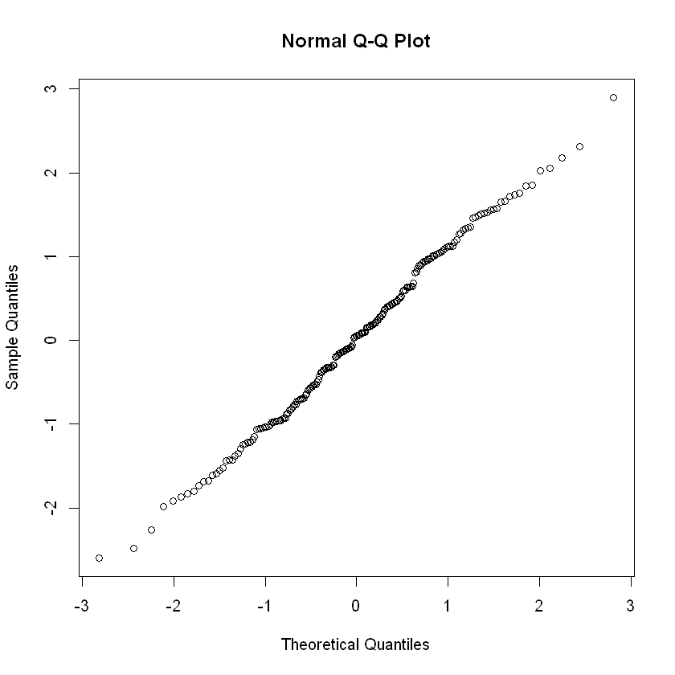
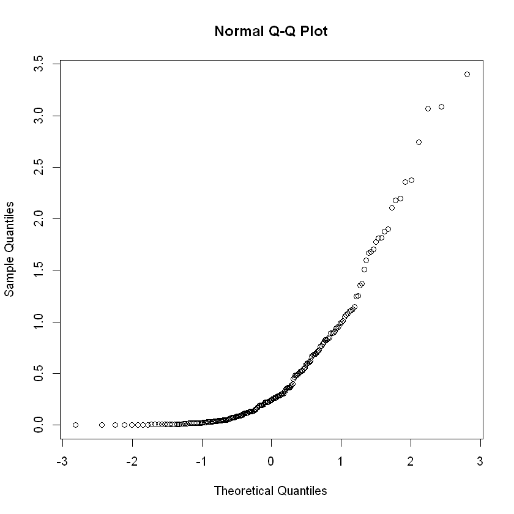

# Order Statistics

## Order Statistics

Let $X_1,...,X_n$ indep. with unknown $F$

order $X_1,...,X_n$ in increasing order $X_{(1)}\leq ... \leq X_{(n)}$. Due to the independence assumption, the order statistics carry the same info about $F$ as the unordered.  

Also, the order statistics can be used to estimate the quantiles $F^{-1}(\tau)$, such as median 

$$M = \begin{cases}
\frac{1}{2}(X_\frac n2 + X_{\frac n2+1}) &\text{even}\\
\frac 1 2 X_{\frac{n+1}2} &\text{odd}
\end{cases}\approx F^{-1}(1/2)$$ 

Similarly, $F^{-1}(\tau)\approx X_{k}, k \approx \tau n$

## Sample Extremums
with the independence assumption, 

### Sample Minimum

\begin{align*}
P(X_{(1)}\leq x) &= 1 - P(X_{1}>x)\\
&= 1 - P(X_1>x, X_2>x,..., X_n>x)\\
&= 1 - \prod_{i=1}^n P(X_i>x) &\text{independence}\\
&= 1 - [1-F(x)]^n
\end{align*}

so that the pdf is $g_1(x) = n[1-F(x)]^{n-1}f(x)$
### Sample Maximum

$$P(X_{n}\leq x) = P(X_1\leq x, ..., X_n\leq x)= F(x)^n$$

pdf is $g_n(x) = nF(x)^{n-1}F(x)$

### Sample Distribution
Consider the distribution of $X_{k}$

First, define r.v. $Z(x) = \sum^n\mathbb I(X_i\leq x) \sim Binomial(n,F(x))$ so that $X_{(k)}\leq x = Z(x)\geq k$. 

Then, 

$$P(X_{(k)}\leq x) = P(Z(x)\geq k) = \sum_{i=k}^n{n\choose i}F(x)^i[1-F(x)]^{n-i}$$

and 

\begin{align*}
g_k(x) &= \frac{d}{dx}\sum_{i=k}^n {n\choose i}F(x)^i[1-F(x)]^{n-i}\\
&= \frac{n!}{(k-1)!(n-k)!}F(x)^{k-1}[1-F(x)]^{n-k}f(x)
\end{align*}

## Central order statistics
Let $k = k_n\approx \tau n, \tau \in (0,1)$, then $X_{(k)}$ is called a __central order statistic__.  
Intuitively, $X_{(k)}$ is an estimator of the $\tau$-quantile $F^{-1}(\tau)$, formally 

$$X_{(k)} \rightarrow^p F^{-1}(\tau), n\rightarrow \infty, k_n/n\rightarrow \tau$$

### Convergence in distribution of central order 

$$\sqrt n(X_{(k)} - F^{-1}(\tau))\rightarrow^d N\bigg(0, \frac{\tau(1-\tau)}{f^2(F^{-1}(\tau))}\bigg)$$

Proof by using $Unif(0,1)$ order statistics and then Delta method to generalize.

_proof_. Take $U_1,...,U_n$ be independent $Unif(0,1)$ r.v., and use the order statistics $U_{(1)}\leq ... \leq U_{(n)}$.  
Take $E_1,E_2,...,E_{n+1}$ to be independent r.v. $\sim Exponential(1)$. Let $S=\sum_{i=1}^{n+1}
E_i$Note that 

$$(U_{(1)},...,U_{(n)})=^d (\frac{E_1}{S}, \frac{E_1+E_2}S, ..., \frac{E_1+...+E_n}S)$$

Then, we can approximate the distribution by sum of exponential r.v. 

$$U_{(k)}=\frac{(E_1+...+E_k)/n}{(E_1+...+E_{n+1})/n}\approx n^{-1}(E_1+...+E_k)$$

Assume $\sqrt{n}(\frac{k_n}{n}-\tau)\rightarrow 0$, then 

$$\sqrt{n}(U_{(k_n)}-\tau)=^d \sqrt n \big(\frac{E_1+...E_{k_n}}{S}-\tau\big)=\sqrt n \big(\frac{E_1+...E_{k_n}-\tau S}{S}\big)$$

Note that 

$$\frac Sn = \underset{\rightarrow^p \:1\: (WLLN)}{\big(\frac{E_1+...E_{n+1}}{n+1}}\big)\underset{\rightarrow 1}{\frac{n+1}{n}}\rightarrow^p 1$$

__WTS $\sqrt n \big(n^{-1}(E_1+...+E_{k_n}-\tau S)\big)\rightarrow^d N(0,\tau(1-\tau))$__

Let $A$ be the summation

\begin{align*}
A&:=E_1+...+E_{k_n}-\tau S \\
&= E_1 + ..+E_{k_n}-\tau(E_1+...+E_n)\\
&= (1-\tau)(E_1 + ... + E_{k_n})+(-\tau)(E_{k_n+1}+...+E_{n+1})\\
\end{align*}

Using CLT, 

\begin{align*}
E[\frac A{\sqrt n}] &= \frac{1}{\sqrt n}\big(k_n(1-\tau)- (n-k_n+1)\tau\big)\\
&=\frac{1}{\sqrt n}(k_n-n\tau -\tau)\\
&= \sqrt n(\frac{k_n}{n}-\tau) - \frac{\tau}{\sqrt n}\\
&\rightarrow 0 - 0=0
\end{align*}

\begin{align*}
var\bigg[\frac A{\sqrt n}\bigg] &= \frac 1 n \big (k_n(1-\tau)^2 + (n-k_n+1)\tau^2\big)\\
&= \frac{1}{n}\big(k_n - 2\tau k_n + k_n \tau^2 + n\tau^2 - k_n \tau^2 + \tau^2\big)\\
&= \frac{k_n} n - 2\tau\frac{k_n}n + \tau^2 + \frac{\tau^2}{n}\\
&\rightarrow \tau - 2\tau\tau + \tau^2 + 0\\
&= \tau(1-\tau)
\end{align*}

__Theorem__ If $U\sim Unif(0,1)$ and $F$ is continuous cdf with pdf $f$ with $f(x)>0$ for all $x$ with $0<F(x)<1$. Then $X=F^{-1}(U)\sim F$. Therefore, for some cdf 

$$F^{-1}(U_{(1)})\leq ... \leq F^{-1}(U_{(n)})$$ 

are order statistics from $F$. 

Then, 

$$\sqrt n (X_{(k_n)}-F^{-1}(\tau))=^d \sqrt n (F^{-1}(U_{(k_n)}-F^{-1}(\tau)))$$

Then we can use Delta Method, note that

\begin{align*}
\frac{d}{d\tau}F(F^{-1}(\tau)) &= \frac d{d\tau}\tau\\
f(F^{-1}(\tau))\frac d{d\tau}F^{-1}(\tau)&= 1\\
\frac d{d\tau}F^{-1}(\tau)&= f(F^{-1}(\tau))^{-1}
\end{align*}

So that 

$$\sqrt n (X_{k_n}-F^{-1}(\tau))\rightarrow^d N\big(0, \frac{\tau(1-\tau)}{f^2(F^{-1}(\tau))}\big)$$

## Quantile-quantile plots
Plot $x_{(k)}$ versus $F_0^{-1}(\tau_k)$ for $k=1,...,n$.  
According to the theory, if the data come from a distribution of this form then 

$$x_{(k)} = \mu + \sigma F_0^{-1}(\tau_k) + \epsilon_k, k=1,...,n$$

where 

$$\epsilon_k \sim N\bigg(0, \frac{\sigma^2\tau_k (1-\tau_k)}{nf_0^2(F_0^{-1})(\tau_k)}\bigg)$$

Then, note that for fixed $\tau_k, var(\tau_k)\rightarrow^{n\rightarrow \infty}0$  

Assess if data $x_1,...,x_n$ are well-modeled by a cdf of the form $F_0(\frac{x-\mu}{\sigma})$ for some $F_0$. 

### Example: Normal QQ Plot
Given $x_1,...,x_n$ then the steps are 

 1. order $x_1,...,x_n$ into $x_{(1)}\leq ...\leq x_{(n)}$
 2. let $Z_{(1)}\leq ... \leq Z_{(n)}$ be the order statistics of a sample of size $n$ from $N(0,1)$ and define $e_i = E(Z_{(i)})$ to be the expected values of the order statistics; $e_i \approx \Phi^{-1}(\frac{i-0.375}{n+0.25})$ 
 3. Plot $x_{(i)}$ vs. $e_i$. If $x_1,...,x_n$ do com from a normal distribution then the points should fall close to a straight line. If the plot shows a certain degree of curvature then notifies this may not be a normal model. 


```r
x1 <- rnorm(200) # generate random data from N(0,1)
qqnorm(x1) 
x2 <- rgamma(200, shape=.5) # generate gamma with shape=0.5
qqnorm(x2)
```


    

    


    

    


## Shapiro-Wilk Test
A formalized way of composing the normal QQ plot by the correlation between $\{X_{(k)}\}$ and $\{F_0^{-1}(\tau_k)\}$ where $F_0 = N(0,1)$

$H_0:$ data come from $N(\mu,\sigma)$ for some $\mu,\sigma$  
statistic 

$$W = \frac{(\sum^n a_ix_{(i)})^2}{\sum^n(x_{(i)}-\bar x)^2}, \text{ where }\begin{bmatrix}a_1\\...\\a_n\end{bmatrix} = k_vV^{-1}\begin{bmatrix}e_1\\...\\e_n\end{bmatrix}$$

where $V[i,j] = cov(Z_{(i)}, Z_{(j)})$ and $k_v$ is determined so that $\sum a_i^2 = 1$. 

For larger $n$, then $W$ is approximately 

$$W^* = \frac{(\sum^n e_ix_{(i)})^2}{\sum_{i=1}^n e_i^2(\sum_{i=1}^n (x_{(i)}-\bar x))^2}$$


```r
shapiro.test(x1)
shapiro.test(x2)
```


    
    	Shapiro-Wilk normality test
    
    data:  x1
    W = 0.99369, p-value = 0.5554
    


    
    	Shapiro-Wilk normality test
    
    data:  x2
    W = 0.6741, p-value < 2.2e-16
    

