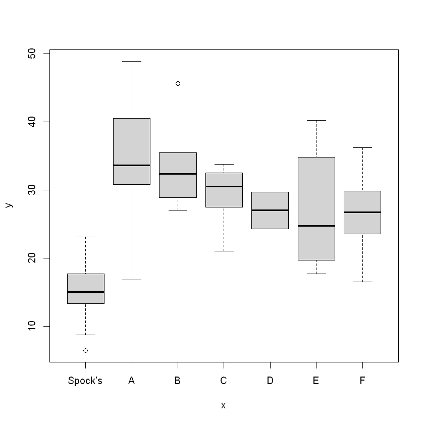
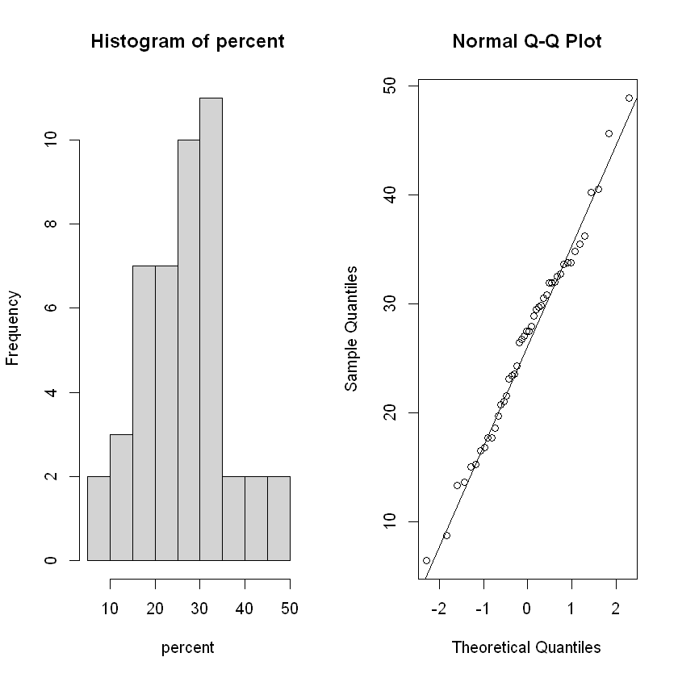
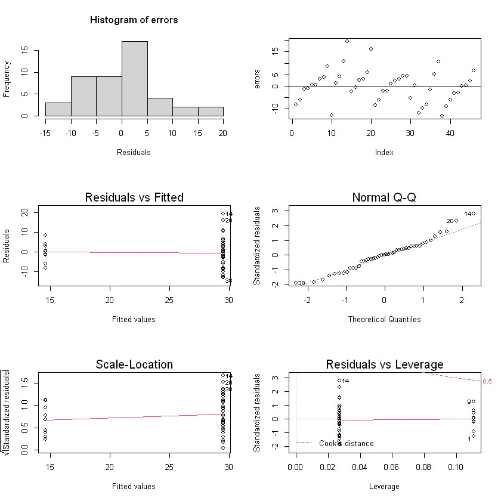

# One Way ANOVA


```R
# import data
library(Sleuth2)
percent = case0502$Percent
judge = case0502$Judge
```


```R
# plot the data
plot(judge, percent)
```

​<figure markdown>
{width="480"}
</figure>

```R
summary(percent)
```


       Min. 1st Qu.  Median    Mean 3rd Qu.    Max. 
       6.40   19.95   27.50   26.58   32.38   48.90 


```R
boxplot(percent, horizontal = T)
```

​<figure markdown>
{width="480"}
</figure>

This looks to be normal, based on Mean vs. Median, and the IQR


```R
t.test(percent, mu = 50)
```


    
    	One Sample t-test
    
    data:  percent
    t = -17.303, df = 45, p-value < 2.2e-16
    alternative hypothesis: true mean is not equal to 50
    95 percent confidence interval:
     23.85675 29.30847
    sample estimates:
    mean of x 
     26.58261 
    


### One sample two sided test
hypothesis: $H_0:\mu=50$ <br>
test statistic: $\frac{\bar{X}-\mu_0}{S/\sqrt{n}}\sim T_{n-1}$ <br>
The result is significant, we can reject the hypothesis. 


```R
par(mfrow = c(1,2))
hist(percent)
qqnorm(percent)
qqline(percent)
```

​<figure markdown>
{width="480"}
</figure>

### Normality Check


```R
shapiro.test(percent)
```


    
    	Shapiro-Wilk normality test
    
    data:  percent
    W = 0.98763, p-value = 0.9013
    


$H_0$: data is normal <br>
Test statistics: 0.98763<br>
Probability: 0.9013 is larger <br>
We have evidence that data is normal.

Consider two-sided t-test

### Two Sample t-test


```R
groupS <- percent[judge == "Spock's"]
groupS
```


     6.40000009536743
     8.69999980926514
     13.3000001907349
     13.6000003814697
     15
     15.1999998092651
     17.7000007629395
     18.6000003814697
     23.1000003814697

```R
groupNS <- percent[judge != "Spock's"]
groupNS
```

     16.7999992370605
     30.7999992370605
     33.5999984741211
     40.5
     48.9000015258789
     27
     28.8999996185303
     32
     32.7000007629395
     35.5
     45.5999984741211
     21
     23.3999996185303
     27.5
     27.5
     30.5
     31.8999996185303
     32.5
     33.7999992370605
     33.7999992370605
     24.2999992370605
     29.7000007629395
     17.7000007629395
     19.7000007629395
     21.5
     27.8999996185303
     34.7999992370605
     40.2000007629395
     16.5
     20.7000007629395
     23.5
     26.3999996185303
     26.7000007629395
     29.5
     29.7999992370605
     31.8999996185303
     36.2000007629395


```R
boxplot(groupS, groupNS, xlab="JUDGE", names = c("Spock", "Other"))
```

​<figure markdown>
{width="480"}
</figure>

**Purpose** to compare two population means <br>
$H_0$: $\mu_x-\mu_y = D_0 (\text{ commonly }D_0=0)$ <br>
**Assumptions** 
- two samples are iid from approximately Normal populations
- Two samples are independent of each other

**Test statistic** $t = \frac{(\bar{x}-\bar{y})-D_0}{se(\bar{x}-\bar{y})}$ <br>
$$ \begin{align*}
var(\bar{x}-\bar{y}) &= var(\bar{x}) + var(-\bar{y}) = \sigma_x^2/n_x + (-1)^2\sigma_y^2/n_y \\
se(\bar{x}-\bar{y}) &= \sqrt{\sigma_x^2/n_x + \sigma_y^2/x_y} 
\end{align*}$$


### Check equal variance assumption


```R
var(groupS)
var(groupNS)
max(var(groupS), var(groupNS)) / min(var(groupS), var(groupNS)) # Rule of Thumb
max(sd(groupS), sd(groupNS)) / min(sd(groupS), sd(groupNS))
```


     25.3894461176131
     55.2163209681473
     2.17477453869475
     1.47471167985296


Rule of thumb test <br>
$H_0: \sigma_x^2 = \sigma_y^2$ <br>
Test statistic: $S_{max}^2 / S^2_{min} = $ larger sample variance / smaller sample variance. <br>
Reject $H_0$ is test-statistic $ > 4$

### Variance Ratio F-test


```R
var.test(groupS, groupNS)
```


    
    	F test to compare two variances
    
    data:  groupS and groupNS
    F = 0.45982, num df = 8, denom df = 36, p-value = 0.2482
    alternative hypothesis: true ratio of variances is not equal to 1
    95 percent confidence interval:
     0.1789822 1.7739665
    sample estimates:
    ratio of variances 
             0.4598178 
    


**Assumptions**
 - Random samples $X_1,X_2$ with size $n_1,n_2$ is drawn from $N(\mu_1,\sigma_1^2), N(\mu_2, \sigma_2^2)$
 - $X_1,X_2$ are independent.
 - Samples size are large (better when samples size are equal)
 
**Test statistic** $F = S_1^2/S_2^2 \sim F_{n_1-1,n_2-1}$ <br>

$p = 0.07668 > 0.05$, we don't reject the null hypothesis, evidence of equal variance

### Two-sample t-test (Satterwaite approximation)


```R
t.test(groupS, groupNS, var.equal = F)
```


    
    	Welch Two Sample t-test
    
    data:  groupS and groupNS
    t = -7.1597, df = 17.608, p-value = 1.303e-06
    alternative hypothesis: true difference in means is not equal to 0
    95 percent confidence interval:
     -19.23999 -10.49935
    sample estimates:
    mean of x mean of y 
     14.62222  29.49189 
    


Used when population variance can't be assume to be equal <br>
**Test statistic** $t = \frac{(\bar{x}-\bar{y}-D_0)}{\sqrt{s^2_x/n_x + s_y^2/n_y}}\sim t_v$, $v = \frac{(s^2_x/n_x + s_y^2/n_y)^2}{(s_x^2/n_x)^2/(n_x-1) + (s_y^2/n_y)^2/(n_y-1)}$. $v$ is calculated by Satterhwaite approximation, round down to the nearest integer

### Pooled two-sample t-test


```R
t.test(groupS, groupNS, var.equal = T)
```


    
    	Two Sample t-test
    
    data:  groupS and groupNS
    t = -5.6697, df = 44, p-value = 1.03e-06
    alternative hypothesis: true difference in means is not equal to 0
    95 percent confidence interval:
     -20.155294  -9.584045
    sample estimates:
    mean of x mean of y 
     14.62222  29.49189 
    


**Assumption** population variance are equal <br>
Estimate pooled variance $s_p^2 = \frac{(n_x-1)^2 s_x^2 + (n_y-1)^2 s_y^2}{n_x+n_y-2}$ <br>
**Test statistic** $t = \frac{(\bar{x}-\bar{y})-D_0}{\sqrt{s_p^2(n_x^{-1}+n_y^{-1})}}\sim t_{n_x+n_y-2}$

Based on the tests, we can reject the hypothesis that two samples have the same means<br>
**Conclusion** Evidence that the percentage of women differs in the two groups

**Paired t-test** <br>
**Requirement** $n_x = n_y$, independent samples

### Pooled t-test (Left tailed)
$H_0: \mu_x - \mu_y = 0, H_a: \mu_x < \mu_y$


```R
t.test(groupS, groupNS, alternative="less", var.equal= T)
```


    
    	Two Sample t-test
    
    data:  groupS and groupNS
    t = -5.6697, df = 44, p-value = 5.148e-07
    alternative hypothesis: true difference in means is less than 0
    95 percent confidence interval:
        -Inf -10.463
    sample estimates:
    mean of x mean of y 
     14.62222  29.49189 
    


## Dummy Variable (SLR)


```R
X <- c(rep(1, length(groupS)), rep(0, length(groupNS)))
model <- lm(percent~X)
summary(model)
```


    
    Call:
    lm(formula = percent ~ X)
    
    Residuals:
         Min       1Q   Median       3Q      Max 
    -12.9919  -4.6669   0.2581   3.7854  19.4081 
    
    Coefficients:
                Estimate Std. Error t value Pr(>|t|)    
    (Intercept)   29.492      1.160   25.42  < 2e-16 ***
    X            -14.870      2.623   -5.67 1.03e-06 ***
    ---
    Signif. codes:  0 '***' 0.001 '**' 0.01 '*' 0.05 '.' 0.1 ' ' 1
    
    Residual standard error: 7.056 on 44 degrees of freedom
    Multiple R-squared:  0.4222,	Adjusted R-squared:  0.409 
    F-statistic: 32.15 on 1 and 44 DF,  p-value: 1.03e-06
    


**Model** $Y_i=\beta_0+\beta_1X_i+\epsilon_i$, where $X_i=\mathbb{I}(\text{ith observation is from group A})$.<br>
**Assumptions**
 - The linear model is appropriate
 - Gauss-Markov assumptions ($E(\epsilon_i)=0, var(\epsilon_i)=\sigma^2$: Uncorrelated errors)
 - $\epsilon_i\sim N(0, \sigma^2)$

$H_0:\beta_1 = 0$ <br>
**Test statistic** $t = \frac{b_1}{se(b_1)}\sim t_{N-2}$, $N = n_A + n_{A^c} $

### Regression diagnostics


```R
yhats = fitted(model)
errors = residuals(model)
par(mfrow=c(3,2))

hist(errors, xlab="Residuals", breaks = 5)

plot(errors)
abline(0, 0)

plot(model)
```

​<figure markdown>
{width="720"}
</figure>

Check Assumptions
- Normality: looks like a little bit right skewed (but they might just be outliers)
- Constant variance: yes
- $E(\epsilon) = 0$: yes


```R
anova(model)
```


<table>
<caption>A anova: 2 × 5</caption>
<thead>
	<tr><th></th><th scope=col>Df</th><th scope=col>Sum Sq</th><th scope=col>Mean Sq</th><th scope=col>F value</th><th scope=col>Pr(&gt;F)</th></tr>
	<tr><th></th><th scope=col>&lt;int&gt;</th><th scope=col>&lt;dbl&gt;</th><th scope=col>&lt;dbl&gt;</th><th scope=col>&lt;dbl&gt;</th><th scope=col>&lt;dbl&gt;</th></tr>
</thead>
<tbody>
	<tr><th scope=row>X</th><td> 1</td><td>1600.623</td><td>1600.62290</td><td>32.14538</td><td>1.029666e-06</td></tr>
	<tr><th scope=row>Residuals</th><td>44</td><td>2190.903</td><td>  49.79325</td><td>      NA</td><td>          NA</td></tr>
</tbody>
</table>


#### ANOVA for linear regression
$H_0:\beta_1 = 0$ <br>
$F=MSR/MSE\sim F_{d.f.variables,\: d.f.errors}$
