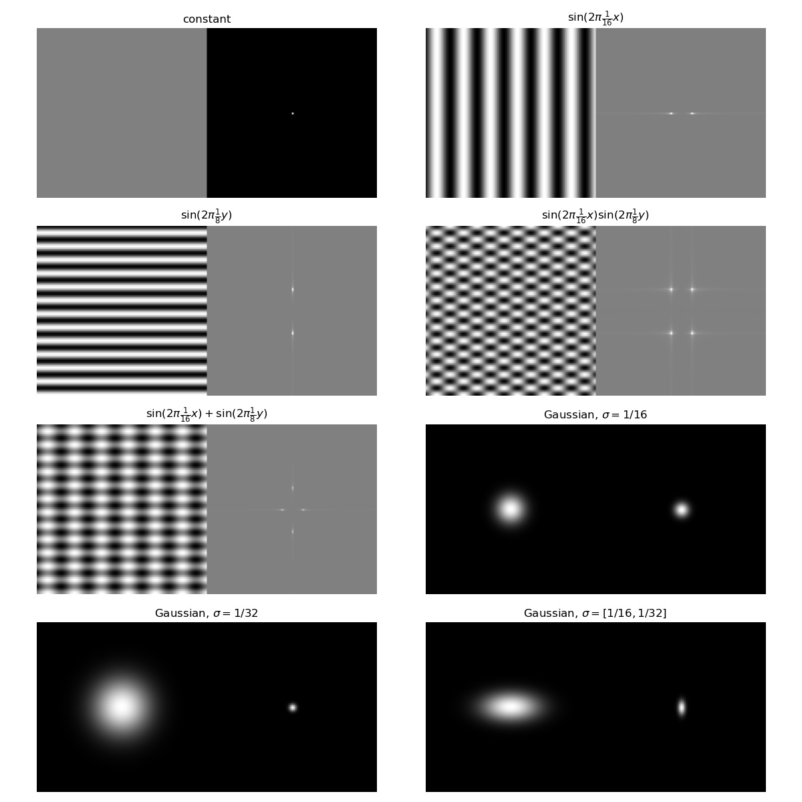
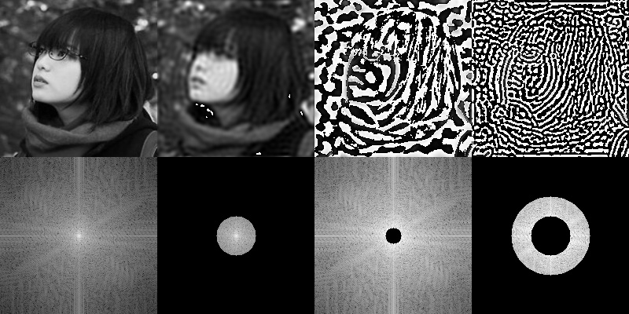

# Sampling Theory

## Fourier Transform Theory

Given function $f:\mathbb R\rightarrow \mathbb R$ in the spatial domain, the function in the frequency domain $F$ is 

$$F(w) = \int_{-\infty}^\infty f(x)e^{-iwx}$$

Often is defined instead with spatial

$$F(f) = \int_{-\infty}^\infty f(x)e^{-i2\pi x} dx$$

The inverse Fourier transform is

$$f(x) = \int_{-\infty}^\infty F(w)e^{iwx}dw$$

Note that $e^{ix} = \cos(x) + i\sin(x)$.

A Fourier transformation is linear $F(a f_1 + bf_2) = aF(f_1) + bF(f_2)$.

### Delta Distribution
(Informally) Delta function can be though as $\delta(x): \mathbb{R}\rightarrow\mathbb{R} = \begin{cases}\infty &x=0\\0&x\neq 0\end{cases}$ and $\int_{-\infty}^\infty \delta(x)dx = 1$. Delta function can be used to represent the impulse of Fourier components in the frequency domain. 

\begin{align*}
F(u) = \delta(u)) &= \int_{-\infty}^\infty \delta(x) e^{-i2\pi x}dx = 1\\
F(u) = \delta(u-t_0)) &\iff f(x) = e^{i2\pi t_0 x}\\
F(u) = \frac{1}{2}(\delta(u-t_0) + \delta(u+t_0)) &\iff f(x) = \cos(2\pi t_0x)\\
F(u) = \frac{1}{2i}(\delta(u-t_0) + \delta(u+t_0)) &\iff f(x) = \sin(2\pi t_0x)
\end{align*}

### 2D Fourier Transformations

The 2D Fourier transform is given as

$$F(u,v) = \iint_{-\infty}^\infty f(x, y) e^{-2\pi(ux+vy)i}dxdy$$

$$f(x,y) = \iint_{-\infty}^\infty F(u,v)e^{2\pi (ux+vy)i}dudv$$

In general, the Fourier transform can be represented as the magnitude spectrum $A = |F|$ and the phase spectrum $\phi = \text{arc}\tan(\frac{Im(F)}{Re(F)})$. Where $A$ represents the amplitude of each Fourier component, and $\phi$ represents the phase/shift of the Fourier component.  

2D FT has many useful properties

- Linearity (same as 1D)
- Symmetry $|F(u,v)| = |F(-u,-v)|$
- Convolution theory $f*g \iff F\cdot G$
- Separable $f(x,y) = f_x(x)f_y(y)\iff F(u,v)=F_x(u)F_y(v), F_x(u) = F_x(f_x), F_y(v) = F_y(f_y)$

Thus, we have some common examples

- constant function will have pulse at $(0,0)$ $F(u,v) = \delta(u,v)\iff f(x,y) = c$. 
- cosine waves $f(x,y) = \cos(2\pi t_0 x + 2\pi t_1 y)$ will have pulse at $\pm (t_0, t_1)$
- sum of waves $f(x,y) = \sin(2\pi t_0x) + \cos(2\pi t_1y)$ will have pulse at $\pm(t_0, 0), \pm (0, t_1)$
- product of waves $f(x,y) = \sin(2\pi t_0x)\cos(2\pi t_1)y$ will have pulse at $(\pm t_0, \pm t_1)$
- 2D Gaussian is still a Gaussian in magnitude spectrum. 


## Image Frequency Space
Note that an image is (mathematically) a continuous 2D function $I(x, y)$, which can be transformed into frequency domain. 

In practice, digital images is discrete and we can transform it into frequency domain using discrete Fourier transform.


<figure markdown>
  {width="1080"}
  <figcaption>2D functions in spatial space (left) and Fourier space (right)</figcaption>
</figure>


__Aliasing__ happens when two signals are indistinguishable at the same sampling rate. 

## Filtering / Convolution Theorem

Convolution in the spatial domain is equivalent to the multiplication in Fourier domain. 

For example, Gaussian filter is a low-pass filter and is equivalent to multiplication in Fourier domain. 

<figure markdown>
  {width="720"}
  <figcaption>Image in spatial space (top) and Fourier space (bottom)</figcaption>
</figure>


As shown in the Gaussian example, larger convolution kernel is equivalent to lower frequencies filter and verse versa. Thus, very large convolution can be implemented as FFT and inverse FFT. 

(running time for convolution: $O(F^2 N^2)$ where $F$ is the kernel size and $N$ is image size, running time for FFT filtering $O(N^2 \log(N^2))$).


## Aliasing

Intuitively, Fourier transform represents the sin and cos waves that can add into a function in real domain. 

If high frequency signal is insufficiently sampled, then samples will erroneously appear to be from a low frequency sample. 


### Nyquist Theorem

We get no aliasing from frequencies in the signal that are less than the __Nyquist frequency__ (which is defined as $1/2$ sampling frequency). 

Intuitively, consider a wave of frequency $t_0$, then we need at least two points for each period to capture the frequency. 

```plotly
{"file_path": "/cs284/assets/sampling.json"}
```

## Antialiasing 

On 2D images, the same theorem applies. Thus there are two solutions, increase the sampling rate (super-sampling, which means more pixels), or lower the image frequency (low-pass filter or blurring before sampling).


### Super-sampling
Instead of outputting whether inside of outside a triangle, supersampling works by sample $N\times N$ samples per pixel, and then average over all values for the pixel. 

```python
# simple sampling, naive implementation
for triangle in triangles:
    for i, j in bounding_box(triangle):
        frame_buffer[i, j] = inside(triangle, i + 0.5, j + 0.5)

# super-sampling, N samples per pixel 
stride = 1 / (N ** 0.5)
for triangle in triangles:
    for i, j in bounding_box(triangle):
        idx = 0
        for x in range(i + stride / 2, i + 1, stride):
            for y in range(j + stride / 2, j + 1, stride):
                sample_buffer[i, j, idx] = inside(triangle, x, y)
                idx += 1
        frame_buffer[i, j] = sample_buffer.sum(axis=2) / N
```

Super-sampling is equivalent to apply a box filter on larger sampled frame. 