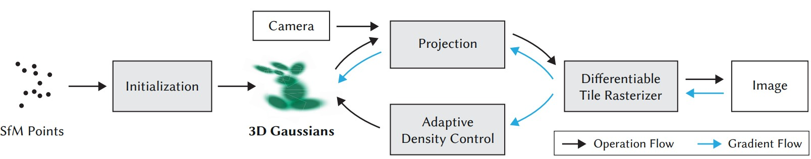

# Gaussian Splatting

[Project Page :fontawesome-solid-link:](https://repo-sam.inria.fr/fungraph/3d-gaussian-splatting/){ .md-button .md-button--primary }
[Paper :fontawesome-solid-file-pdf:](https://repo-sam.inria.fr/fungraph/3d-gaussian-splatting/3d_gaussian_splatting_low.pdf){ .md-button .md-button--primary } 

Instead of representing the scene as an implicit continuous field; 3DGS [@3Dgaussians] represent it as a unstructured, discrete set of points, augmented with features (either neural features or explicit things). Then, use the differentiable renderer to backprop/optimize over the set of images.  

Combines several ideas of recent works. Including point-based volume rendering, Explicit anisotropic Gaussian splats for real-time rasterization. Efficient initialization from SfM points (sparse recon from COLMAP instead of lengthy dense recon)

## Contributions

- The introduction of anisotropic 3D Gaussians as a high-quality, unstructured representation of radiance fields. 
- An optimization method of 3D Gaussian properties, interleaved with adaptive density control that creates high-quality representations for captured scenes. 
- A fast, differentiable rendering approach for the GPU, which is visibility-aware, allows anisotropic splatting and fast backpropagation to achieve high-quality novel view synthesis.

## Representation
3D Gaussians is defined by 

$$\mathbf G(\mathbf x) = \exp(-\frac{1}{2}(\mathbf x-\mathbf p)^T \Sigma^{-1}(\mathbf x-\mathbf p))$$

where $\mathbf p$ is the position (mean) and $\Sigma$ is the covariance matrix, both in world space. Each Gaussian is multiplied by $\alpha$ (transparency) and augmented with spherical harmonics for directional appearance component. 

Each 3G Gaussian can be projected onto the 2D image space, the mean is simply a point projection, and the covariance $\Sigma$ is projected to a 2D covariance matrix $\Sigma'$ where

$$\Sigma' = JW\Sigma W^T J^T$$

where $W$ is the viewing transformation matrix, $J$ is the Jacobian of the affine approximation of the projective transformation. 

However, to enforce positive semi-definite property so that the matrix keeps the properties of a covariance matrix, we cannot directly optimize on the 3D matrix space. Instead, we decompose $\Sigma$ into a scaling matrix $S$ and rotation matrix $R$ as 

$$\Sigma = RSS^TR^T$$

which is the configuration of a 3D ellipsoid, analogous to a 3D Gaussian covariance. In practice, use axis scaling vector $\mathbf s\in\mathbb R^3$ for scaling and (normalized) quaternion $\mathbf q\in\mathbb{R}^4$ to represent rotation.

## Optimizations

Add sigmoid function on $\alpha$, exponential on $\mathbf s$ to constrain the range, normalize $\mathbf q$ so that it's a unit quaternion. 

Initialize the set of isotropic Gaussian with axes equal to the mean of the distance to the closest three points. Thanks to the rapid rendering, the method can be optimized on the whole image instead of randomly sampled rays, thus we can apply image based losses during training as well. For example, D-SSIM loss. 

To populate/prune Gaussians, after some iterations  

- remove Gaussians that are essentially transparent ($\alpha < \epsilon_{\alpha}$)
- To encourage binarized alphas and reduce floaters, cut the alpha values every $N=3000$ iterations. 
- If the average magnitude of view-space position gradient is larger than some threshold $\tau_{\text{pos}}$. 
    - If the Gaussian is small (decided by scaling vector), then make a clone and move along the positional gradient. 
    - If the Gaussian is large, then shrink the scale by $\phi = 1.6$ and make a clone and move along the positional gradient. 

## Rendering 

Instead of doing pixel-wise ordering / ray-marching, the method pre-order the Gaussian splats for each view. First, split the screen into $16\times 16$ tiles, then only keep Gaussians that's $99\%$ within the view frustum (with a set-up near plane and far plane to avoid extreme cases). Then, simply do z-ordering on the Gaussians. 