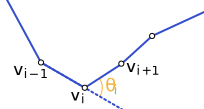
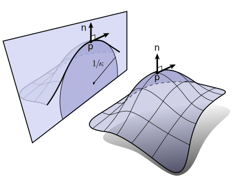
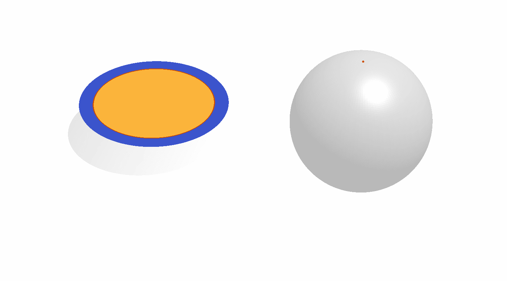
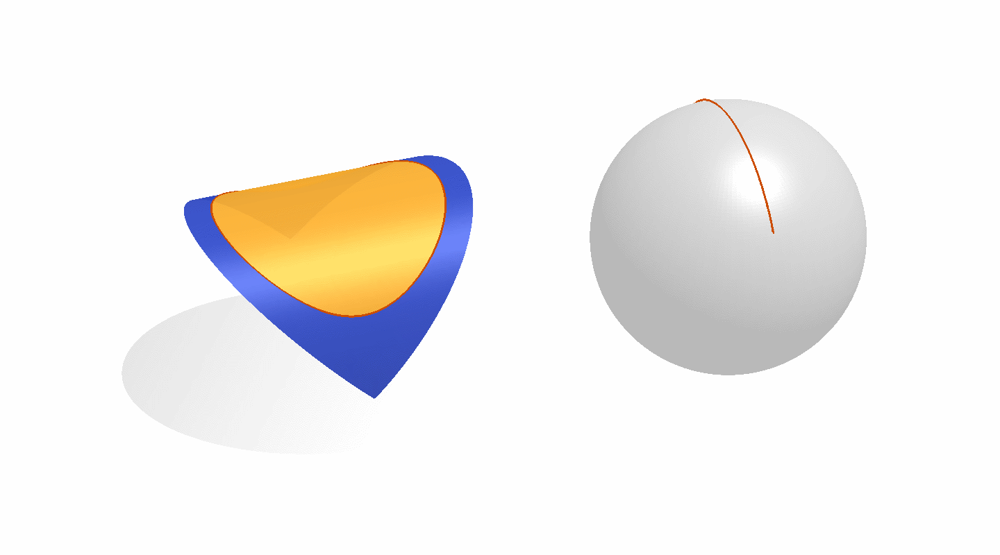
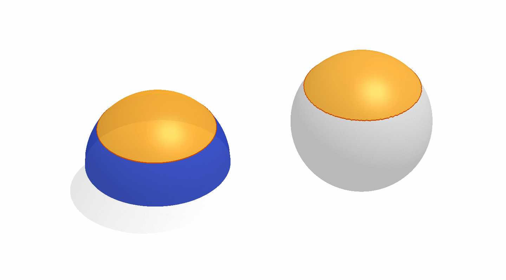

# Curvature

## Define Curvature
(more interesting notes can be found in [MAT363](../mat363/curvature.md))

For a planar curve $\gamma:[0, 1]\rightarrow \mathbb R^2$, consider the following definitions

### Osculating circle

Define the __tangent direction__ at a point $p=\gamma(s)$ as the secant line formed by approaching $p$ from $q$ on the curve, i,e,

$$\mathbf t (s) = \lim_{\mathbf q\rightarrow \mathbf p}\frac{\mathbf q-\mathbf p}{\|\mathbf q-\mathbf p\|} = \lim_{t\rightarrow s}\frac{\gamma(t)-\gamma(s)}{\|\gamma(t)-\gamma(s)\|} = \frac{\gamma'(s)}{\|\gamma'(s)\|}$$

Assume without loss of generality that $s$ is an arc length parameterization, so that $\|\gamma'\| = 1$, then the unit tangent is simply $\gamma'(s)$. 

We can also consider the limit of the circum-circle $C(\mathbf q_1, \mathbf p, \mathbf q_2)$ (Note that a circum-circle is the circle passing through all the points, and 3 points can uniquely defines a circle), where $\mathbf q_1 = \gamma(t_1), \mathbf q_2=\gamma(t_2), t_1 < s < t_2$, so that we can define the limit circum-circle as 

$$C(\mathbf p) = \lim_{\mathbf q_1\rightarrow \mathbf p-, \mathbf q_2\rightarrow \mathbf p+} C(\mathbf q_1, \mathbf p, \mathbf q_2)$$

We call $C(\mathbf p)$ the __ocsulating circle__ at the point $\mathbf p$ on $\gamma$, the tangent of the curve and the circle match as $\gamma'(s)$ and the radius $R(\mathbf p)$ of $C(\mathbf p)$ is proportional to how straight the curve is locally. $R\rightarrow \infty$ when the curve is getting to be a line. Therefore, the radius is inversely proportional the the curvyness. Hence, define the curvature as 

$$\kappa(\mathbf p) = R(\mathbf p)^{-1}$$

Thinking about how we construct the circum-circle from the three points, we can have 

$$R(\mathbf p) = \lim_{q_1,q_2\rightarrow p} \frac{\|\mathbf q_1-\mathbf p\|\|\mathbf p-\mathbf q_2\|\|\mathbf q_2-\mathbf q_1\|}{2|(\mathbf q_1-\mathbf p)\times (\mathbf p-\mathbf q_2)|}$$

### Signed Curvature
Another way of thinking about curvature is by plugging in the arc-length parameterization, where the curvature is equal to the magnitude of change in the tangent, 

$$\kappa(s) = \lim_{t\rightarrow s}\|\frac{\gamma'(t) - \gamma'(s)}{t-s}\| = \|\gamma''(s)\|$$

Since we are having arc-length parameterization, the only change to the tangent $\gamma'$ is the change in direction. This means that the change is orthogonal to the tangent, i.e.

$$\gamma''\cdot \gamma' = 0\Rightarrow y''\cdot\hat{\mathbf n} = \pm \kappa \hat{\mathbf n}$$

If we define an orientation of our curve (we have starting point and ending point as from $\gamma(0)$ to $\gamma(1)$), then we can endow the curvature with a sign based on whether $C(\mathbf p)$ lies on the left of right side of the curve. And since the orthogonal relationship, the vector from $\mathbf p$ to the circle's center $c(\mathbf p)$ must be perpendicular to the tangent, i.e. the positive or negative normal directions. 

If the orientation agrees with increasing the arc-length parameter $s$, then the sign can be determined by comparing the second derivative $\gamma''$ to the unit normal $\hat{\mathbf n} = \gamma'^{\perp}$. The __signed curvature__ at $\mathbf p$ is 

$$k(\mathbf p) = \text{sign} (\gamma''(\mathbf p)\cdot\hat{\mathbf n})\cdot \kappa(\mathbf p) = \gamma''(\mathbf p)\cdot \hat{\mathbf n}$$

### Moving point analogy
Thinking about the curve as the trajectory formed by a moving particle, parameterized by time $t$, hence $\gamma'(t)$ is the velocity and $\|\gamma'(t)\|$ the speed. Reparameterize the trajectory with a perfectly uniform speed $\|\gamma'(s(t))\| = 1$. 

Then, the curvature is the amount of "turning". Imagine this is driven by a steering wheel, then straight line is no turning, the circle is turning the wheel to a particular fixed angle (left = positive, right = negative) and changing the steering wheel is equal to changing the curvature. 

## Turning number
The integrated signed curvature around a closed curve must be an __integer__ multiple of $2\pi$, i.e. 

$$\oint_S k(s)ds = 2\pi\tau$$

$\tau$ is called the turning number of the curve. 

Note that we can accumulating the "turning", since we are on a closed curve, thinking about the moving point analogy, the point will eventually turning back for any starting point. Therefore, the accumulated direction can turn an integer times of a circle. 

## Discrete Curvature
To discretize a curve, we need to fit it to a piecewise linear chain of segments. And for each point on the chain, define the discrete curvature as the change in tangent direction

​<figure markdown>
{width="480"}
</figure>

The turning number still holds in this case, since we will "turning back" eventually, i.e. 

$$\sum k_i = 2\pi\tau$$

## Surface Curvature
For a surface $\mathcal S$, note that along different directions, we have different curves (for example, thinking about a potato chip). Therefore, it's more difficult to understand the curvature of a surface. 

More specifically, we want to find some path/direction/trajectory on the surface, so that we can have a curve, and extend the definition curvature on that curve. 

### Normal curvature
The simplest way to extend curvature on the point $\mathbf p\in \mathcal S$ is to "cut" through the surface with a plane $P$ along the normal $\mathbf n(\mathbf p)$. 

​<figure markdown>
{width="720"}
</figure>

so that we get some curve from the intersection of $P$ and $\mathcal S$. Note that there are infinitely many planes passing $\mathbf p$ and lie parallel to $\mathbf n(\mathbf q)$, as we rotating $P$ around $\mathbf n$ with any angle $\varphi$. Therefore, we can parameterize and define normal curvature for each choice of $\varphi$ as

$$k_{\mathbf n}(\varphi, \mathbf p) = \gamma_\varphi''(\mathbf p)$$

### Mean curvature
Normal curvature defines infinitely many curvature values, which is undesirable. One way to reduce the space of normal curvature is the take the mean of all normal curvatures.

$$H(\mathbf p) = \frac{1}{2\pi} \int_0^{2\pi} k_{\mathbf n}(\varphi,\mathbf p)d\varphi$$

### Max/Min curvature
Another obvious way of reduction is 

$$k_1(\mathbf p) = \max_{\varphi} k_{\mathbf n}(\varphi, \mathbf p), \quad k_2(\mathbf p) = \min_{\varphi} k_{\mathbf n}(\varphi, \mathbf p)$$

$k_1,k_2$ are referred as the __principal curvatures__. with corresponding angles

$$\varphi_1(\mathbf p) = \arg\max_\varphi k_{\mathbf n}(\varphi, \mathbf p), \quad \varphi_2(\mathbf p) = \arg\min_\varphi k_{\mathbf n}(\varphi, \mathbf p)$$

By Euler's theorem

$$k_{\mathbf n}(\varphi, \mathbf p) = k_1\cos^2\varphi + k_2\sin^2\varphi$$

And the corollary

1. $\varphi_1\perp \varphi_2$
2. $H = \frac12(k_1 + k_2)$

### Gaussian curvature
Max/min/mean curvature cannot alone distinguish between points lying on a round ball, a flat sheet of paper, and the potato chip. So we introduce Gaussian curvature, 

$$K = k_1k_2$$

$K$ maintains the disagreement in sign that categories the saddle-like behavior (positive in one direction and negative in another)

## Relationship to Surface Area

### Mean curvature as area gradient
Consider the problem of finding a flow of a given surface $\mathcal S$ in the direction that shrinks the surface area. We write the surface area as the integral of unit density 

$$A(\mathcal S) = \int_S 1d\mathbf x = \int_S \|\nabla \mathbf x\|^2 d\mathbf x, \|\nabla \mathbf x\| = 1$$

there are many expressions for $1$ in the integral, but we pick the differential norm (the change in position over a small change in position), and to make sure linearity, we use the squared norm, hence the area is a quadratic function os positions and familiarly as the Dirichlet energy. 

Note that $A(S, \mathbf x)$ is a functional with varying $\mathbf x$. So that the functional derivative, for any $\mathbf y$

\begin{align*}
\frac{dA}{d\mathbf x} &= \lim_{\epsilon\rightarrow 0}\frac{A(\mathbf x + \epsilon \mathbf y) - A(\mathbf x)}{\epsilon}\\
&= \left [\frac{d}{d\epsilon}A(\mathbf x + \epsilon\mathbf y)\right]_{\epsilon=0}\\
&= \left [\frac{d}{d\epsilon} \int_S\|\nabla\mathbf x + \epsilon\nabla \mathbf y\|^2 d\mathbf x \right]_{\epsilon=0}\\
&= \int_S 2\nabla \mathbf y\cdot \nabla \mathbf x d\mathbf x\\
&= -\int_S \mathbf y \Delta \mathbf x d\mathbf x &\text{assume closed surface, by Green's identity}
\end{align*}

Then consider the derivative evaluated at some point $\mathbf u = (u, v)$. Since we can freely pick $\mathbf y$, let $y(a) = \mathbb I(a=\mathbf u)$, i.e. a "bump" at $\mathbf u$ and $0$ elsewhere so that 

$$\frac{dA}{d\mathbf x}(\mathbf u) = -2\Delta \mathbf x(\mathbf u)$$

where $\Delta$ is the Laplacian operator

$$\Delta f = \nabla\cdot\nabla f = \frac{\partial^2f}{\partial u^2} + \frac{\partial^2f}{\partial v^2}$$

In this case, we can pick the directions $\varphi_1, \varphi_2$ as our $u,v$, since the principal directions are orthogonal, so that 

$$\Delta\mathbf x = \frac{\partial^2 \mathbf x}{\partial\varphi_1^2}+\frac{\partial^2 \mathbf x}{\partial\varphi_2^2} = k_1\mathbf n + k_2\mathbf n = 2H\mathbf n$$

### Gaussian curvature as area distortion
Consider Gaussian curvature $K=k_1k_2$, which is the product of principal curvatures. Note that $K=0$ IFF at least one of the principal curvature is $0$. In this case, the surface is called __developable surfaces__ because it can be flattened (developed) onto a flat plane (Since the principal direction is 0, it's like a rolled paper, we can then unroll through the non-zero principal direction) without stretch of shearing. Locally, Gaussian curvature measures how far from developable the surface is: how much would the local area need to stretch to become flat. 

Then, introducing the __Gauss map__ $N:\mathcal S\rightarrow \mathcal S^2$ where 

$$N(\mathbf p) = \mathbf n(\mathbf p)$$

Then, consider a small patch on a curved surface. Gaussian curvature $K$ can equivalently be defined as the limit of hte ratio between the area swept out by the unit normal on the Gauss map $A_G$ and the area of the surface patch $A$, 

$$K = \lim_{A\rightarrow 0}\frac{A_G}{A}$$

Some examples of different types of regions, the left is $A$ and the right is $A_G$

<table>
<thead>
  <tr>
    <th>type</th>
    <th>$A_G$</th>
    <th width="50%">demo</th>
  </tr>
</thead>
<tbody>
  <tr>
    <td>flat</td>
    <td>0</td>
    <td></td>
  </tr>
  <tr>
    <td>cylindrical</td>
    <td>0</td>
    <td></td>
  </tr>
  <tr>
    <td>spherical</td>
    <td>&gt;0</td>
    <td></td>
  </tr>
  <tr>
    <td>saddle</td>
    <td>&lt;0</td>
    <td></td>
  </tr>
</tbody>
</table>

Similar to the turning number theorem for curves, the __theorem for surfaces__ states that 

$$\int_S K dA = 2\pi\chi(\mathcal S)$$

where $\chi(\mathcal S)$ is the __<a href="https://en.wikipedia.org/wiki/Euler_characteristic">Euler characteristic</a>__  of the surface $\mathcal S$.

__Theorem for surfaces__ means that we cannot add Gaussian curvature to a surface without removing an equal amount some place else or changing the topology of the surface. 

### Shape operator
Let $\mathbf n$ be the unit normal for a point $\mathbf p$ on $\mathcal S$, let $\mathbf v$ s.t. $\mathbf v\cdot\mathbf n = 0$ (the unit tangent). Then we can ask how does the normal change as we move in the direction in $\mathbf v$ along the surface. 

$$S_\mathbf p(\mathbf v) = \nabla \mathbf n\cdot\mathbf v$$

$S_\mathbf p$ is the __shape operator__ at point $\mathbf p$. 

Note that any tangent vector can be spanned by 2 orthogonal basis tangent vectors, denote them as $\mathbf e_1,\mathbf e_2\in\mathbb R^2$. The shape operator as a differential operator is linear, for $\mathbf v = x_1\mathbf e_1 + x_2\mathbf e_2$, we have

$$S_\mathbf p(\mathbf v) = 
\begin{bmatrix}
S_{\mathbf p}(\mathbf e_1)\cdot \mathbf e_1&S_{\mathbf p}(\mathbf e_1)\cdot \mathbf e_2\\
S_{\mathbf p}(\mathbf e_2)\cdot \mathbf e_1&S_{\mathbf p}(\mathbf e_2)\cdot \mathbf e_2
\end{bmatrix}v$$

Given $\varphi_1, \varphi_2$ as the principal directions, we can rotate our coordinate frame to align $\mathbf e_1, \mathbf e_2$ with the principal directions, so that 

$$S_\mathbf p = \begin{bmatrix}\varphi_1&\varphi_2\end{bmatrix}
\begin{bmatrix}k_1&0\\0&k_2\end{bmatrix}
\begin{bmatrix}\varphi_1&\varphi_2\end{bmatrix}^T$$

Note that this is the Eigen decomposition of the shape operator. Therefore, Eigen decomposition will give principal directions as eigenvectors and principal curvatures as eigenvalues. 

## Discretization

First, review that the discrete Laplacian for triangle meshes is 

$$\Delta f \approx M^{-1}L\mathbf f$$

where $M$ is the mass matrix and $L$ is the cotangent matrix and $\mathbf f$ is the discrete approximation of $f$ . 

If we apply this operator to vertex positions, we will have a pointwise approximation of the mean curvature normal

$$H\mathbf n \approx \mathbf H = M^{-1}LV\in\mathbb R^{n\times 3}$$

### Discrete Gaussian curvature via angle defect
On a discrete surface, curvature cannot live on flat faces and edges (we can always develop/unroll the surface along the edge). Therefore, the curvature must live at vertices. 

Using the definition in terms of the area on the Gauss map. Vertices correspond to spherical polygons connecting face normal points. The area $\Omega$ subtended on the Gauss map is called the __solid angle__. Conveniently, this area is simply the angle defect of internal angles $\theta_f$ incident on the $i$th vertex contributed by each $f$th incident faces. 

$$\Omega_i = 2\pi - \sum_{f\in faces(i)}\theta_{if}$$

Thus, our discrete analog of locally integrated Gaussian curvature is given as the angle defect at the $i$th vertex. The local integral average discrete Gaussian curvature is the angle defect divided by the local area associated with the $i$th vertex. 

$$K_i = \frac{\Omega_i}{A_i}$$

By ways of closing up the Gauss map, closed polyhedral surfaces will have 

$$\sum^n K_i = 2\pi \chi(S) = |V|-|E|+|F|$$

which connects with the Euler's formula. 

### Approximation and Eigen decomposition of the shape operator

Alternatively, we nned to approximate all curvatures of a surface by locally fitting an analytic surface so that we have its curvatures. The simplest is the quadratic surface. 

The algorithm proceeds as follows

for $\mathbf v$ in $V$

   1. gather sampling points from neighborhood. For simplicity, find vertices in the __two rings__ of $\mathbf v$, i.e. 
   
    $$\text{Ring}_1 = \{\mathbf u\mid \mathbf u\mathbf v \in E\}, \text{Ring}_2 = \{\mathbf w\mid \exists \mathbf u. \mathbf u \mathbf v\in E\land \mathbf w \mathbf u\in E\}, \text{Neighbor}=\text{Ring}_1\cup \text{Ring}_2$$

    Then, let $\text{Neighbor} \in\mathbb R^{k\times 3}$ be stacked vertices, construct $P = \text{Neighbor} - \mathbf v$ so that $P$ be the position of neighboring vertices relative to $\mathbf v$. 

   2. Compute PCA of $P$ (eigen decomposition of $P^TP$). Let $S\in \mathbb R^{k\times 2}$ be the principal directions ($u,v$ directions) and $B\in\mathbb R^k$ be the height of each point in the least principal direction $w$-direction.
   
   3. An quadratic function as a height field surface passing through the origin is given by 

    $$w = a_1u+a_2v + a_3u^2 + a_4uv +a_5v^2$$

    We have $k$ sets of equations, and we can fits for the 5 parameters $a_i$. 

   4. The shape operator can be constructed as the product of the second and first fundamental form matrices

    $$S = -\begin{bmatrix}e&f\\f&g\end{bmatrix}\begin{bmatrix}E&F\\F&G\end{bmatrix}^{-1}$$

    The entries categorize the strech and bending in each direction

    $$E = 1 + a_1^2;\quad F = a_1a_2;\quad G=1 + a_2^2$$ 

    $$e =\frac{2a_3}{\sqrt{a_1^2 + 1 + a_2^2}};\quad f = \frac{a_4}{\sqrt{a_1^2 + 1 + a_2^2}};\quad g = \frac{2a_5}{\sqrt{a_1^2 + 1 + a_2^2}}$$ 

   5. Eigen decomposition of $S$ gives $k_1, k_2$ and the principal directions (in PCA basis)
   
   6. Lieft the principal tangent directions back to world $\mathbb R^3$. 
